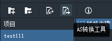
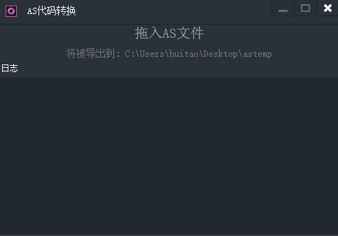

“AS代码转换工具”可将as3件导出为egret项目ts代码。作为EgretConversion附属工具，可以在as3件有更改时，单独转换该as3件，而不用转换整个项目。

**如何使用“AS代码转换工具”单独转换as3件？**

 点击工具栏的按钮“SWF转换工具”
 
 
 
 打开AS代码转换面板：
 
 
 
具体操作：

1. 直接把as3文件或文件夹拖到面板中

2. 转换后的代码会在C:\Users\xxxx\Desktop\astemp中

3. 可以直接把代码拷贝到egret项目中直接使用（错误自己还是需要改的）