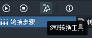
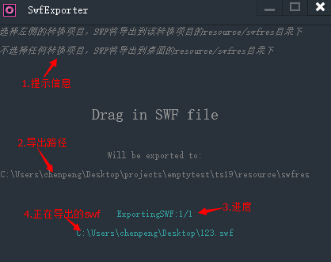

“SWF转换工具”可将swf文件导出为Egret项目可用的资源。作为Egret Conversion附属工具，可以在swf文件有更改时，单独转换该swf文件，而不用转换整个项目。要注意的是，“SWF转换工具”是为Egret定制的工具，转出的格式只能用于egret项目（需要三方库的支持），无法在其他h5项目中使用。

## 一、如何使用“SWF转换工具”单独转换swf文件？

点击工具栏的按钮“SWF转换工具”



打开SWFExporter面板：



1：提示信息区

2：swf文件的导出位置

3：当前导出swf文件的进度信息

4：正在导出的swf文件全路径

以Flashbuilder项目为例：

从Flash项目的bin-debug或源码目录下拖入一个或多个swf文件到面板中，也可拖入目录。转换时在面板底部显示有转换的进度，当转换完成将显示“complete!”。

如果选择了一个转换项目，所有转换的swf都会生成资源到转换项目下的egret项目resource/swfres目录下。

如果没有选择任何转换项目，所有转换的swf都会生成到桌面上resource/swfres下。

## 二、怎样在 Egret 项目中使用生成的资源？

把生成到resource/swfres路径下的资源文件夹拷贝到egret项目的相应位置(resource下)。然后可以像在flash中写as3代码一样加载swf文件。

例如在as3中这样写：

```
var url:String = "123.swf";
var urlRequest:URLRequest = new URLRequest(url);
var loader:Loader = new Loader();
loader.load(urlRequest, null);
loader.contentLoaderInfo.addEventListener(Event.COMPLETE, onLoadComplete);
```

在egret项目中这样写：

```
var url:String = "123.swf";
var urlRequest:egret.URLRequest = new egret.URLRequest(url);
var loader:flash.Loader = new flash.Loader();
loader.load(urlRequest,null);
loader.contentLoaderInfo.addEventListener(egret.Event.COMPLETE,flash.bind(this.onLoadComplete,this),null);
```

可以看到egret项目的typescript代码直接加载了swf格式的文件。

egret项目直接支持swf文件格式吗？答案是不支持。

而使用Egret Conversion转换生成的egret项目支持swf。这是因为EgretConversion在底层封装了swf文件格式，在代码层模拟了这一功能，请看下文讲解。

## 三、egret中是怎么实现载入swf的？

在flash中可以直接加载swf格式的文件，然后从文件中取到各种资源，而egret是不支持swf文件格式的。Egret Conversion通过转换操作，将flash项目的as3语法翻译为egret项目的ts语法，将swf文件解析为可为egret项目识别的资源格式，通过底层的封装最终可在代码层直接加载swf。要注意的是，这种加载swf并不是真的load了一个.swf文件，而是在底层载入了经过转换后的图片等文件。

## 四、支持swf资源的三方库

Egret Conversion转换的swf资源可在任意egret项目中使用，通过导入一个开源的三方库。

获得三方库：用EgretConversion转换任意一个flash项目（可以用示例项目），在生成的egret项目中，src/as3目录即是这个三方库文件。

将三方库拷贝到自己的egret项目相应路径下。