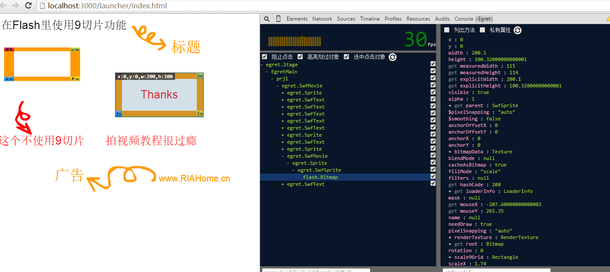
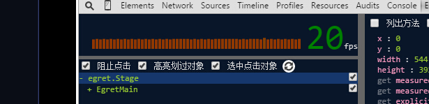

转换Flash项目只是第一步，用EgretConversion转换完项目并按照提示修改错误的语法，以保证项目可以通过编译，然后才能运行项目 。这里提供一些技巧以便于您能快速调试自己的项目。

1. 源项目只需转换一次，剩余的工作都在Egret项目端完成。

2. 做好项目备份。

EgretConversion不会修改源Flash项目的任何内容，但是每次转换操作会覆盖Egret项目的所有代码。因此如果在Egret端已经修复了很多错误，需要谨慎使用“转换按钮”。建议是转换过项目之后所有的改动在Egret端做，不要在Flash项目中继续修改as3代码。

3. Egret项目开发工具可以使用Egret Wing或者Webstorm或者visual studio。wing的断点调试功能很方便。

4. 在Chrome中调试Egret的程序，可以断点查看运行时变量值。

5. 给Chrome安装Egret Inspector插件（从Egret下载器里下载），可以直观的看到显示对象的层级关系，并可动态修改所选目标的属性值以查看效果。查看当前帧率也在这里：

6. 修改舞台背景色。舞台背景默认是黑色。

打开Egret项目launcher下的index.html文件，修改 background: #000000;字段

7. 设置横竖屏，如上。修改 <meta name="screen-orientation" content="portrait"/>

8. 以WebGL模式运行项目：（Filter等效果只有在WebGL模式下有效果）

打开Egret项目下launcher下的egret_loader.js，修改var rendererType = 0;变量为1。

9. 修改舞台默认大小。

打开Egret项目下launcher下的egret_loader.js，修改egret.StageDelegate.getInstance().setDesignSize(600,600);

10. 修改帧频

打开Egret项目下launcher下的egret_loader.js，修改stage.frameRate = 10;

要注意的是该值必须为可被60整除的数（10,15,20,30,60），否则在运行时会将60作为默认值。

11. 更新老项目的库文件

EgretConversion升级之后，库文件（as3目录下的类库）会有所更新。创建新的转换项目会使用最新的库文件，对于之前的转换项目，需要把最新的库文件拷贝到项目中替换旧文件。也可以在自动检测到库更新后点“更新配置”自动更新。

12. 更新老项目的引擎版本

本机升级Egret后，在命令行中cd到egret项目目录，执行egret upgrade升级项目，然后执行egret build -e编译项目。