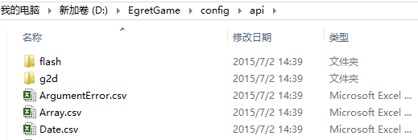

本文讲述EgretConversion中遇到的API报错的处理方式。包括没有实现的Flash类，没有实现的Flash属性、API接口等的手动补充方法。

在转换完项目后，“API警告统计”页面会显示所有未能转换的Flash类或属性，并在详情页定位到项目代码的位置。如果项目必须使用这些类或函数则必须补全这些API，即在egret项目端有相应的flash api的映射。

手动补全过程如下：

### 1. 配置csv表：

配置文件CSV表结构

| 类别 | 含义 |
|--|--|
| 类 | as3 中的类 全路径 |
| 继承类 | s3 中的父类 全路径 |
| 静态 | 静态1 非静态不填写 |
| 属性 | 对象的属性 |
| 属性get/set | 读1 只写2  读写不 填写|
| 函数 | 对象的方法 |
| 类型 | 类型、方法的返回值类型 |
| 转换类 | ts 中对应的类 |
| 是否需要删除前缀 | 静态属性、静态方法才写 |
| 转换属性| 属性对应不一致填写（mouseEnable /uchEnabled） |
| 转换属性格式 | 是1 给属性方法转成object[“xxx”]而不是object.xxx |
| 转换函数 | 应as3.sorton |
| 转换参数 | 意义不一样时 a.b()  as3.sorton (a,b) 应填写b0 a1 |
| 是否转换实现 | 是1 否0 |
| 错误提示 | 可以备注错误信息 |
| 权重 | api出现频率 |
| 测试 | 是否测试过 |

填写完后放到项目文件夹的config目录下：



## 2. 增加映射的类文件或API

除了填写配置表还要补充相应的ts文件才能正确执行，例如api目录下的配置表对应的文件大部分都在Egret引擎中，也有少部分在扩展库as3中


具体操作步骤：

**1. 当发现缺失的API需要补充时，从附件“API模板”中找到API的文件。**

例如没找到InvokeEventReason类的STANDARD属性，这是一个静态属性。在egret项目中没找到InvokeEventReason.ts这个类，说明当前还没有实现这个API。

**2. 在egret项目目录相应目录下创建ts类。**

InvokeEventReason的flash包路径为flash.desktop.InvokeEventReason，在目录C:\Users\chenpeng\Desktop\out\demo1\src\as3\flash\desktop下创建InvokeEventReason.ts文件。填充内容如下： 

```
module flash
 {
     export class InvokeEventReason
     {
         public static STANDARD:string = "standard";
         public static NOTIFICATION:string = "notification";
         public static OPEN_URL:string = "openUrl";
         public static LOGIN:string = "login";
         constructor(){
         }
     }
 }
```

**3.InvokeEventReason.csv放到C:\Users\chenpeng\Desktop\out\config\api\flash\desktop下。**