前面的文章介绍了Egret Conversion的界面，示例项目的演示。本文将讲述新手如何开始使用工具，更加详细的讲述工具的功能和细节，在转换过程中的问题和解决办法。

在开始转换一个Flash的项目之前，建议您先阅读[EgretConversion FAQ](../..//Conversion/questions/README.md)文档，以了解本工具目前的可用范围。

接下来以转换工具自带的示例项目“连连看”为例，演示创建转换项目到最终执行的整个过程。

## 首先获取示例项目

在Egret Conversion工具中切换到“欢迎界面”页面，选择“示例项目一：连连看”，工具立刻开始解压连连看项目到系统的文档文件夹下，windows系统下解压后的项目路径为：C:\Users\***\Documents\project\LianLianKan，我把这个项目拷贝到D盘下并重新命名为FlashGame，以便路径更短便于下文的截图展示。接下来开始转换项目：

### 1. 创建转换项目

点“新建转换项目”，在弹框中填入相应的参数如下：

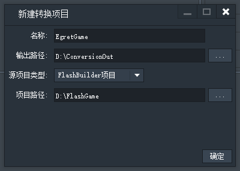

名称EgretGame是指转换后的Egret项目名称，这个可以取任何名字（合法的文件夹名）。

项目路径选择刚才的FlashGame目录路径。

输出路径填入的是转换项目目录，与转换相关的配置文件及转换后的Egret项目，log等都保存在这个目录下。建议提前创建一个空的目录，然后拷贝目录路径到输出路径，在工作区中删除转换项目时可以选择删除整个目录，因此要小心影响到不相关文件。

**提示：输出路径支持中文路径。**

FlashGame这个项目是flash builder项目，在源项目类型中选择“FlashBuilder项目”。

源项目类型可以选择“FlashBuilder项目”、“FlashDevelop项目”、“Flash Professional项目”、“其他Flash项目”四个选项。根据自己的项目类型来选择正确的类型。工具根据项目类型来自动识别项目的目录结构。

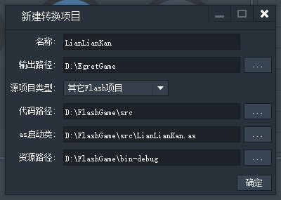

不能自动识别的项目需要手动填入项目的代码路径、项目启动文件、资源路径。

**填好配置后，点确定按钮即开始创建转换项目。工具将在转换项目的目录下生成项目配置文件、日志文件夹、以及一个空的Egret项目。此时工具在后台进行以下一些操作：**

1. 调用egret的命令来创建一个新的egret项目LianLianKan。

提示：如果没有安装egret，则无法创建项目，现象就是在日志区没有任何输出信息，工具卡在这里。

2. 从工具的安装目录下copy启动文件EgretMain.ts、API转换配置表到到”输出目录/config“目录下。

3. 从工具安装目录下copy文件LoadingUI.ts到”输出目录/LianLianKan/src/LoadingUI.ts“。

4. copy类库（与flash一一对应的ts类库）到”输出目录/LianLianKan/src“下。

5. 生成项目属性文件conversion.cts，存储项目的配置信息。

如果成功创建了转换项目，在日志区有如下信息输出：

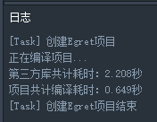

此时按钮”转换Flash项目“会高亮显示。

### 2. 转换项目

点按钮”转换Flash项目“，工具在后台将执行以下步骤：

#### 源码转换：

1）工具会根据一些好的语法转换规则和”输出路径/config“下的API映射关系转换as3源码到“输出路径/名称/src”目录下。

具体的源码转换步骤如下：

     1. 载入API转换配置，分析配置表中的类信息

     2. 载入as3源码，解析源码的语法结构，类的继承关系，基本类信息，如类的成员名称，类型信息等。
     
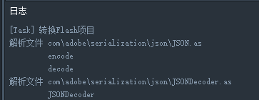

3. 按照文件逐一进行类型检查、转换特殊语法结构、API名称变换，最后把该文件的语法树打印成ts文件。

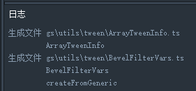

2) copy并适当修改”输出路径\config\EgretMain.ts”文件到”输出路径\名称\src\EgretMain.ts”，主要修改启动类的名称和Embed资源列表。

### 资源拷贝

自动copy Flash项目输出目录(如bin-debug)下的资源文件，如png、xml、txt等文件，到D:\ConversionOut\EgretGame\对应的目录下。

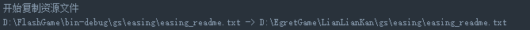

### swf资源转换

转换Flash项目输出目录下的swf资源文件，并生成对应的资源到

”输出路径\名称\resources\”对应的目录下

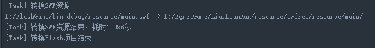

### 显示转换过程的统计信息

 1) 代码文件转换率，统计了代码文件个数，以及成功生成的文件个数。

如果有文件生成失败则会在文件转换信息面板下显示

1. 源码转换错误

例如在LianLianKan.as中写了如下代码：

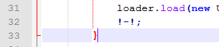

则会在面板中有如下提示：

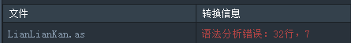

出现这种情况就要根据提示查看源代码是否有语法错误，或者用了很生僻的写法，目前工具还没有记录这种写法。

2. 资源转换错误

遇到无法转换的swf文件，可以根据log信息查看哪个资源转换出错。目前工具对低版本swf文件的支持可能有问题，也缺少对视频等资源的支持。

可以采取的措施是暂时删除该类型资源或该swf文件，等待后续工具版本对资源的更多支持。

2) API转换率，是指用了多少个API，其中有API错误的个占比是多少，详细信息在

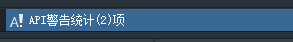

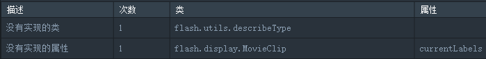

 API的问题一共分为4种：

1. 缺少类信息。有以下几种情况：

    情况一：文件转换失败，导致整个文件的结构信息都没有解析出来，其它代码中引用了这个文件的类或方法就会报缺少类信息错误。

    情况二：用了第三方库swc，工具解析的过程中无法得知swc中的类信息。如果是这种情况请把swc中的代码文件复制到项目的src目录下。

    情况三：使用了未支持的flash类库，比如AIR的一些类库，或者flex的类库，这种情况也会导致找不到类信息。

2. 缺少属性信息。主要是因为没有解析到相关类里有这个属性名称。

3. 没有实现的类。在API转换表(见附录)中填写了标志“是否转换实现”。

4. 没有实现的属性。在API转换表中填写了标志“是否转换实现”。

### 3. 编译项目

在代码和资源转换完成之后，下一步是编译项目。当然前提是项目转换之后没有严重的错误。

点第二步“编译Egret项目”。此时编译的是Egret的项目了。

如果出现编译错误请参考提示说明，或者参见开发者中心的[文档说明](http://edn.egret.com/cn/)。在代码和资源转换完成之后，下一步是编译项目。当然前提是项目转换之后没有严重的错误。

点第二步“编译Egret项目”。此时编译的是Egret的项目了。

如果出现编译错误请参考提示说明，或者参见开发者中心的[文档说明](http://edn.egret.com/cn/)。

### 4. 运行项目

点第三步“运行Egret项目”。

连连看小游戏在我的默认浏览器chrome上运行了。

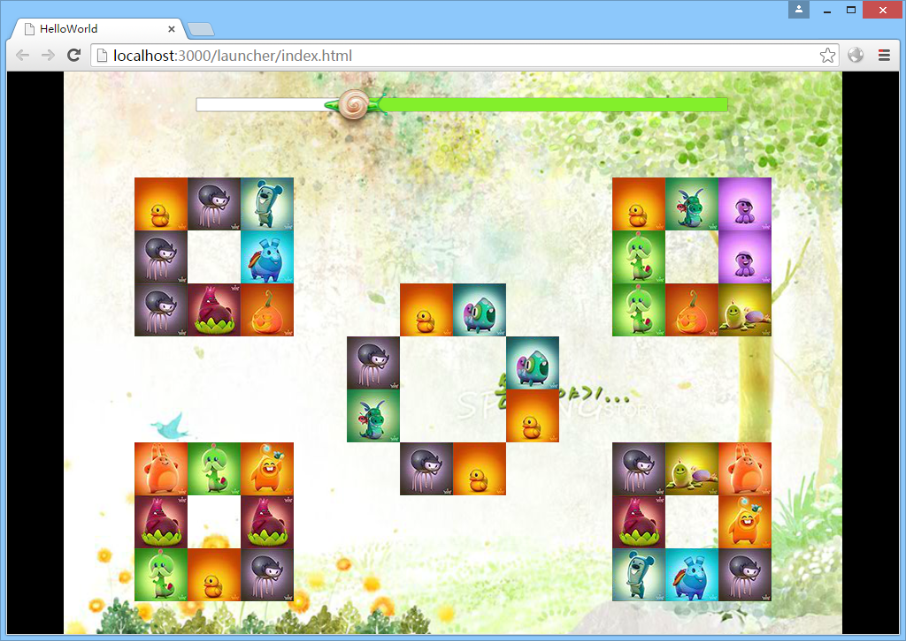

注意，本地项目都会运行在3000端口上， 如果3000端口被占用，请先kill掉占用程序再尝试启动项目。见“附1：KILL 3000端口”。

### 5. 查看与调试

游戏运行起来之后可在浏览器中调试程序。建议用chrome启动游戏。

在chrome中右键菜单里选择“审查元素”，打开相应的的js文件，可以断点执行，查看变量的内容等。

选择Egret标签页可以查看当前帧率，可以定位到游戏中具体的对象上，然后在右侧更改该对象的属性可实时生效。例如我找到右侧一个小格子，对其旋转45度，效果如下：

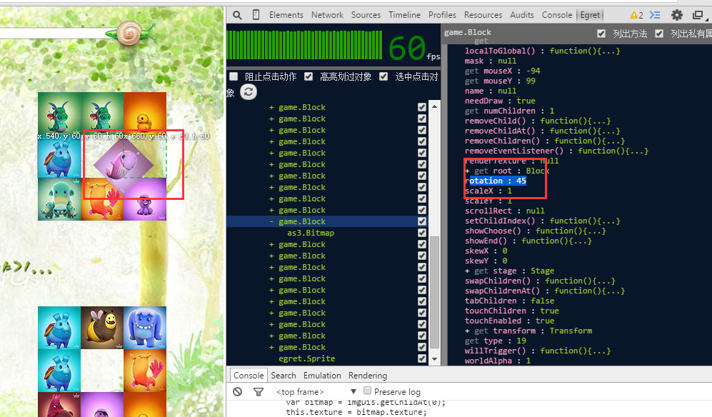

附1：KILL 3000端口

MAC下：

打开终端：sudo lsof -i :3000

sudo kill -9 xxxx

Windows下：

先查询占用3000端口的pid：

netstat –ano | findstr 3000

杀掉进程：

Taskkill /pid xxxx /f