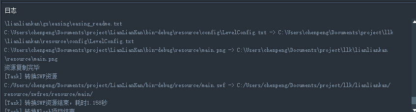
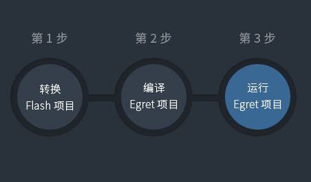
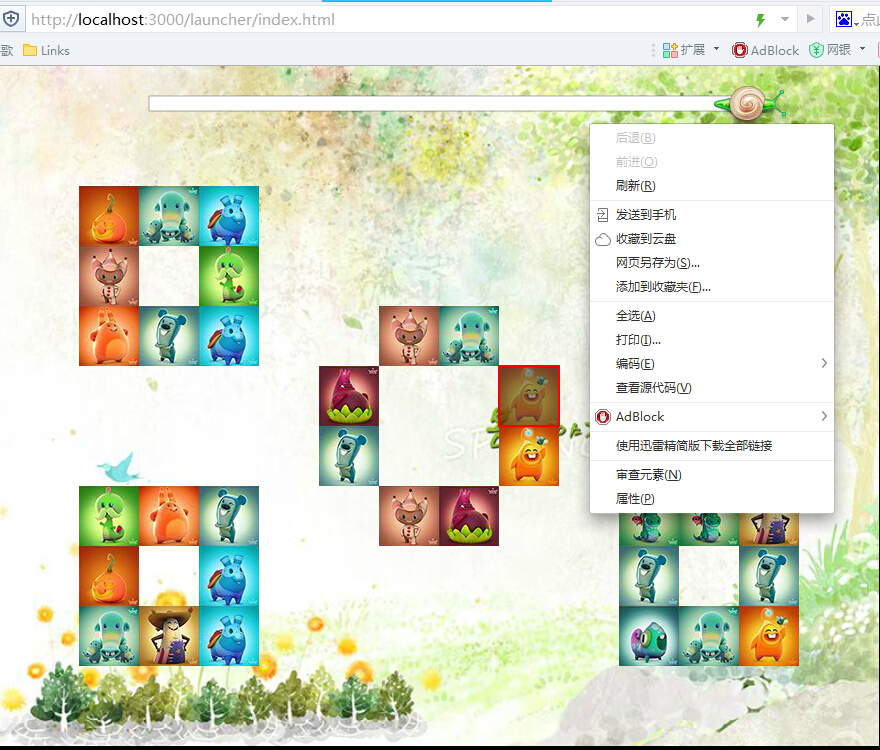

安装好EgretConversion后，为了快速上手，可以用工具自带的示例项目来熟悉基本操作流程。

**查看示例项目的流程如下：**

----

打开工具后，自动切换到了欢迎界面。

**1.  选择欢迎界面的“导入示例项目”->“示例项目一：连连看”。**

工具将自动跳转到“转换步骤”页面，并开始加压示例项目的过程，在下方的日志区会显示当前解压进度，大概20秒左右解压完成。

然后开始自动创建一个空egret项目并编译。

**2. 在创建egret项目完成后，按照转换页面的提示，依次点“转换Flash项目”，“编译Egret项目”，“运行Egret项目”，即可自动在浏览器中打开转换之后的html5游戏。**

**3.步走：**

运行效果：

可以看到游戏成功在浏览器页面上运行起来了，而没有使用flash player。

这里要注意的是：开发时最好使用chrome浏览器，如果当前无法自动弹出浏览器页面，可以手动在浏览器里打开 

**3. 查看示例项目代码**

打开的示例项目源码位置如下，可用相应IDE打开查看。

源Flash builder项目：C:\Users\***\Documents\project\LianLianKan

生成的egret项目：     C:\Users\***\Documents\project\llk\lianliankanhttp://localhost:3000/launcher/index.html。

**4. 修改代码查看转换结果**

如果修改原flash项目，需要从“转换Flash项目”这一步转换项目。

如果修改的是egret项目，从“编译Egret项目”这一步开始。

注意：“转换Flash项目”操作会重新生成所有代码，如果在转换后的egret项目有修改要注意备份。

