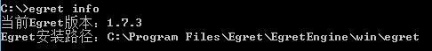
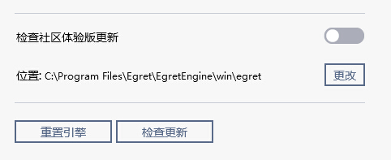
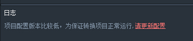

## 使用EgretConversion转换工具之前需要做哪些准备工作呢？

### 一. 在本机安装Egret环境

转换工具EgretConversion可将Flash的项目转换为基于Egret的项目。因此需要事先安装Egret Engine，否则工具无法运作。

Egret Engine下载地址在[http://www.egret.com/products/engine.html](http://www.egret.com/products/engine.html)，这里提供了Egret最新发行版和各个历史版本，目前提供的有Windows和Mac两个版本的下载。

下载之后直接双击安装。

检查是否安装Egret Engine成功，可在命令行中输入Egret，如果列出了可用的Egret命令列表，这就表明已经安装成功。

下面是egret安装文档链接：

[安装与部署](../../Engine2D/projectConfig/installation/README.md)

二. 使用EgretConversion所需的Egret版本

工具使用特定版本的Egret，当前EgretConversion使用的是 [2.0版本的Egret](http://www.egret.com/products/engine.html)。

如果本机正在使用的Egret版本低于EgretConversion所要求的版本号，则可能出现转换后项目报错情况。

查看本机Egret版本的命令为`egret info`

这是我的本机版本:

配置本机Egret版本为EgretConversion可用的版本:

a. 在引擎管理面板升级Egret为最新版。[参考Egret引擎更新](http://edn.egret.com/cn/docs/page/581#检查更新按钮)

b. 切换egret版本：

通过在引擎管理面板配置Egret位置可以切换到其他版本Egret。

点“更改”按钮选择其他路径下的egret为要使用的版本。

不同版本的Egret可从github获取到，egret的github地址是[https://github.com/egret-labs/egret-core](https://github.com/egret-labs/egret-core)。

更换Egret版本后用egret info命令检查最新版本号，然后重新启动EgretConversion工具，否则工具创建的egret项目依然是之前版本的。

注意：如果升级了EgretConversion，所需的Egret版本也可能会提升。打开EgretConversion后会自动检测到Egret的版本并提示升级。

### 三、安装EgretConversion

Egret配置正确后，接下来安装EgretConversion：

下载地址：http://www.egret.com/egretconversion，也可通过引擎管理面板获取和升级EgretConversion。

安装EgretConversion，安装过程的任何问题请联系我们的支持团队。

### 四、升级EgretConversion

在引擎管理面板中升级EgretConversion到最新的版本。打开EgretConversion，选择已存在的项目有如下类库升级提示：

点更新配置升级旧项目到最新的工具类库。

EgretConversion联系方式：

官方QQ群：Egret Conversion VIP 249685517

官方论坛：[http://bbs.egret.com/forum.php?mod=forumdisplay&fid=70](http://bbs.egret.com/forum.php?mod=forumdisplay&fid=70)