本文档对EgretConversion工具做个大概介绍，通过本文档可以总览工具的所有功能特征，每个功能的具体用法在之后相应的文档中做详细解释。

## 一、菜单

**菜单->文件**

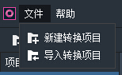

新建转换项目：这是EgretConversion的入口，所有的转换项目都要从这里创建。点击将弹出”新建转换项目“面板，填入项目名称、项目路径、项目类型、输出路径等几项参数。确定后将创建一个转换项目。

导入转换项目：导入一个之前已经创建好的转换项目。点击将弹出”导入项目“面板，选择或输入转换项目目录即可导入已存在的转换项目。

**菜单->帮助**

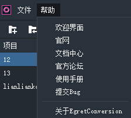

欢迎界面：点击后标签页跳转到欢迎页

官网：点击在浏览器中打开Egret官网页面。

文档中心：点击在浏览器中打开EDN中心。

官方论坛：点击在浏览器中打开官方论坛。

使用手册：点击在浏览器中打开EgretConversion文档页面。

提交bug：点击弹出”问题反馈“面板，可直接在这里提交遇到的bug，或者给工具的开发团队提任何建议等反馈。并可上传附件。

关于EgretConversion：点击打开关于面板，主要用于查看当前EgretConversion版本号。

## 二、工具栏 

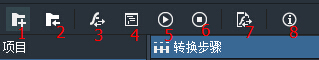

1："新建转换项目"按钮，功能同菜单->文件->新建转换项目。

2："导入转换项目"按钮，功能同菜单->文件->导入转换项目。

3："转换"按钮，点击将开始转换Flash的项目到Egret的项目，转换过程在日志区中会有相关提示。详见后续文档。

4："编译"按钮，点击将编译转换后的Egret项目，编译过程在日志区有相关提示，编译错误会直接显示在日志区。详见后续文档。

5："运行"按钮，如果编译通过，点击将直接运行egret的项目。详见后续文档。

6："停止运行"按钮，如果转换后的项目正在运行，点击可关闭egret内部服务器，再刷新浏览器页面项目就无法运行了。参考运行项目。

7："SWF转换工具"按钮，点击打开转换swf面板，拖入swf文件即可单独转换为egret项目的资源。这部分在后面的文档中做详细解释。

8："问题反馈"按钮，功能同菜单->帮助->提交Bug。

## 三、项目工作区

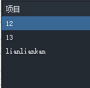

项目工作区位于界面左侧，这里列出了之前创建的转换项目。点选某个项目，在工具中所做的操作都是针对该项目。左键选择项目，右键可打开快捷菜单：

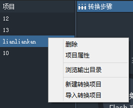

删除：删除选中的转换项目。会弹出删除确定面板：

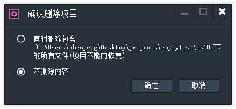

同时删除包含：删除项目的同时删掉转换项目目录下的所有文件。

不删除内容：只删除项目在工作区的引用，不真实删项目文件。

项目属性：点击打开项目的属性配置界面：

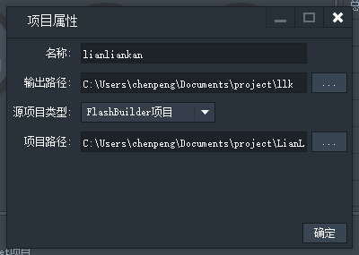

浏览输出目录：点击直接打开转换项目目录。

新建转换项目：功能同菜单->文件->新建转换项目。

导入转换项目：功能同菜单->文件->导入转换项目。

**标签页**

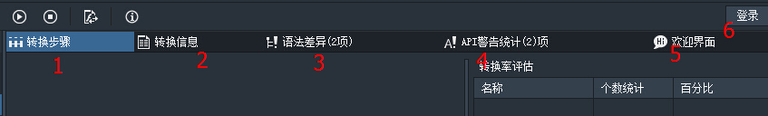

1：转换步骤：转换项目时的工作区，详见下文。

2：转换信息：转换完项目后，代码文件与swf文件的转换情况报告在这里全部列出。

3：语法差异：在as3代码转换到ts代码后，typescript与actionscript不兼容语法都在这里列出，可以对照提示逐条修改。详见后续文档的语法差异部分。

4：API警告统计：转换过程中遇到的API或者不可转换的as3类在这里列出，详见后续文档如何手动修复此类警告信息。

5：欢迎界面：转换工具的欢迎页。有转换项目、导入项目等快捷方式，示例项目，相关教程链接等。

6：登陆：提供登陆和注册功能，登陆后可以特定身份提交bug反馈给官方。

## 四、日志区

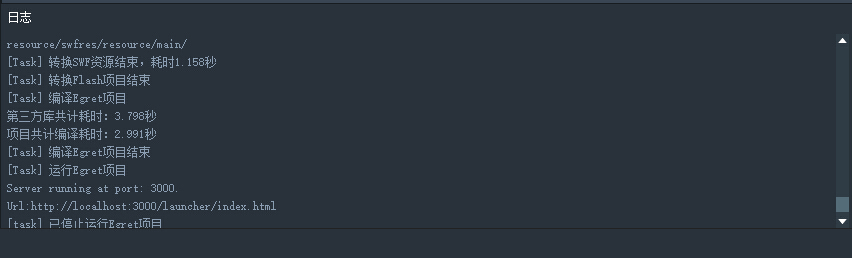

 日志区实时显示转换项目当前进度，log信息，提示信息等。
 
## 五、转换步骤标签页：
 
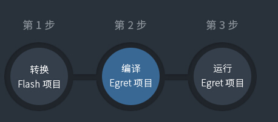

转换Flash项目：功能同工具栏->转换按钮

编译Egret项目：功能同工具栏->编译按钮

运行Egret项目：功能同工具栏->运行按钮

## 六、转换率评估区

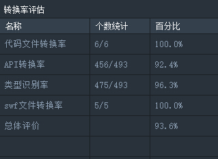

* 代码文件转换率：as3文件到ts文件转换情况，每个as3的文件都会被转换对应的ts文件，语法从actionscript3转换为typescript的语法。这里显示了文件转换个数。点击条目会切换到”转换信息“页面，在这里可看到具体的哪个文件转换成功了，哪个转换失败了。

* API转换率：统计了Flash的API转换到Egret过程中，API成功转换的个数和比例，此数值越高越好。点击条目会切换到“API警告统计”标签页。见“API警告统计”说明。

* 类型识别率：统计了as3与ts在语法上类型转换一项上的个数统计与转换比例，此数值越高越好。点击条目会切换到“语法差异”。见“语法差异”说明。

* swf文件转换率：swf文件被解析的个数统计。点击条目会切换到”转换信息“页面，在这里可看到具体的哪个文件转换成功了，哪个转换失败了。

* 总体评价：对上述几项数值做出的综合评估，大体反应当前项目转换到egret的比例。此项数值越高越好，但也不表明100%就表示完全转换成功，不到100%就是转换失败，具体情况需视项目而论。