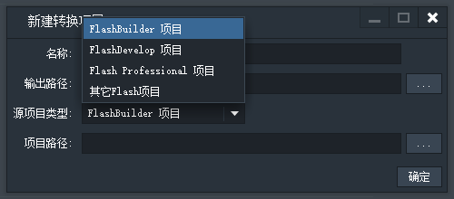

## Egret Conversion 2.0.1 特性解读

Egret Conversion是一款可以快速的将现有的Flash项目转换到Egret HTML5项目的转换工具。随着 Egret Conversion 版本的不断迭代，其转换项目的成功率进一步提升。

### 单文件转换

在2.0.0以前的版本中我们有着非常多的需求是，转换一些功能相对独立的代码模块，如A*，通信库以及自定义的功能类等等，旧有的方法：

1. 建立一个新的Flash项目。

1. 复制所需代码到新的项目中。

1. 新建一个转换项目导入Flash项目。

1. 转换Flash项目-》编辑Egret项目-》运行

我们每次都需要通过复杂的步骤去转换我们需要的一些功能模块或资源，现在通过单文件转换功能，我们可以非常方便的将ActionScript 3代码以及SWF转换为Egret项目所使用的语言或资源,不管从转换成本与调试成本都极大的提高了我们效率，通过拖拽方式进行便捷转换。友好反馈机制，可以了解到转换过程中一些问题所在，方便定位去修复问题。

> 注意：这里指的单文件转换不只是单个文件，也可以是文件夹形式。

### 支持Flash Pro项目

通过Flash Pro建立的项目或文档类现在可以进行导入。



现在Egret Conversion可以直接导入的项目包含Flash Pro、Flash Builder、FlashDeveloper以及自定义模式。自定义模式允许我们设置代码路径、AS启动类、资源路径三项来确定我们项目导入的基本参数。

### 支持final public class的写法

后续对于新添加语法分析的部分直接看代码比较直观，现在可以转换类似的代码：

```
package
{
   public final class Math
   {
        //...
   }
}
```

### 支持全局函数的写法

```
package starling.utils
{
    public function deg2rad(deg:Number):Number
    {
        return deg / 180.0 * Math.PI;   
    }
}
```

### 支持全局变量的写法

```
package Math
{
	public var E:Number = 2.718 ;
}
```

### 引擎更新

Egret Conversion是基于Egret引擎最新版进行语法转换，有时候我们由于调试或其他原因，我们的引擎版本可能低于转换要求的版本。使我们转换出现一些问题，主要集中在缺少引擎新增API。 现在通过内部的检测机制给出提示信息定位问题：

* 为保证转换项目正常运行，请更新 Egret Engine 到 2.0.n

* 未找到Egret引擎，请安装Egret引擎

### Retina屏幕适配

### 需要手动解决的

目前遇到的一些问题，不过这些问题都可以通过简单方式避免：

1. int.MAXVALUE 转换后变成 number["MAXVALUE" + ""] 这个是要手动修改成 Number.MAX_VALUE 当然这样不能保证你的逻辑是对的。

1. Socket 转换 后变成 WebSocket 的同时服务器也是要修改的，不然会出现 WebSocket connection to 'ws://xxx:8080/' failed: Connection closed before receiving a handshake response 握手失败。

1. set、get同名方法子类重写会出现出错。目前需要规避这类写法。

1. namespace 暂时不推荐使用。Retina屏幕适配与代码以及资源无关，主要是为了软件在一些高分屏（视网膜显示屏）提供更加友好的体验。其实从这里能看出团队对于用户的的态度。不过还是希望把重点放在对代码与资源的转换上。

### 修复

* [修复] ts 修改LoaderInfo.ts 资源重复加载

* [修复]英文状态下Api详细提示界面排版错乱

* [修复]修改导入项目不能转换项目

* [修复]修改再次打开Egret Conversion 已创建项目运行报错

* [修复]修复代码转换bug，跳过namespace导致的无法转换代码（代码转换遇到namespace 失败 ，转换继续进行）

* [修复]单独转换swf卡死问题

* [修复]修改再次打开Egret Conversion 已创建项目运行报错

* [修复]修复代码转换bug，跳过namespace导致的无法转换代码

* [优化]界面表格放缩异常

* [优化]单独转换swf弹框增加提示信息，转换过程进度等