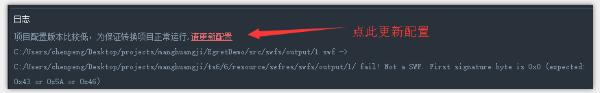
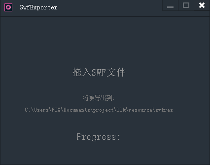
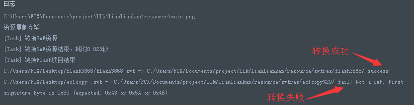
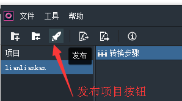
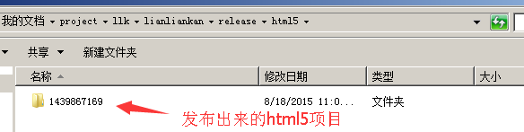

## Egret Conversion 2.2.0 特性解读

在 Egret Conversion 进入2.0以来，团队更加注重优化用户体验，解决实际项目转换过程中遇到的问题。让我们一起来看看，刚刚发布的 Egret Conversion 2.2.0 带来了哪些优化和新功能来帮助我们把 Flash 项目转换成 Egret 项目吧。

### 遇到类库需要升级怎么办？

需要手动拷贝过去？不需要这么做。在新版本的 Egret Conversion 里，选择项目，如果需要升级类库的话将会有下面的提示：

点击更新项目配置,工具会将旧项目升级到最新的工具类库。Egret Conversion 新增的检测项目类库是否需要升级并给出提示的功能，方便我们在转换过程中快速定位到问题所在，并轻松解决之。同样的，在其他方面 Egret Conversion 2.2.0 也做出了相应的优化改善。

### 优化的swf转换工具

单swf文件导出资源增加识别项目源码中swf的能力,项目源代码路径下swf可通过SWF转换工具（SWFExporter）直接生成到egret资源目录下。

遇到坑了怎么办呢？在日志区域打印着转换的过程，我们可以直接看到遇到了哪些坑，是否能跳过去。

上面我拖拽了两个swf文件，可以看到头一个转换成功，并且输出到了相关文件夹下。第二个文件告诉我转换失败，并不是一个swf文件。看来我要检查一下我的文件本身了。转换成功的文件我就可以在 egret 项目中使用了。

### 提升转出项目的质量

我们把 Flash 项目转换成 egret 项目之后，当然要先看看转换的效果如何。为了提高转出项目的质量 Egret Conversion 2.2.0 修复和优化了很多内容：

* 动态文本颜色只显示白色的bug修复，现在可以显示正确的颜色了。

* 动画播放过程中跳动现象已修复。

* 优化了动画播放性能，增加了缓存机制。

* UI对复杂多层级面板支持更好。

### 新特性

* 增加对位图填充矢量图形的支持，完美支持填充的位图缩放、旋转及打散后使用部分图形。

* 静态文本使用字形字体，不再导出为图片。统一转换为使用设备字体，以提升效率和支持文字着色。

### 发布项目

现在可以直接将转换好的 egret 项目发布出来了。

转换 Flash 项目到 egret 项目之后可以编译-运行 egret 项目来查看效果。之后可以直接点击上面的发布按钮来发布一份 html5 版本的项目啦。

上面就是刚刚发布出来的html5项目。

#### Egret Conversion 还在不断完善当中

Egret Conversion 2.2.0 还修优化了很多地方，比如大幅减少了工具卡死闪退等。

Egret Conversion 还在不断完善当中，希望您能留下宝贵意见。

EgretConversion联系方式：

官方QQ群：Egret Conversion VIP 249685517

官方论坛：http://bbs.egret.com/forum.php?mod=forumdisplay&fid=70