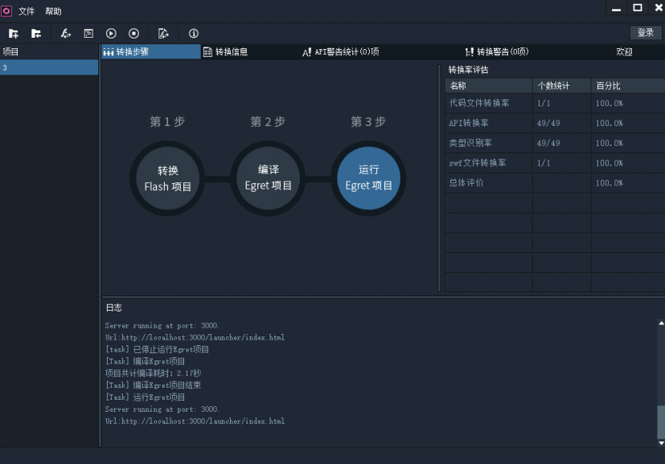
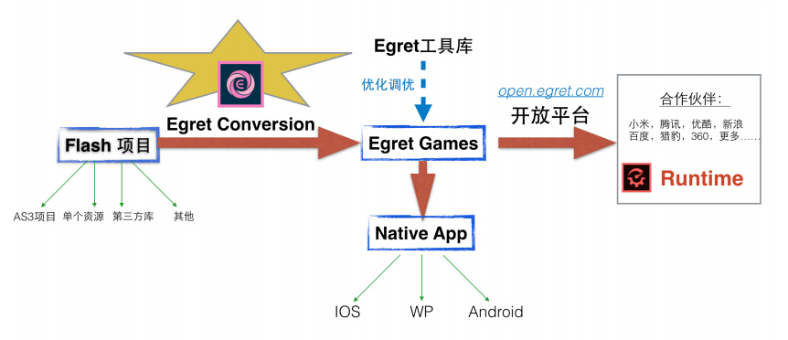
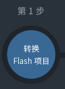
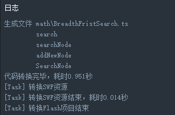
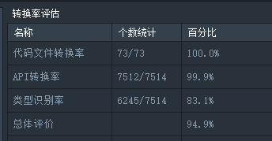
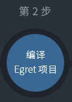

Version 2.0.0

Egret Technology

Egret Conversion 2.0 产品白皮书

2015年7月

**Egret Conversion 2.0 产品白皮书**

## 什么是Egret Conversion 2.0?

Egret Conversion是白鹭时代推出的一款重要产品，可以快速的将现有的Flash项目转换到Egret HTML5项目。界面友好易用，无需其他工具的辅助。功能强大可扩展，支持AS3各种复杂语法特性，涵盖绝大部分的Flash API，并且支持swf资源的直接转换。

随着Flash技术移动版的缺失和HTML5市场的不断成熟，越来越多的Flash项目需要向HTML5平台迁移转换。而Flash工程师更加迫切的需要选择一款高效易用，成熟度和认可度高的HTML5引擎作为技术移植和项目转换的目标。

Egret Conversion提供的是一整套的项目转换解决方案。不仅能够帮助开发者高效的迁移Flash项目，而且提供后期项目优化和维护的高效解决方案；不仅帮助生成Egret HTML5项目，还可以帮助转换后的项目更好的接入HTML5整个生态渠道，享受更好的后期服务。

Egret Conversion的产品特性：

* 集成化界面，转换过程的所有操作均在这一个工具中完成。通过自带的demo项目可迅速了解整个转换流程。

* 支持99%的AS3语法特性，甚至包括Embed等标签，Dictionary，XML，For each...

* 对Flash API的支持达到90%以上。

* API定制功能可以轻松自行扩展尚未支持的API，无需等待新版本的发布。

* 轻松扩展第三方库。可用工具快速转换第三方库。

* 对swf强大的支持，支持直接转换swf资源。对位图、文本、SimpleButton、矢量动画、帧动画、声音等常用类型有良好的支持。

* 支持动态创建链接类对象。

* 转换过程全面的智能提示。

* 丰富详尽的转换结果报告，包括语法兼容性及转换率报告，API转换和警告列表，类型提示列表报告，资源转换报告等。

 

## Egret Conversion 2.0能用来做什么？

    1. 转换AS3项目到Egret HTML5项目。

    2. 转换Flash第三方类库、个人类库到Egret HTML5项目。

    3. 支持使用Flash制作的swf资源转换成Egret可用的资源。

    4. 支持位图，动画，矢量等单个资源的转换。

 

## 为什么选择Egret Conversion 2.0？

### 1. 强大的HTML5游戏引擎Egret Engine

* Flash页游领域是个成熟的市场，有很多成功优秀的案例。随着Flash移动版的缺失和HTML5市场的逐渐火爆，大量优秀的传统Flash项目需要快速低成本的往移动端迁移。而Flash开发者也需要寻找一个市场覆盖广，熟识度高，易上手的引擎做项目的平台迁移。

* 白鹭引擎Egret Engine为HTML5而生，引领H5游戏整个生态的发展，其基于TypeScript语言封装的语法结构与Flash AS3非常相似，所以Egret成为Flash开发者在做项目转换时考虑的首选方向。

### 2. 项目转换功能的强大

* 支持AS3的绝大部分语法结构，类、接口、函数、各种语句、操作符等。

* 支持AS3的特殊语法结构和类型，如Embed、for each和XML、Dictionary等。

* 支持Flash制作的swf资源的转换。

### 3. 简洁的操作，实现高效转换

无需任何配置，从打开Egret Conversion 2.0到转换完成一个Egret项目只需简单几步操作即可。

### 4. 全面友好的提示，支持错误的快速定位和解决

简洁的转换率报表让你了解整体的转换情况。

在转换过程中不可避免的会出现Flash和Egret不兼容的地方，比如语法兼容性问题，API兼容性问题，这些都不用你担心，工具会告诉你问题出在哪，只要按照我们建议的方案修改即可。

### 5. 强大的后续Egret项目调优，打包，发布以及运营的一站式解决方案的支持

选择了Egret Conversion 2.0就是选择了Egret HTML5工具流和发布平台解决方案，从产品研发，项目转换，调试优化，打包发布到上线运营，一站式解决方案，解决后顾之忧。

转换后的Egret项目运行在集成Runtime的渠道平台上，将获得接近于原始页游项目的性能体验。Egret开放平台更可以帮助转换后的项目迅速接入HTML5主流渠道，实现流量变现。

## Egret Conversion 2.0 入门

**使用Egret Conversion 2.0之前需要先下载更新Egret Engine 最新版本。从官网下载Egret Engine:[http://www.egret.com/products/engine.html](http://www.egret.com/products/engine.html)**

* 新建一个转换项目

点击确定后会在输出路径D:\ConversionOut下创建一个名为EgretGame的Egret项目，并且Copy一些必要的配置文件到D:\ConversionOut\config目录下。

* 点击转换按钮

1) 源码转换。工具会根据已写好的语法转换规则和D:\ConversionOut\config目录下的API映射关系转换as3源码到D:\ConversionOut\EgretGame\src目录下。

2) 资源拷贝。自动copy Flash项目输出目录(如bin-debug)下的资源文件，如png、xml、txt等文件，到D:\ConversionOut\EgretGame\对应的目录下。

3) swf资源转换。转换Flash项目输出目录下的swf资源文件，并生成对应的资源到D:\ConversionOut\EgretGame\resources\对应的目录下

在上面的每一个过程中都会输出日志到主界面下面的日志面板中：

并且生成一个转换统计结果：

统计结果的每一项都会反映当前项目的转换概况。

* 点击编译按钮

点击后工具会调用Egret Engine的build命令，编译转换后的Egret项目。

编译的错误提示会在日志窗口显示出来。

* 点击运行按钮

点击后工具会调用Egret Engine的run命令，可以在浏览器中预览Egret项目效果。

更加详细的Egret Conversion 2.0使用方法请参考：[http://edn.egret.com/cn/](http://edn.egret.com/cn/)

更多信息

Egret官方网站 [http://www.egret.com](http://www.egret.com)

Egret Conversion 2.0产品页 [http://www.egret.com/products-conversion](http://www.egret.com/products-conversion)

开发者中心 [http://edn.egret.com/cn/](http://edn.egret.com/cn/)

