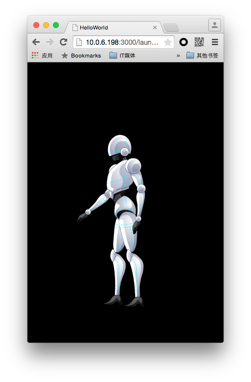

首先从DragonBones Pro中导出一份骨骼动画数据。你可以点击下面的连接下载。

[Robot.zip](http://sedn.egret.com/ueditor/20150701/55937e0a59ba9.zip)

我们通过Res Depot工具将资源中的`texture.png`，`texture.json`和`RobotGame_1.json` 添加到项目组中。

使用RES模块加载资源完成后，可以创建基于DragonBones的骨骼动画。

实例化DragonBones所需要的数据。

```
var dragonbonesData = RES.getRes( "RobotGame_1_json" );  
var textureData = RES.getRes( "texture_json" );  
var texture = RES.getRes( "texture_png" );
```

DragonBones动画由工厂类进行管理，可以使用EgretFactory对象来处理所有的动画数据以及贴图。
步骤如下：

1. 创建EgretFactory类型对象
2. 解析外部数据，并添加至EgretFactory中
3. 设置动画中绑定的贴图

```
var dragonbonesFactory:dragonBones.EgretFactory = new dragonBones.EgretFactory();  
dragonbonesFactory.addDragonBonesData(dragonBones.DataParser.parseDragonBonesData(dragonbonesData));  
dragonbonesFactory.addTextureAtlas(new dragonBones.EgretTextureAtlas(texture,textureData));
```

数据准备好后，需要从数据中提取出需要的骨架系统。在DragonBones中，骨架有多个骨骼组成。每个骨架中绑定了当前骨架的动画数据。

`var armature: dragonBones.Armature = dragonbonesFactory.buildArmature("robot");`

通过`buildArmature`方法，我们提取名称为`robot`的骨架。要想在舞台中看到该骨架，我们需要将其显性的添加到的舞台当中，可以使用下面语句。

```
this.addChild(armature.display);
armature.display.x = 200;
armature.display.y = 300;
armature.display.scaleX = 0.5;
armature.display.scaleY = 0.5;
```

`armature`是名称为`robot`的骨架对象，其中display为当前骨架的显示对象。将其添加到显示列表中，就可以在舞台中看到当前提取的机器人。效果如图：



DragonBones的动画播放系统由一个WorldClock（世界时钟）控制。你需要手动激活WorldClock。

播放骨架动画，需要三步操作。

第一步：将当前骨架添加到世界时钟当中

```
dragonBones.WorldClock.clock.add( armature );
```

第二步：设置骨架动画，指定播放的动画。

```
armature.animation.gotoAndPlay("Run");
```

每个骨架中都包含一个Animation对象，负责操作当前骨架的所有动画数据。执行`gotoAndPlay`时，需要指定即将播放的动画名称。当前实例中的`Run`动画我们可以在DragonBones Pro中进行编辑查看。


第三步：手动刷新世界时钟

刷新WorldClock，在Egret中有两种方法。一种使用EnterFrame事件，另外一种使用Ticker心跳控制器。

推荐第二种方式，可绕过Egret事件系统，提高执行性能。 

```
egret.Ticker.getInstance().register(  
          function(frameTime:number){dragonBones.WorldClock.clock.advanceTime(0.01)},  
    this  
);
```

这里这个参数传的是0.01，会让帧频固定在20帧，应该传-1，或者传frameTime/1000。

编译程序预览，你可以看到机器人在舞台中进行跑步动作。
你也可以使用更加简便的API来创建骨骼动画。

完整代码如下：

```
private createGameScene(): void {
      
    var dragonbonesData = RES.getRes( "RobotGame_1_json" );
    var textureData = RES.getRes( "texture_json" );
    var texture = RES.getRes( "texture_png" );
      
    var dragonbonesFactory:dragonBones.EgretFactory = new dragonBones.EgretFactory();
          dragonbonesFactory.addDragonBonesData(dragonBones.DataParser.parseDragonBonesData(dragonbonesData));
    dragonbonesFactory.addTextureAtlas(new dragonBones.EgretTextureAtlas(texture,textureData));  
    var armature: dragonBones.Armature = dragonbonesFactory.buildArmature("robot");  
       this.addChild(armature.display);  
     
       armature.display.x = 200;  
       armature.display.y = 300;  
       armature.display.scaleX = 0.5;  
       armature.display.scaleY = 0.5;  
     
       dragonBones.WorldClock.clock.add( armature );  
       armature.animation.gotoAndPlay("Run");  
     
       egret.Ticker.getInstance().register(  
       function(frameTime:number){dragonBones.WorldClock.clock.advanceTime(0.01)},  
       this  
       );  
      }
```      