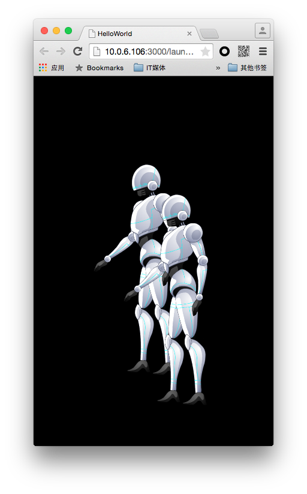
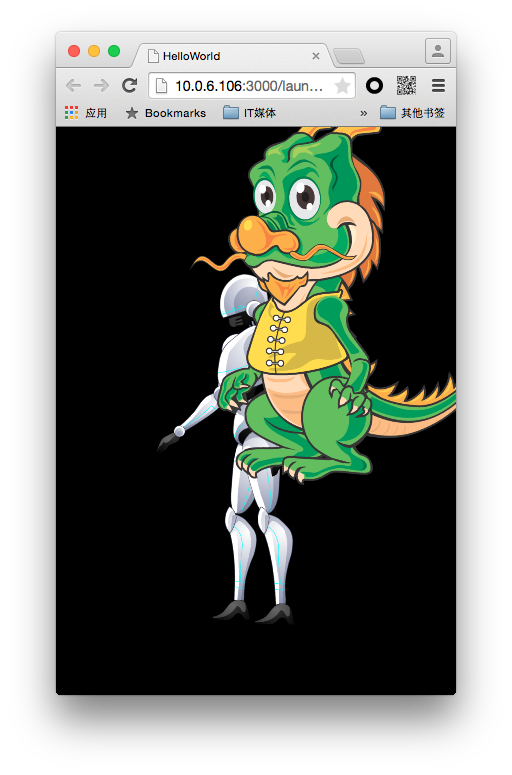

DragonBones系统中允许创建多个骨骼动画，用户可以创建多个EgretFactory来管理不同的骨骼动画，也可使用同一个EgretFactory来管理多个骨骼动画。

使用多个EgretFactory时，可以单独操作EgretFactory，以及读取出的骨架和数据。使用同一EgretFactory时，需要对数据进行命名操作，以区分骨架系统与动画数据。

使用多个EgretFactory方法可参考**创建骨骼动画**一节。
范例如下：

```
var dragonbonesData = RES.getRes( "RobotGame_1_json" );
var textureData = RES.getRes( "texture_json" );
var texture = RES.getRes( "texture_png" );
var dragonbonesFactory:dragonBones.EgretFactory = new dragonBones.EgretFactory();
var armature:dragonBones.Armature = dragonbonesFactory.buildArmatureUsingArmatureDataFromTextureAtlas(
  dragonBones.DataParser.parseDragonBonesData(dragonbonesData),
  dragonBones.DataParser.parseDragonBonesData(dragonbonesData).getArmatureDataByName("robot"),
  new dragonBones.EgretTextureAtlas(texture,textureData)
);
this.addChild(armature.display);
armature.display.x = 200;
armature.display.y = 300;
armature.display.scaleX = 0.5;
armature.display.scaleY = 0.5;
var dbfactory:dragonBones.EgretFactory = new dragonBones.EgretFactory();
var arm:dragonBones.Armature = dbfactory.buildArmatureUsingArmatureDataFromTextureAtlas(
  dragonBones.DataParser.parseDragonBonesData(dragonbonesData),
  dragonBones.DataParser.parseDragonBonesData(dragonbonesData).getArmatureDataByName("robot"),
  new dragonBones.EgretTextureAtlas(texture,textureData)
);
this.addChild( arm.display );
arm.display.x = 250;
arm.display.y = 350;
arm.display.scaleX = 0.5;
arm.display.scaleY = 0.5;
```

效果如图：



使用同一EgretFactory方法如下：

```
var dragonbonesData = RES.getRes( "RobotGame_1_json" );
var textureData = RES.getRes( "texture_json" );
var texture = RES.getRes( "texture_png" );
var dbdata = RES.getRes("Dragon_json");
var dbtexturedata = RES.getRes("dragontexture_json");
var dbtexture = RES.getRes("dragontexture_png");
var dragonbonesFactory:dragonBones.EgretFactory = new dragonBones.EgretFactory();
dragonbonesFactory.addDragonBonesData(dragonBones.DataParser.parseDragonBonesData(dragonbonesData));
dragonbonesFactory.addTextureAtlas(new dragonBones.EgretTextureAtlas(texture,textureData));
dragonbonesFactory.addDragonBonesData(dragonBones.DataParser.parseDragonBonesData(dbdata));
dragonbonesFactory.addTextureAtlas(new dragonBones.EgretTextureAtlas(dbtexture,dbtexturedata));
var armature:dragonBones.Armature = dragonbonesFactory.buildArmature("robot");
this.addChild(armature.display);
armature.display.x = 200;
armature.display.y = 300;
armature.display.scaleX = 0.5;
armature.display.scaleY = 0.5;
var arm:dragonBones.Armature = dragonbonesFactory.buildArmature("Dragon");
this.addChild( arm.display );
arm.display.x = 250;
arm.display.y = 350;
arm.display.scaleX = 0.5;
arm.display.scaleY = 0.5;
```

效果如图：

