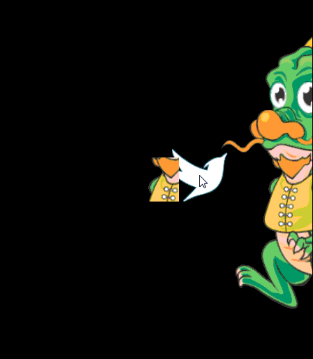

有的时候，对于一个有趣的游戏，仅仅播放预先设置的骨骼动画是不够的，我们需要角色具有动态可控的动作。令人高兴的是DragonBones提供了访问并控制骨骼框架里每根骨头的方法，让你的角色在游戏中随意运动。
下面示例通过鼠标在场景中的移动来控制骨骼。我们创建了一个跟随鼠标运动的小鸟，小龙人会与小鸟保持一定距离，同时小龙人的头和胳膊会跟随小鸟运动而做出不同姿势，非常有趣。完整的项目代码可以在示例中心下载此示例。

[程序控制骨骼运动](http://edn.egret.com/cn/index.php/article/index/id/691)

下面看一下实现这个功能的关键代码段。

```
this.head = this.armature.getBone("head");
this.head.offset.rotation = r;
```

从上面代码我们可以看到，通过方法dragonBones.Armature.getBone(_name:String):Bone来获取某个骨骼。骨骼中的offset是一个DBTransform对象，是专门用于给开发者设置叠加的变换信息的，包括平移，旋转，缩放，等等。我们可以根据游戏逻辑的需要对设置这些参数，从而实现动态控制此骨骼的效果。

>注意offset的值是叠加到骨骼上现有的变换，并不是取代骨骼上现有的变换。


