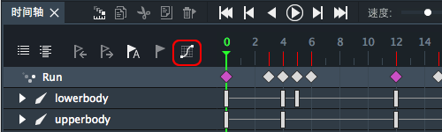
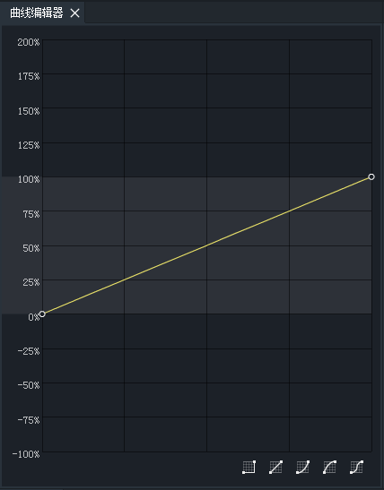
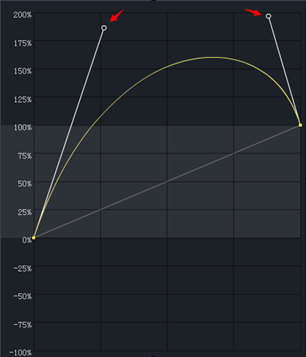
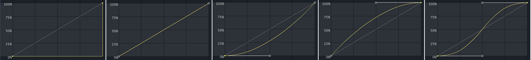
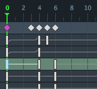

DragonBones 4.1 新添加了曲线编辑器面板，在这个面板中，您可以对帧与帧间的补间应用曲线来实现不同的补间效果。

进入动画模式，选中一个关键帧（其后含有补间的关键帧），然后点击时间轴上的曲线按钮。如下图：

曲线编辑器面板打开，如下图：

拖动上下的两个手柄可以手动调整曲线。

面板右下方为预置曲线设置

由由左到右依次为，无，线性，淡入，淡出，淡入淡出。每个预设的曲线图如下：

应用曲线后的时间轴如下图：

曲线特性：
* Y坐标轴上，向上最大值为200%，向下最小值为-100%。
* 预置的“无”曲线对应的就是无补间的效果。
* 曲线适用于：
    * 骨骼的旋转，移动，缩放。
    * 插槽的颜色变换，透明度变化。
* 曲线面板只存在于动画制作模式
* 应用了曲线的两帧间新插入一帧，则切割产生的两端补间，左侧的继承原有曲线，右侧的为默认的线性。
* 三个前后相连的关键帧，其中前两帧间有曲线A，后两帧间有曲线B，删掉中间的关键帧，剩下的两帧间会应用曲线A，曲线B被删除。
* 以下情况曲线编辑器面板置空：

复选关键帧:
* 关键帧为当前层的最后一帧
* 选中事件层关键帧时
* 无关键帧选中时

