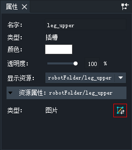
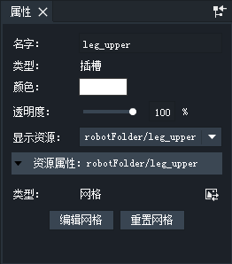
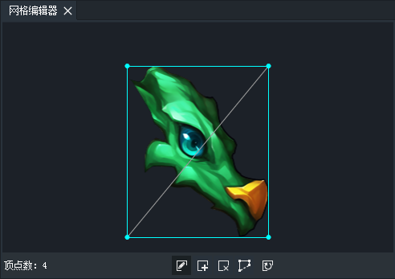
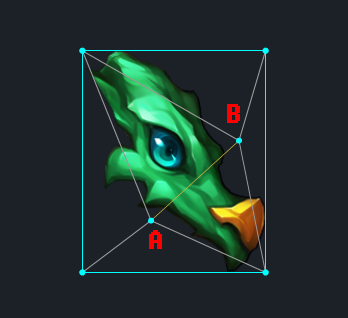

#### 简介
网格可以用来实现图片的任意变形和扭曲。
DragonBones Pro 从4.5.0开始支持网格的创建和编辑。

#### 创建网格
选中插槽或插槽内的图片，在属性面板，点击转换成网格按钮。

图片转换为网格后，插槽和图片的属性面板如下

点击“编辑网格”按钮，便可以打开网格编辑器面板，开始编辑网格。
点击“重置网格”按钮，网格中图片和网格顶点的对应关系会被重置，图片会恢复原有的形状。
点击“转换为图片”按钮，可以将网格重新转换回图片。

#### 网格编辑器

下方工具栏由左至右依次是：
- 顶点数：显示网格中顶点的个数
- 编辑工具：用来移动顶点（快捷键为Q）
- 添加工具：用来添加顶点（快捷键为W)
- 删除工具：用来删除顶点（快捷键为E)
- 边线工具：用来勾画网格边线的工具。注意，使用这个工具时，原有的顶点和边线会被全部清除。
- 重置工具：顶点会被重置为默认状态和数量。（四个顶点分居正方形的四个角）

使用添加工具可以添加顶点，通过拖拽还可以添加自定义连线。如下图

A或B点和四个角的顶点间的连线是灰色的，这是自动生成的连线。
A和B之间的连线是黄色的，这是通过拖拽生成的自定义连线。

#### 网格特性
- 网格拉伸图片到达的尺寸最大不能超过2048x2048
- 网格的边线必须是闭合的，如果绘制的边线没有手动绘制闭合，边线会自动闭合。
- 网格的旋转中心点为原图片的旋转中心点，不会因为网格边线的重新绘制或图片的拉伸而改变
- 当前版本中还不支持网格顶点基于权重绑定于指定骨骼
- 动画模式下，网格在时间轴上有独立的图层，对顶点的位移操作可以在时间轴上添加关键帧