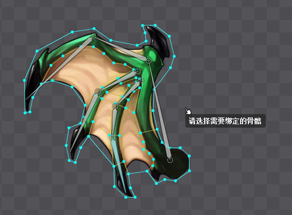
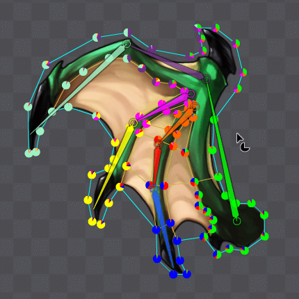

### 简介
蒙皮是指将网格点绑定在指定的骨骼上，基于绑定时分配的权重，网格点随着骨骼的运动而移动。蒙皮使得繁琐复杂的网格点操作只要通过简单的骨骼操作便能实现。

### 绑定方法

1. 首先要将图片转化为网格，并添加网格点。具体方法请参看[网格](http://edn.egret.com/cn/docs/page/874 "网格")
2. 选中网格，并在属性面板勾选“开启编辑”。（或者切换到权重工具，直接选择网格，便自动开启权重编辑)

3. 开启编辑后，点击“绑定骨骼”按钮，然后依次点选需要权重绑定的骨骼。选中的骨骼会被自动分配一个颜色以便和其他的绑定骨骼区分开来。

4. 骨骼绑定结束后，右键点击空白处，便会基于骨骼和网格点的相对位置自动计算分配权重。（若在初次绑定后再添加新的绑定骨骼到列表中，便不会再自动计算权重，这时可以点击属性面板中的“自动权重”按钮再次自动计算权重）骨骼绑定，权重计算完毕后如下图。此时每根骨骼的权重都是0，因为我们选中的是整个网格。

单独选中一个网格点的话，在属性面板便可以看到这个网格点分配给每根绑定骨骼的权重占比了。每根骨骼的权重比可以通过拖拽滑块儿调整。如下图

### 权重工具
在上边介绍的绑定方法中，绑定结束后，选中网格点，在属性面板可以调整绑定骨骼的权重占比。更便捷的方法是使用权重工具来调整。
在工具栏选中权重工具后，选中网格，便可直观的看出每个网格点中不同的绑定骨骼所占的权重。权重以饼状图展示，饼状图中的颜色与骨骼的颜色相对应。

单独选中一根绑定骨骼，然后选择一个网格点（若不选择，会提示需要选择一个网格点），然后按住鼠标左键，上下拖动，便可以改变选中骨骼在选中网格点中的权重占比。

依次选择不同的网格点，便可以调整选中骨骼在不同网格点中的权重占比。
如果需要快速的把一个网格点的所有权重100%的分配给选中骨骼，只要在选中骨骼的情况下，按住ALt键，然后依次点中要完全分配权重的点即可。

绑定及权重分配完毕后，便可以通过调整骨骼来控制网格的变形了。
