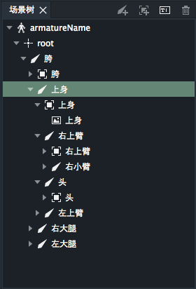
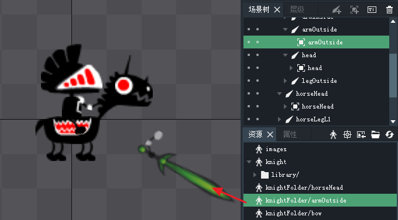
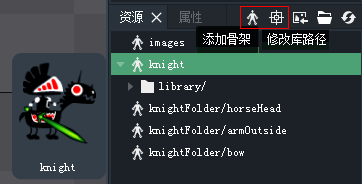
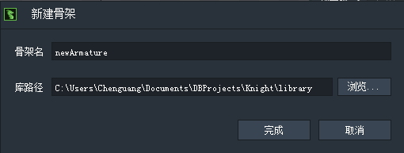

骨架是骨骼的集合，骨架中至少包含一个骨骼。一个项目中可以包含多付骨架。

下图中的armatureName及其以下的树状结构便是一个典型的骨架。

DragonBones Pro 从4.3开始，支持多骨架项目。

DragonBones的制作最早是依赖Flash Pro进行的。Flash Pro中的影片剪辑是可以嵌套的，对应到DragonBones格式中就是骨架的嵌套。

Flash Pro制作的包含多骨架或子骨架的DragonBones动画可以完美的用DragonBones Pro进行导入和再次编辑。

下图中便是一个DB导入的包含多骨架的Flash Pro项目。

导入的多骨架项目中的多个骨架会显示在资源库面板中，每个骨架中包含一个库目录，指向硬盘中的一个文件夹。

不同的骨架可以使用不同的库目录，也可以共享同一个库目录

鼠标悬浮到子骨架上可以显示骨架的预览图。

另外工具栏了增加了两个工具按钮，上图中红色框选的，分别是创建骨架和修改库路径。

点击添加骨架按钮，会弹出新建骨架对话框。新建骨架的时候要指定骨架对应的库路径。

