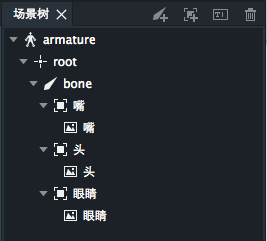
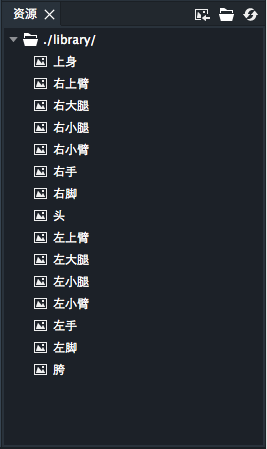
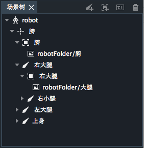

图片是最基本的设计素材，项目所需的图片都放在资源面板里。图片需要以插槽为中介来和骨骼绑定。如下图，“头”骨骼下有“嘴”，“头”和“眼睛“三个插槽，三个插槽下又分别有一个同名的图片。绑定后，图片依附于骨骼，随着骨骼的变动而变动（旋转，缩放，平移）。

DragonBones Professional支持纹理集和图片文件两种图片整理方式。
* 纹理集，一个文件里包括所有的图片，每个图片可以单独引用。
* 图片文件， 每一个图片都是单一的文件。

左侧为图片文件在资源库中的呈现方式。右侧为纹理集在资源库中的呈现方式。

图片特性：
* 图片不能重命名。
* 同一张图片可以多次被添加到场景中。
* 如果图片在资源库的子目录中，场景树中图片的全名会包括子目录名。如下图

