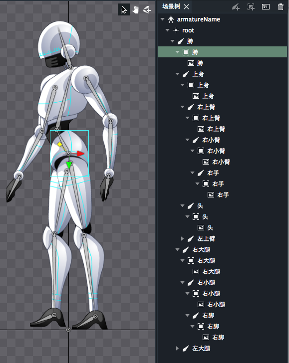

骨骼是骨骼动画的基本组成部分。骨骼可以旋转，缩放，平移。

骨骼创建的方法有两种：

1. 选择骨骼创建工具，在主场景内按住鼠标左键并拖拽。
2. 点击场景树面板上的创建骨骼按钮，会创建一个骨骼点。

DragonBones Pro 4.3 开始支持骨骼创建自动绑定图片。

自动绑定功能可以在首选项窗口开启和关闭。

当这个功能开启时，在用户通过创建骨骼工具拖拽创建骨骼时，系统就会智能的选择最匹配的图片，在松开鼠标时，骨骼创建完成，同时被选中的图片就会绑定到该骨骼上，并且骨骼会以绑定的图片命名。

骨骼的起点和终点都要在图片内，才能完成自动绑定。

如果用户对系统匹配的结果不满意，可以按下Ctrl键临时关闭自动匹配功能，在这种情况下松开鼠标，就不会有任何图片被绑定。同时，保持Ctrl按下，便处于手动绑定模式，用户就可以用鼠标选择指定图片（可以指定多张）绑定到刚刚创建的骨骼中。松开Ctrl键，绑定就会生效。然后可以继续创建骨骼自动绑定。

DragonBones Pro 4.5.0 开始，可以设置骨骼对父骨骼旋转和缩放的继承开关。

默认缩放和旋转都是勾选的，表示继承父骨骼的缩放和旋转。
* 不勾选“缩放”，表示不继承父骨骼的缩放。此时父骨骼的缩放不会影响所选的子骨骼。
* 不勾选“旋转”，表示不继承父骨骼的旋转。此时无论父骨骼怎么旋转，子骨骼始终指向同一个方向。（添加了IK约束的骨骼无法关闭旋转继承，关闭了旋转继承的骨骼无法添加IK约束）

DragonBones Pro 4.5.0 开始，选中骨骼后，鼠标悬停在骨骼末端，会出现绿色圆圈，拖动圆圈可以改变骨骼长度。

