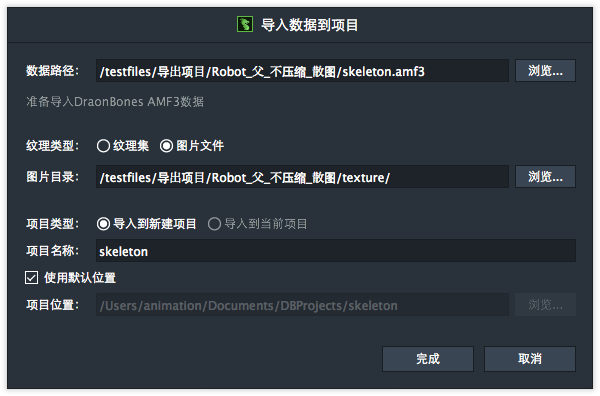

如果项目文件为文件夹形式，则选择相应的项目数据文件，json, xml或 amf。

DragonBones Professional 会自动判断项目使用的是图片文件还是纹理集，然后切换对应的导入选项，用户也可以手动切换。

a ). 纹理集

如果是纹理集，导入窗口扩展如下

纹理集路径和配置文件路径默认与项目数据文件在同级目录下。用户可以手动指定。

DragonBones pro 从4.3开始支持多纹理集的导入。

可以添加复数的纹理集文件和配置文件。（注：每个纹理集都要有一个对应的配置文件，也就是纹理集和配置文件是成对出现的。）

* 导入到新建项目：新建一个项目，将导入项目放在其中。
* 导入到当前项目：导入的项目会添加到当前项目中。DragonBones pro从4.3开始支持多骨架，新导入到当前项目中的骨架会显示在资源库中。

项目名称默认为导入的项目文件的文件名。

项目位置默认为“我的文档”+项目名称。DragonBones Professional会记住上一次用户选择的路径，勾选了“使用默认位置”的话，DragonBones Professional 会默认使用上一次用户选择的路径。 不勾选“使用默认位置“的话，用户可以手动指定项目保存的位置。

b ). 图片文件

如果是图片文件，导入窗口扩展如下

皮肤路径默认为项目数据文件所在目录+texture，用户也可以手动指定。

* 导入到新建项目：新建一个项目，将导入项目放在其中。
* 导入到当前项目：导入的项目会添加到当前项目中。DragonBones pro从4.3开始支持多骨架，新导入到当前项目中的骨架会显示在资源库中。

项目名称默认为导入的项目文件的文件名。

项目位置默认为“我的文档”+项目名称。DragonBones Professional会记住上一次用户选择的路径，勾选了“使用默认位置”的话，DragonBones Professional 会默认使用上一次用户选择的路径。 不勾选“使用默认位置“的话，用户可以手动指定项目保存的位置。

如果图片目录上找不到皮肤，完成按钮也是亮起的，可以点击。以保证用户可以导入不包含图片的项目文件。

