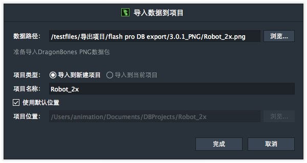

如果用户选择集成数据的PNG，导入窗口扩展如下

当前版本只能导入到新建项目，导入到当前项目不可用。

项目名称默认为导入的项目文件的文件名。

项目位置默认为“我的文档”+项目名称。DragonBones Professional会记住上一次用户选择的路径，勾选了“使用默认位置”的话，DragonBones Professional 会默认使用上一次用户选择的路径。 不勾选“使用默认位置“的话，用户可以手动指定项目保存的位置。

