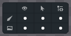

* 显示/可选/继承工具用于打开和关闭骨骼和插槽的显示，可选，继承关系。

* 显示: 打开时，骨骼或插槽在主场景中可见。关闭时，骨骼或插槽在主场景中不可见。

* 可选：打开时，骨骼或插槽在主场景中可以被选中。关闭时，骨骼或插槽在主场景中不可以被选中。

* 继承：打开时，骨骼或插槽会继承父骨骼的动作。关闭时，骨骼或插槽不会继承父骨骼的动作。

特性：

* 骨骼和插槽的显示在骨架装配和动画制作下均可用。

* 骨骼和插槽的可选在动画制作下，骨骼默认为可选且可修改，插槽默认为不可选且不可修改。

* 骨骼和插槽的继承在动画制作下默认为继承且不可修改。