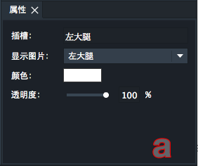
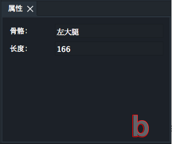
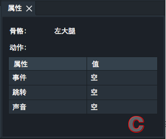

  

属性面板用于显示和编辑骨骼或插槽的各种属性值。a为插槽的属性面板，b为骨骼的属性面板, c为骨骼帧的属性面板。此面板在骨架装配和动画制作下均可显示。（骨骼帧属性面板只出现在动画制作）

a ). 插槽的属性：

不含图片的空插槽的属性只有名字，名字可以编辑，效果和重命名相同。

包含有图片的插槽的属性包括：名字，显示图片，颜色和透明度。
* 其中名字可以编辑，效果和重命名相同。
* 显示图片为当前插槽内可见并显示的图片，插槽内的所有图片都会在这个下拉列表中。显示图片显示为“空”时，插槽内的所有图片均隐藏，没有图片被显示。
* 颜色为叠加在图片上的颜色，点击会打开颜色选择窗口。默认为白色，表示无颜色叠加。
* 透明度默认为100%，表示不透明。最小为0%，表示完全透明。

b ). 骨骼的属性包括：

名字和长度。其中名字可以编辑，效果和重命名相同。长度可以编辑，控制骨骼的长度。（动画制作模式下，长度和名字都不可编辑）

c ). 骨骼帧的属性包括：

名称和动作。名称不可编辑。动作包括三个属性：事件，跳转，声音。可以根据游戏开发的要求填写相应的值。

