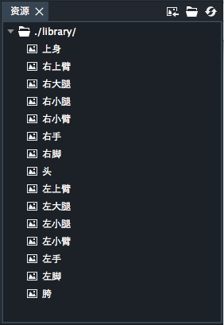

右上角按钮依次为：导入资源按钮，打开库文件夹按钮和刷新按钮。此面板只可以在骨架装配模式下显示。

项目所使用的所有图片都保存在资源面板中。DragonBones Professional每个项目的资源库都对应一个系统中实际存在的文件夹，文件夹中DragonBones Professional所支持的PNG图片都会被显示在资源面板中。

可以通过由系统其他文件夹向DragonBones Professional 的资源面板中拖拽PNG文件的方法，向资源库里添加图片，相应的PNG文件也会被拷贝到对应的资源库文件夹中。也可以点击“导入资源”按钮，在弹出的系统窗口中指定要添加的资源PNG文件。

