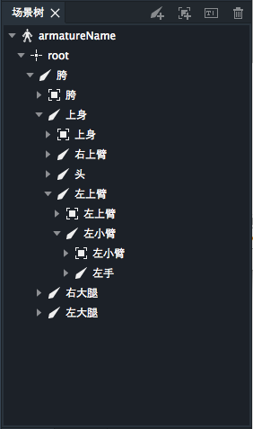

场景树面板用于显示和编辑主场景中骨骼和插槽的父子树形关系。

右上角按钮依次为：点骨骼创建按钮，插槽创建按钮，重命名按钮和删除按钮。

骨架装配模式下，双击场景树中的骨骼或插槽会弹出重命名窗口。

此面板在骨架装配和动画制作下均可显示。但在动画制作下，不可编辑。

骨骼和插槽可以在场景树中复选。

骨骼继承关系在场景树中的编辑：
* 骨骼间的继承关系可以通过在场景树面板内拖拽改变。
* 子骨骼可以被拖拽到同级或父及其以上的骨骼下。
* 父骨骼不能被拖拽到它的子骨骼及其以下骨骼下。
