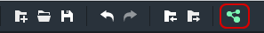
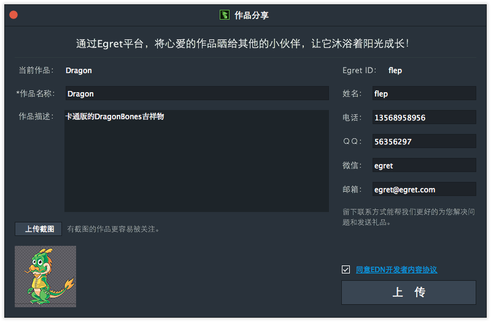

提供了一个展示您优秀作品的平台，通过作品分享功能，您可以将自己满意作品分享给大家。
通过点击系统工具栏上的作品分享按钮或文件菜单中的作品分享选项进入作品分享页面。

首先需要用Egret ID登陆（Egret ID,就是Egret开发者社区的账号），如果没有注册，请先访问开发者社区注册一个Egret ID。

登陆后，作品分享页面弹出

当前选中项目会作为准备分享的作品，您可以填写作品的名称和描述。然后附上一张作品的截图。填写好您的详细联系方式。勾选“同意EDN开发者内容协议”，然后点击“上传”按钮，就可以将您的作品分享出去。

