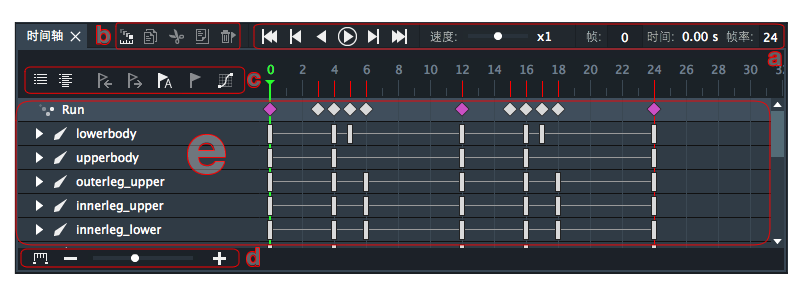
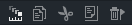
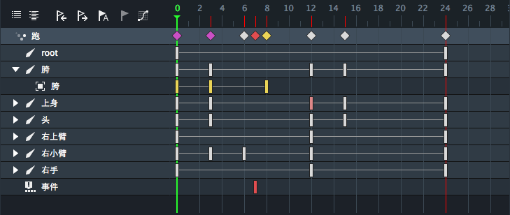

时间轴面板用于动画剪辑的编辑。此面板只能在动画制作下显示。

a ). 播放控制工具

时间轴面板上的播放控制工具，用于控制动画剪辑的播放。由左向右依次为：回到首帧按钮，前一帧按钮，倒放按钮，播放按钮，下一帧按钮，最后一帧按钮，播放速度控制滑块，当前帧，当前时间，帧率。
* 播放速度控制滑块的控制范围是0.1x ~ 10x。
* 当前帧：可编辑，输入具体的帧数，绿色播放指针便会跳转到相应的帧数。拖动绿色指针或播放动画，当前帧的数值也会跟着相应的变化。
* 当前时间：不可编辑，基于当前帧和帧率计算得出。
* 帧率：可编辑，默认为24fps。设定每一秒钟的动画有多少帧。

b ). 帧编辑工具栏

帧编辑工具栏，由左向右依次为：洋葱皮按钮，复制帧按钮，剪切帧按钮，粘贴帧按钮，删除帧按钮。

* 洋葱皮按钮：开关洋葱皮功能。
* 复制帧按钮：选中关键帧后点击，帧的参数便被复制到剪切板中。
* 剪切帧按钮：选中关键帧后点击，帧的参数便被剪切到剪切板中。
* 粘贴帧按钮: 剪切板中的帧参数可以被粘贴到时间轴的任意帧数，任意层（骨骼层和插槽层的帧不能互相粘贴，关键帧中记录的参数是与上一个关键帧的相对变动值，0帧的相对变动值均为0），也可以覆盖已存在关键帧。
* 删除帧按钮: 删除当前选中帧。

c ).  时间轴工具栏

时间轴工具栏，由左向右依次为：折叠列表，展开列表，向右移动帧，向左移动帧，自动关键帧按钮，添加关键帧按钮，曲线图面板按钮。
* 折叠列表：折叠时间轴上所有的层。
* 展开列表：展开时间轴上所有的层。
* 向右移动一帧，向左移动一帧： 点击按钮将整体移动选中关键帧以右的所有关键帧。若左侧的上一帧已有关键帧，则不能再向左移动，向左移动关键帧按钮将灰掉。
* 自动关键帧：具有开关两种状态的按钮，白色为关，红色为开。开启后，对骨骼或插槽的改动将会在绿色播放指针所在帧和相应的骨骼或插槽层上自动添加关键帧。
* 添加关键帧按钮： 三种状态按钮，白色表示无改动，无关键帧。黄色表示有改动未添加或更新关键帧。红色表示无改动已添加或更新关键帧。白色或黄色状态下，点击按钮，将在绿色播放指针所在帧和相应骨骼层或插槽层上添加或更新关键帧。红色状态下点击无效果。红色或白色状态下，改动骨骼或插槽，按钮将变为黄色，表示骨骼或插槽发生改动。无骨骼或插槽选中时，按钮不可用。
* 曲线图面板按钮：开关曲线图面板。

d ). 时间轴缩放工具

时间轴缩放工具用于控制时间轴的比例缩放。左侧为适合屏幕按钮，-和+按钮控制缩小和放大。拖动滑块也可以控制缩放。

e ). 时间轴

* 骨骼层内关键帧为白色，插槽层内关键帧为黄色，事件层内关键帧为红色,含有事件，跳转，声音的骨骼关键帧为粉色。
* 时间轴的第一层为动画剪辑层，不能直接编辑，在其他任意层添加关键帧后，动画剪辑层便会出现菱形方块，表示当前帧下某层或多层存在关键帧。白色表示为骨骼层关键帧，黄色表示插槽层关键帧，红色为事件层关键帧，粉色为存在多种层混合的关键帧。选中菱形方块便选中这一帧数下的所有关键帧。可以进行整体左右平移，拖拽，复制，剪切，粘贴，删除。
* 只要相应帧数下存在关键帧，时间轴标尺上便会出现红线，时间轴标尺不会随时间轴的上下滚动条滚动，始终可见。
* 时间轴的第一级为骨骼层或事件层，第二级为插槽层，插槽层相对骨骼层向右缩进一层。时间轴内不体现父子骨骼的层级关系。事件层只有一层。
* 选中的层会高亮，对应层的骨骼或插槽也会被选中，反之，选中骨骼或插槽，对应的层也会被选中。
* 关键帧可以在时间轴同层内任意拖拽。

帧的框选

DragonBones Pro 4.2 开始支持时间轴内的帧的框选操作。在时间轴内可以框选所要操作的帧，选中后，可以对帧进行，复制，剪切，删除等操作。

框选后，鼠标移动到选框内部，鼠标光标变为十字四向箭头时，点击拖拽，可以左右平移选中帧。

平移后效果如下图。

框选后，鼠标移动到选框边缘，鼠标光标变为左右箭头时，点击拖拽，可以缩放选中帧的间距，进而改变动画的速度。

缩放后，效果如下图。

按住Ctrl键可以连续框选帧。

