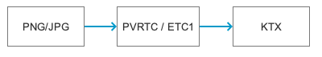
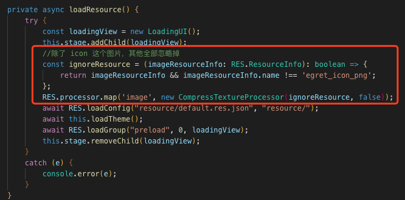
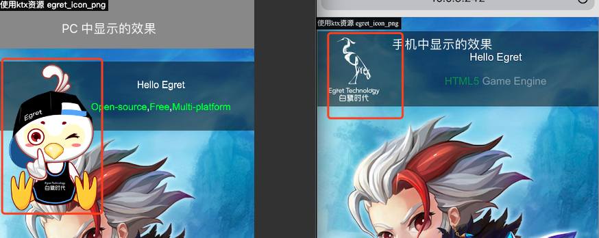

## KTX 纹理压缩使用说明

### 一.关于 KTX
KTX (Khronos Texture) 是一种纹理存储格式，大部分移动设备的 GPU 均支持这种格式。可以有效降低设备的显存占用，提高运行效率和稳定性。

* 关于 KTX 的具体信息，可以参考下述2个文档：
	* [KTX 描述说明](https://www.khronos.org/opengles/sdk/tools/KTX/)
	* [KTX 文件格式说明](https://www.khronos.org/opengles/sdk/tools/KTX/file_format_spec/)



如上图所示，第一步我们先把普通的 png\jpg 图片，转换成 `ios` 系统支持的 PVRTC 和安卓系统支持的 `ETC1` 格式的纹理。第二步再把纹理打包为 KTX 格式。

**注：ktx 有很多种格式，如 astc, dxt, pvrtc, etc1，etc2。白鹭引擎在 iOS 平台只支持 pvrtc, 安卓平台只支持 etc1**

我们制作了一个 ktx 转换工具：

- [CompressedTextureTool](http://tool.egret-labs.org/DocZip/tools/CompressedTextureTool_v1.1.zip) 内含使用说明

也可以使用其他的转换工具:

- [PowerVRSDK](https://www.imgtec.com/developers/powervr-sdk-tools/)
- [Mali_Texture_Compression_Tool](https://developer.arm.com/tools-and-software/graphics-and-gaming/graphics-development-tools/mali-texture-compression-tool)
- [texture-compressor](https://www.npmjs.com/package/texture-compressor)


### 二.如何使用 KTX
**[KTX 使用示例下载](http://tool.egret-labs.org/DocZip/engine/KTXHello.zip)**

上面是一个 `HelloWorld` 的示例项目，其中只把 `egret_icon.png` 这个图片转换为 `KTX` 格式使用。

#### 1.资源说明
在 `resource/assets` 目录下，`egret_icon` 有如下几种格式，引擎会根据不同平台来读取不同的格式：

```
egret_icon.png
egret_icon.pvr.ktx
egret_icon_alpha.ktx
egret_icon.ktx
```
* `egret_icon.png`：PC 平台使用。
* `egret_icon.pvr.ktx`：pvr 格式的 ktx，iOS 平台使用
* `egret_icon.ktx`(etc1 格式的颜色纹理) 和 `egret_icon_alpha.ktx`(alpha遮罩纹理)：安卓平台使用。**注：也可以把 2 个 ktx 文件合成一个文件，具体方法请参考 [高级示例 v1.2](http://tool.egret-labs.org/DocZip/engine/CompressedTextureDemo_v1.2.zip)，该示例我们后续还会更新完善**

#### 2.代码说明



在 `Main.ts` 中的 `loadResource` 方法里，我们加了几行代码。

* `ignoreResource` 方法表示只有 `egret_icon.png` 这个图片才会进入 `ktx` 的使用流程，其他资源全部忽略
* `CompressTextureProcessor` 是加载资源的处理器，我们把它注册到了  `AssetsManager` 资源管理器中。具体的处理逻辑，请看示例中的代码。

#### 3.显示效果


为了更容易看出效果，我们把 `egret_icon.png` 换成了另外一张白鹭小鸟，而 `ktx` 格式还是标准 `HelloWorld ` 里的白鹭图标。

从上图中很容易看出，左侧是 `PC` 浏览器中的显示效果，因为不支持 `ktx` 格式，显示的是 `png` 图片。而右侧的 `iOS` 手机浏览器，因为支持 `ktx` 格式，显示的是 `pvr` 纹理格式的图片。

#### 4.远程加载 KTX 资源
您可以使用 `AssetsManager` 自动远程加载资源。也可以使用 `URLLoader` 自己控制资源加载。

* 注意：
	* 因为 ktx 不是普通的图片格式，不能使用 ImageLoader 加载。
	* URLLoader.dataFormat 要设置成 BINARY 二进制格式

使用 `URLLoader` 加载和显示 ktx 纹理 ，[可以参考此示例](http://tool.egret-labs.org/DocZip/engine/KTXURLLoader_v1.0.zip)


#### 5.KTX 性能测试
[纹理提交速度对比测试](http://tool.egret-labs.org/DocZip/engine/CompressedTexturePerformance.zip) 点击屏幕，可以对比测试提交 100 次 png 与 ktx 纹理的耗时。