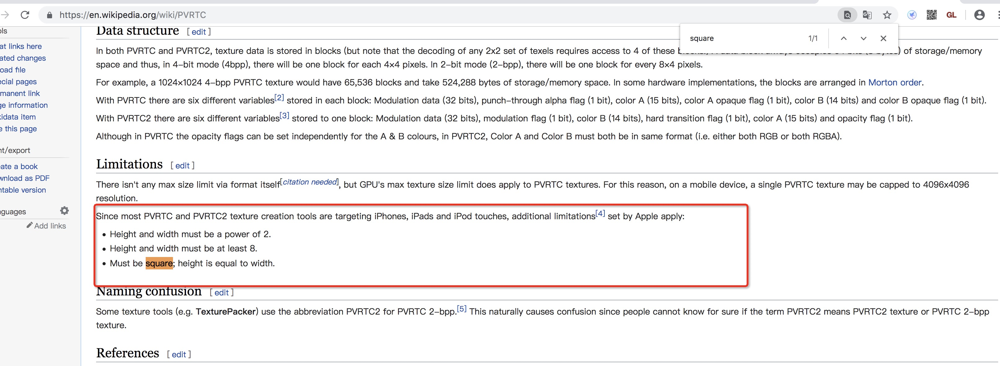

## KTX 纹理压缩常见问题

#### 我使用的图片转换成 KTX 后在 iOS 手机上显示变形了
答：因为 iOS 使用的 ktx 是 PVRTC 格式的。PVRTC 必须是正方形（边长为2的N次方，如128、256、512），否则显示出来就变形了。建议把资源打包成正方型的 SpriteSheet 纹理集后，再转换成 ktx 格式使用。

#### 图片转换成 KTX 后体积变大了，会占用更多的内存影响游戏性能吗？
答：文件体积变大并不会占用更多的内存。ktx 是一种 GPU 能直接读取并显示的格式，使得图像无需解压即可进行渲染，节约大量的内存。

#### 原始资源加上转换后的 ktx 资源，包体变的很大怎么处理？
* 答：
	* 我们建议初始包体里只放普通的 png、jpg 图片，然后根据设备信息远程加载适合	该平台使用的 ktx 资源。
	* 不过 ktx 文件体积大，远程加载资源的时候会慢一些，这个就需要开发者权衡资源加载时间和游戏性能之间的利弊了。
	* 服务器可以开启 gzip ，ktx 压缩后的体积会很小。