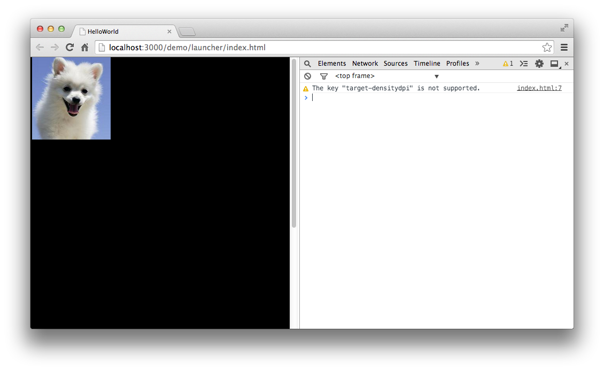
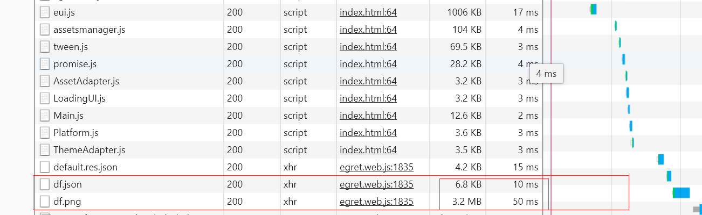
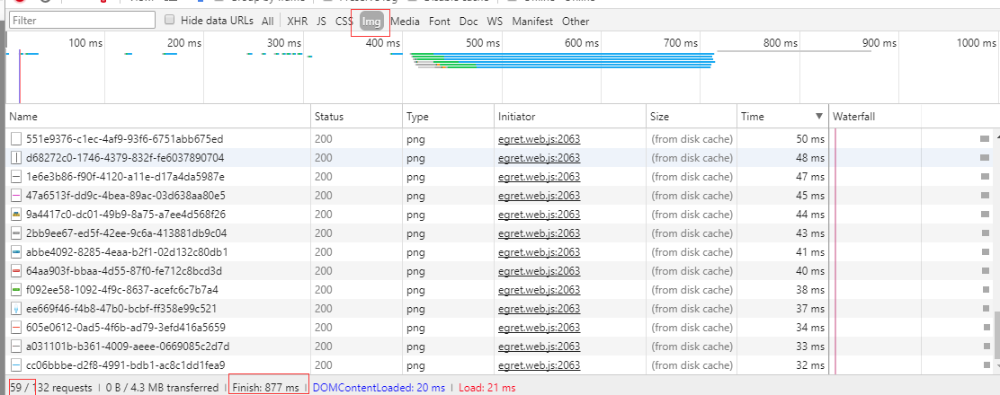
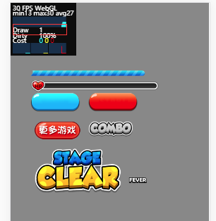
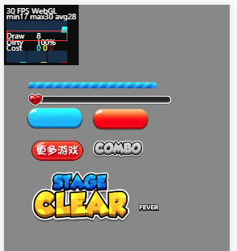

纹理集是将一些零碎的小图放到一张大图当中。游戏中经常使用到纹理集。


Egret内置了纹理集的支持，在编写代码之前，需要先制作一张纹理集，具体使用的工具可以选择业内比较流行的 Texture Merger。 具体使用方法请参考[Texture Merger](../../../tools/TextureMerger/manual/README.md)。

## 使用步骤

* 首先制作一张纹理集，拼合后的效果如下：

  


同时生成的对应的json文件如下：
  
```
{
    "file": "dogs.png",
    "frames": {
        "dog1": {
            "x": 322,
            "y": 2,
            "w": 184,
            "h": 222,
            "offX":0,
            "offY":0,
            "sourceW":184,
            "sourceH":222
        },
        "dog2": {
            "x": 307,
            "y": 226,
            "w": 147,
            "h": 154,
            "offX":0,
            "offY":0,
            "sourceW":147,
            "sourceH":154
        },
        "dog3": {
            "x": 2,
            "y": 2,
            "w": 318,
            "h": 217,
            "offX":0,
            "offY":0,
            "sourceW":318,
            "sourceH":217
        },
        "dog4": {
            "x": 2,
            "y": 393,
            "w": 298,
            "h": 201,
            "offX":0,
            "offY":0,
            "sourceW":298,
            "sourceH":201
        },
        "dog5": {
            "x": 2,
            "y": 221,
            "w": 303,
            "h": 170,
            "offX":0,
            "offY":0,
            "sourceW":303,
            "sourceH":170
        },
        "dog6": {
            "x": 2,
            "y": 596,
            "w": 245,
            "h": 125,
            "offX":0,
            "offY":0,
            "sourceW":245,
            "sourceH":125
        }
    }
}
```


* 将资源文件拷贝到项目文件夹中的 `resource/assets/` 目录下，同时修改资源配置文件 `default.des.json` 。

资源配置文件内容如下：

```
{
"resources":
    [
        {"name":"dogs","type":"sheet","url":"assets/dogs.json"}
    ],
"groups":
    [
        {"name":"preload","keys":"dogs"}
    ]
}
```

* 编写代码：

```
class BitmapTest extends egret.DisplayObjectContainer{
    public constructor()
    {
        super();
        this.addEventListener(egret.Event.ADDED_TO_STAGE,this.onAddToStage,this);
    }
    private onAddToStage(event:egret.Event) {
        RES.addEventListener(RES.ResourceEvent.GROUP_COMPLETE, this.onGroupComplete, this);
        RES.loadConfig("resource/resource.json", "resource/");
        RES.loadGroup("preload");
    }
    private onGroupComplete()
    {
        var txtr:egret.Texture = RES.getRes( "dogs#dog1" );
        var img:egret.Bitmap = new egret.Bitmap( txtr );
        this.addChild(img);
    }
}
```

注意其中一行：

```
var txtr:egret.Texture = RES.getRes( "dogs#dog1" );
```

其中dogs为纹理集，id为该纹理集中的一个资源id。

编译后运行，效果如图：





## 那么在 HTML5 游戏中使用纹理集的好处是什么呢？

* 第一个 在游戏中使用纹理集能够帮助你的游戏提高加载速度，从而减少你的带宽成本，更快速的 HTTP 加载时间。

下面我为大家展示第一个例子：我们下载一张来自服务器的 4096 x 4096 一张 3.2M 的纹理，需要的时间为 50 毫秒。再加上一个纹理集的配置文件仅仅增加了 10 毫秒，如果我们不使用纹理集，采用加载单张小图，即加载 59 张小图。整体的加载时间将会发生巨大的变化，即将从 50 毫秒提升至 877 秒，即增加了 14 倍。
> 注意这里只为演示效果直观，所以采用了 4096 x 4096，在游戏开发中强烈建议不用超过 2048.

使用纹理集

;

未使用纹理集

;

我们知道浏览器本身对 HTTP 请求的数量也是有限制的，而当到达了这一限制时，浏览器便会阻塞之后的请求。
如果你拥有 4千个待请求的 HTTP，但是这时候却只能同时进行 6 个连接，所以后面的请求便只能被暂时搁置着。所以除了能够减少加载时间，同样也能够减少 HTTP 的请求数量。


* 第二个 在 webgl 模式下，能够进行硬件加速。这也就意味着 GPU 将处理图像和转化。这时使用了纹理集可以降低 GPU 渲染批次（Draw）来提升渲染性能，每个纹理都必须在绘制出几何体图像前与 GPU 连接在一起，并且特定的 GPU 都必须拥有一个特定数量的纹理槽，所以在抽样单位间进行纹理转化将需要花费大量的时间。而纹理集则能够通过让 GPU 将一个单一纹理绑定在图像驱动器上而减少转化所需要的额外开销，也就是减少少 Draw 的次数，而提升游戏的性能。

使用纹理集

;

未使用纹理集

;

在图中可以很明确的看出如果不使用纹理集时 Draw 的次数应该为 8，在使用了纹理集时 Draw 的数量仅为 1，这个简单的例子足以说明纹理集对 Draw 数量的影响程度。有很多开发者遇到 Draw 的数量太高，其实合理的使用纹理图集会很好的减少 Draw 数量。

关于纹理集先介绍到这里，后期将会更深入的介绍如何根据实际项目来使用纹理集。

