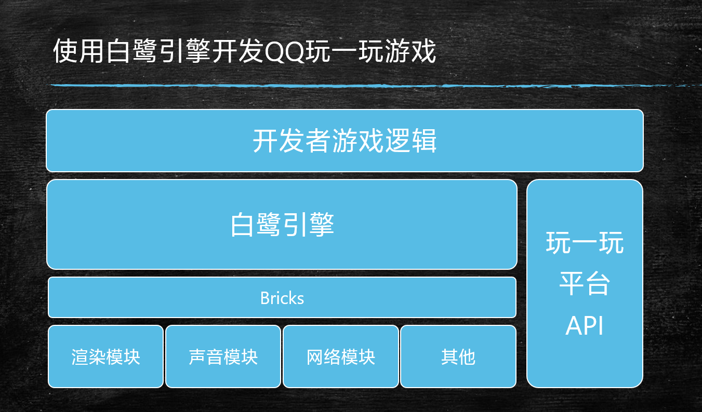
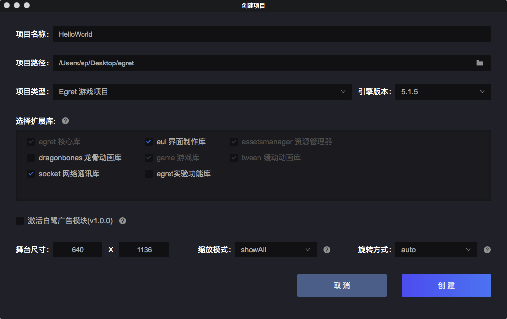
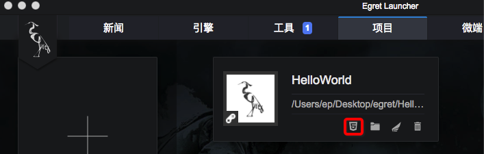
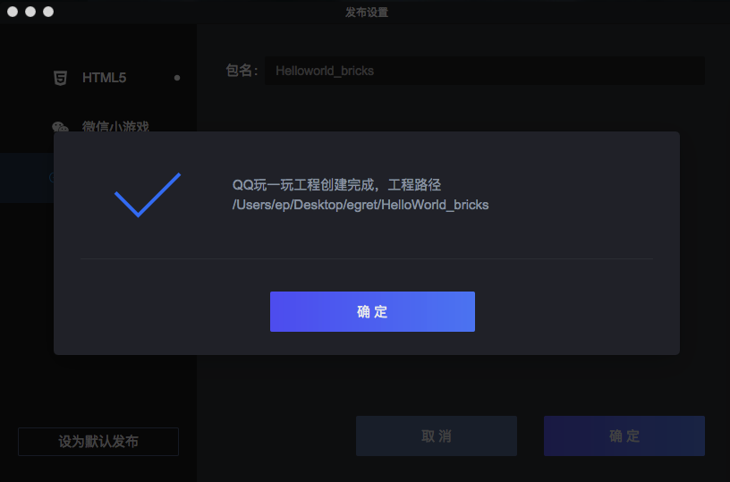

# 新手教程

[新手教程](#新手教程)


- [什么是玩一玩平台](#什么是玩一玩平台)

- [如何将白鹭游戏引擎制作的游戏发布到玩一玩平台](#如何将白鹭游戏引擎制作的游戏发布到玩一玩平台)

- [其他版本引擎发布](#其他版本引擎发布)

- [更新内容](#更新内容)

- [已知问题](#已知问题)


<br>

## 什么是玩一玩平台
在手机QQ最新版本更新中，提供了一系列为游戏服务的底层接口，包含渲染、音频、本地存储、社交接口等，通过这些接口，开发者可以制作小游戏并运行在手机QQ中。

玩一玩的底层采用了QQ团队自主研发的 bricks 引擎，与 HTML5 环境不同的是，bricks 引擎提供了更高层次的 API 封装，并提供了物理模块，多人音视频模块，AI模块，网络，存储，云，手势等功能，并在上层同样提供基于 JavaScript 的接口，其基础架构如下


目前白鹭引擎已经添加了对于玩一玩开发的支持，您只要使用白鹭引擎开发，就可以将游戏发布至QQ玩一玩平台上。其技术原理如下：


通过这种方式，开发者只需要使用白鹭引擎的最新版本，通过使用白鹭引擎完整工具流，就可以快速创建、开发与发布玩一玩小游戏，而无需过多的关注底层技术细节。


## 如何将白鹭游戏引擎制作的游戏发布到玩一玩平台

这次更新中，我们添加了图形化界面支持。现在 Egret Launcher 支持一键式将 Egret 游戏项目发布为玩一玩平台游戏项目。

首先通过 Egret Launcher 创建项目。建议您以 `5.1.5` 及以上的版本进行玩一玩平台的游戏开发。如果您使用的引擎版本为 `5.1.x` 系列版本但低于 `5.1.4` ，您可以查看[其他版本引擎发布](#其他版本引擎发布)来发布到玩一玩平台。

我们以 `5.1.5` 版本引擎为例。


在项目列表中找到创建好的项目，通过 发布设置 按钮选择发布的类型。


在 QQ玩一玩 标签中填写要发布的包名。


发布成功后会在项目的同级目录下生成发布后的文件。



最后用Xcode打开 `HelloWorld_bricks/PublicBrickGameEngine.xcodeproject` ,您就可以进行玩一玩平台的游戏开发调试了。更多文档可以参见玩一玩的[开发者文档](http://hudong.qq.com/)。

当然，您也可以在原始项目中执行 `egret run --target bricks` ,也能通过Xcode打开发布完的项目。

* 注：目前玩一玩只支持MacOS开发，我们正在和玩一玩团队共同努力，争取尽快提供 Windows 下的开发调试环境。
* 目前执行 egret run --target bricks 命令会提示编译项目失败，但只是显示问题，并不影响开发。该问题会在下个版本中修复。


## 其他版本引擎发布

如果您的引擎为 `5.1.x` 但低于 `5.1.5` ，我们可以通过修改配置文件的方法进行发布。

以下介绍的方法仅在 `5.1.2`  , ` 5.1.3 ` 版本中适用。

以 5.1.2 版本为例，我们需要在 `./scripts`文件夹中添加一个 `bricks/bricks.ts`的文件。

```javascript
import * as fs from 'fs';
import * as path from 'path';
type ManifestConfig = {
    initial: string[],
    game: string[]
}
export class BricksPlugin implements plugins.Command {
    constructor() {
    }
    async onFile(file: plugins.File) {
        const filename = file.origin;
        if (filename == 'manifest.json') {
            const contents = file.contents.toString();
            const jsonData: ManifestConfig = JSON.parse(contents);
            let content = '';
            for (let item of jsonData.initial) {
                if (item != 'js/promise.js' && item != 'js/promise.min.js') {
                    content += `BK.Script.loadlib("GameRes://${item}");\n`
                }
                if (item == "js/egret.js" || item == 'js/egret.min.js') {
                    content += `BK.Script.loadlib("GameRes://egret.bricks.js");\n`
                }
            }
            for (let item of jsonData.game) {
                content += `BK.Script.loadlib("GameRes://${item}");\n`
            }
            file.path = file.dirname + '/manifest.js'
            file.contents = new Buffer(content);
        }
        return file;
    }
    async onFinish(pluginContext) {
    }
}
```

同时，在`./scripts/config.ts`，在其中添加如下代码：

```javascript
import { BricksPlugin } from './bricks/bricks';
```
```javascript
        if (target == 'bricks') {
            const outputDir = `../${projectName}_bricks/PublicBrickEngineGame/Res`;
            return {
                outputDir,
                commands: [
                    new CompilePlugin({ libraryType: "debug" }),
                    new ExmlPlugin('commonjs'), // 非 EUI 项目关闭此设置
                    new ManifestPlugin({ output: 'manifest.json' }),
                    new BricksPlugin()
                ]
            }
        }
```
之后，您就可以按照上面介绍的[如何将白鹭游戏引擎制作的游戏发布到玩一玩平台](#如何将白鹭游戏引擎制作的游戏发布到玩一玩平台)的方法发布游戏了。


# 更新内容

本周白鹭引擎对玩一玩平台的支持进行了较大的改善，重点修复了以下问题：

* 添加了对 EUI 的支持
* 添加了对 DragonBones 的支持
* 添加了对 Graphics 的支持
* 添加了对 Mesh 的支持
* 添加了显示对象的 blendMode与scrollRect属性的支持
* 添加了对 LocalStorage 的支持
* 添加了对 WebSocket 的支持
* 修复了二进制数据无法加载的 BUG
* 修复了九宫格渲染错误的 BUG
* 修复了多个文本渲染及文本布局的 BUG
* 修复了 HTTP 请求无法发送 post 请求的 BUG

# 已知问题
白鹭引擎目前尚有以下功能尚未支持玩一玩平台

* 渲染相关 
  * 不规则遮罩
  * 动态截屏
  * 位图缓存
* 触摸相关 
  * 像素级碰撞检测
  * 点击穿透
* 调试相关 
  * 脏矩形调试显示
  * fps监视器
  * 屏幕调试日志

以上功能预计在以后的更新中逐个支持。

同时，由于玩一玩平台的 bricks 引擎目前处于内测状态，仍然存在一些问题，目前我们暂时不建议开发者在玩一玩平台使用以下功能：

* 贝塞尔曲线绘制
* 视频播放

以上问题我们会和玩一玩平台的工程师保持紧密沟通，争取尽快解决。