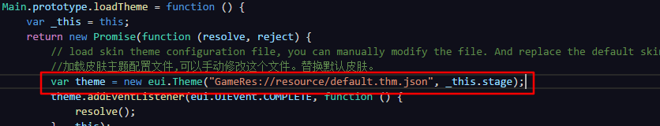
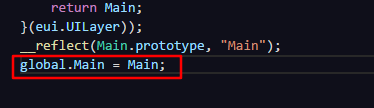

# 新手教程

针对目前玩一玩平台的部分相关问题，在此做出回应。日后会持续更新。

首先，强调一些玩一玩平台的技术限制：
 - 玩一玩平台不支持基于DOM Document对象的HTML元素处理
 - 玩一玩平台不支持皮肤的远程加载，所有皮肤必须声明到egret项目的 `default.thm.json` 文件当中。
 - 不允许动态执行代码能力。

 接下来向诸位开发者汇总一下进来的玩一玩平台开发普遍问题以及解决方案：

## 问题
### 我的玩一玩项目为什么在Xcode上运行没有问题，可在手机QQ上加载不出图片，也没有报错？

答：这种问题基本可以确定是文件根目录缺少前缀导致的。玩一玩平台的路径要求前缀为 `"GameRes://"` ,egret中针对其做了资源配置的处理。可以查看js/main.js文件，查看以下两段代码。

这两段代码如果与图示相同，之后的资源加载就无需加入前缀了。

## 打包好玩一玩项目，运行到手机上完全黑屏，资源加载也没有问题。
答：如果是直接通过厘米游戏(http://hudong.qq.com/)的游戏管理上传的包，有一下两种情况。
 - 安卓端与ios端都显示为黑屏。
 
 可能是混淆导致类名变动的问题，使得找不到egret项目的主入口类。需要在js/main.js文件中加入以下代码。
 
 这样，代码即使经过提交混淆也可以找到主类了。

 - 只有安卓端显示黑屏，ios显示正常。

 ios平台与安卓平台的差异导致promise在两个平台上的不同。需要替换提交包中 `js/promise.js` 文件。目前在安卓端可以稳定运行的promise.js文件地址为:https://github.com/egret-labs/egret-target-bricks/tree/master/template/PublicBrickEngineGame/Res/js 。下载并更新 `js/promise.js` 文件后，还需要手动修改 `manifest.js` 文件。
 
 保证在manifest.js文件中第一个被引用即可。

 ## socket在玩一玩平台是不支持吗？为什么socket一直连接不上？
 socket在玩一玩平台是支持的。socket连接不上可能是 `manifest.js` 中引用导致的问题。
 首先，确认您的原egret项目引用了我们提供的socket通讯库。
 之后，检查发布后的 `manifest.js` 文件。
  
  确保socket.js库在`egret.js`与`egret.bricks.js`之间引用。
  这样就可以保证socket库加载成功了。调用egret.WebSocket API即可调用socket。

  有更多的相关问题请您到egret论坛bbs.egret.com参与讨论。我们也会持续更新问题以及解决方案。