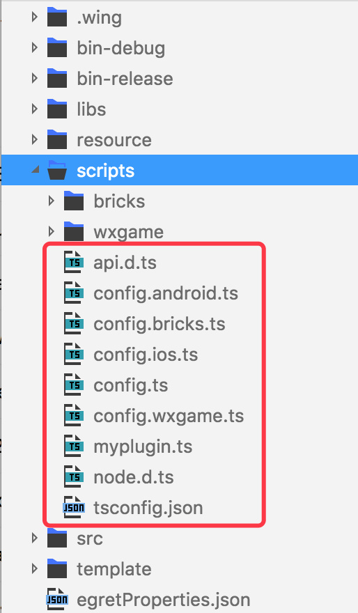
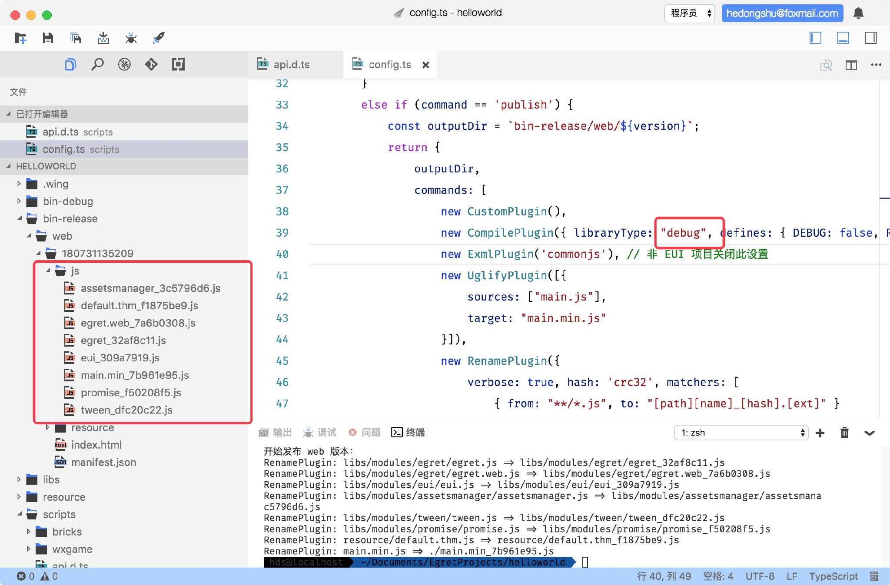
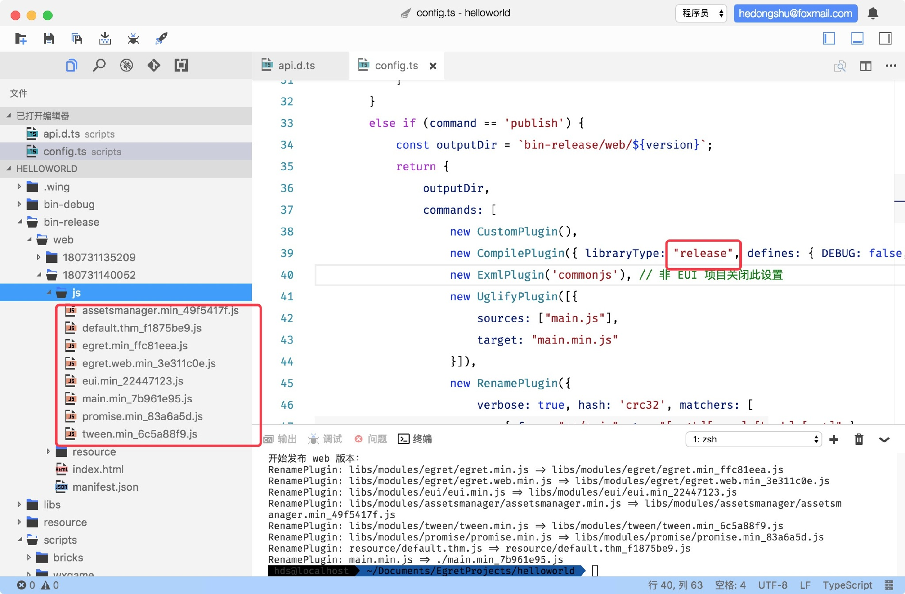
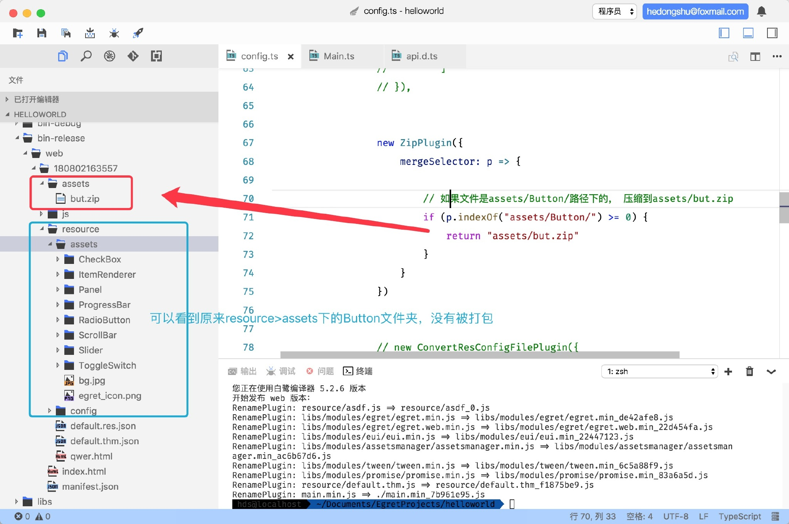
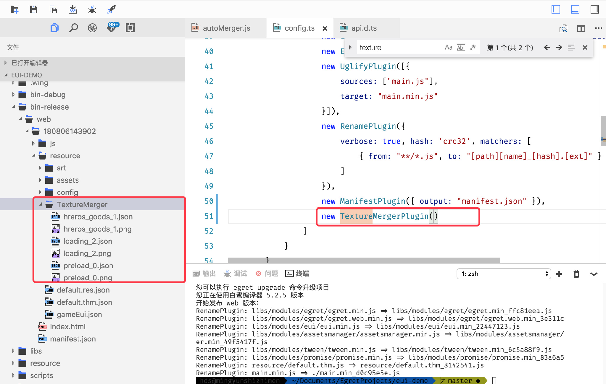

# 命令行扩展插件 API 文档

## 脚本插件目录结构

```
scripts    
	|-- api.d.ts // 文档    
	|-- config.ts // 构建脚本入口        
	|-- myplugin.ts // 开发者自定义插件的示例        
	|-- node.d.ts // node的.d.ts 文件
```

## 插件运行机制简介

开发者执行 ` build` 和 ` publish` 的时候，可以执行不同的插件。

在项目构建的时候会自动执行 ` config.ts` 文件中的 ` buildConfig` 函数。

>  这个函数的功能是返回一个对象，对象中的内容会根据执行不同的命令返回相对应的输出路径和需要执行的插件，插件在返回对象的 commands 数组中实例化后就会执行。


` config.ts` 有多个版本对应着不同的平台：



发布到不同平台时，执行的` config.ts`是不同的，比如执行 ：

```shell
egret publish --target wxgame
```

发布到微信小游戏，执行的是 ` config.wxgame.ts`。

## 运行调用

> config.ts

```typescript

else if (command == 'publish') {
            const outputDir = `bin-release/web/${version}`;
            return {
                outputDir,
                
                // ----------调用开始-----------
                // commands数组中实例化之后，就会执行该插件
                commands: [
                    new CustomPlugin(),
                    new CompilePlugin({ libraryType: "release", defines: { DEBUG: false, RELEASE: true } }),
                    new ExmlPlugin('commonjs'), // 非 EUI 项目关闭此设置
                    new UglifyPlugin([{
                        sources: ["main.js"],
                        target: "main.min.js"
                    }]),
                    new RenamePlugin({
                        verbose: true, hash: 'crc32', matchers: [
                            { from: "**/*.js", to: "[path][name]_[hash].[ext]" }
                        ]
                    }),
                    new ManifestPlugin({ output: "manifest.json" }),
                ]
                // ----------调用结束------------
                
                
            }
        }
```

插件按照**数组顺序**调用。

为了方便开发者使用，Egret内置了一些常用插件。

----


## 插件---ExmlPlugin

### 定义

EXML 插件，用于使用不同的策略来发布 EXML 文件。

### 语法

```typescript
new ExmlPlugin(publishPolicy: EXML_Publish_Policy)
```

###  参数值

| 参数 | 类型 | 描述 |
| ---- | ---- | --- |
| default | string | 使用 egretProperties.json 中的 exmlPublishPolicy 中的策略 |
| debug| string | 默认策略，用于开发环境 |
| contents | string | 将 EXML 的内容写入到主题文件中 |
| gjs| string | 将生成的JS文件写入到主题文件中 |
| commonjs | string | 将EXML合并为一个 CommonJS 风格的文件 |
| commonjs2 | string | 将EXML合并为一个含有解析方法和皮肤定义的文件，且皮肤抽离为一份配置 |

### 细节

如果当前项目非EUI项目，请关掉这个设置。


## 插件---UglifyPlugin

### 定义

混淆插件，用来压缩混淆代码。

### 语法

```typescript
new UglifyPlugin([{
    sources: ["main.js"],
    target: "main.min.js"
}])
```

### 参数值

UglifyPlugin 的参数是一个数组，数组中的值是一个 ` UglifyPluginOption`对象，对象属性如下：

| 参数    | 类型     | 描述             |
| ------- | -------- | ---------------- |
| sources | string[] | 需要被压缩的文件 |
| target  | string   | 压缩后的文件名   |


## 插件---RenamePlugin

### 定义

修改文件名插件，用哈希算法给文件名生成一个独一无二的后缀。

### 语法

```typescript
new RenamePlugin({
    verbose: true, hash: 'crc32', matchers: [
        { from: "**/*.js", to: "[path][name]_[hash].[ext]" }
    ]
})
```

### 参数值

RenamePlugin 的参数是一个对象，对象属性如下：

| 参数     | 类型      | 描述                                                         |
| -------- | --------- | ------------------------------------------------------------ |
| verbose  | boolean   | 是否输出日志 (可选参数)                                      |
| hash     | string    | 采用何种 hash 算法，目前暂时只支持 crc32 (可选参数)          |
| matchers | Matcher[] | 设置匹配规则，将指定文件进行改名<br />该参数是个数组，允许设置多个匹配规则，数组内是Matcher对象 |

Matcher对象：

匹配机制，将满足 ` from` 的文件输出为 ` to` 格式的文件。

` from` 采用 glob 表达式 ,`  to` 包含 ` path`  、` name`、  ` hash`、  ` ext`  四个变量。

示例：

```typescript
// 将所有的文件（*表示通配符，匹配所有情况）输出为to的格式
{ from:"resource/**.*" , to:"[path][name]_[hash].[ext]" }
```


## 插件---ManifestPlugin

### 定义

生成 manifest 文件，这个文件会被用于记录 JavaScript 文件的版本号。

### 语法

```typescript
new ManifestPlugin({ output: "manifest.json" })
```

### 参数值

ManifestPlugin的参数是一个对象，属性如下：

| 参数    | 类型    | 描述                                      |
| ------- | ------- | ----------------------------------------- |
| output  | string  | 输出的文件名，支持 json 与 js 两种格式    |
| hash    | string  | 使用的算法，暂只支持 “crc32”   (可选参数) |
| verbose | boolean | 是否输出转换过程 (可选参数)               |


## 插件---CompilePlugin

### 定义

编译插件，根据参数选择不同的编译方式。

### 语法

```typescript
new CompilePlugin({ libraryType: "release", defines: { DEBUG: false, RELEASE: true } })
```

### 参数值

CompilePlugin 的参数是一个对象，属性如下：

| 参数        | 类型   | 描述                          |
| ----------- | ------ | ----------------------------- |
| libraryType | string | 可选取值 "debug" \| “release" |
| defines     | any    | 定义   （可选参数）           |

### 细节

libraryType参数设置编译的模式。

设置为 debug 时，发布后的js文件不会被混淆压缩，保留可读性，方便debug。




设置为 release 时，发布后的js文件会被混淆压缩。




## 插件---IncrementCompilePlugin

### 定义

增量编译,  重新编译程序代码中更改的那部分代码 （常用在开发模式，发布时请使用 `CompilePlugin`）。

### 语法

```typescript
new IncrementCompilePlugin()
```

### 细节

这个插件生成的 JavaScript 代码不会被添加到构建管线中，后续其他插件无法获取生成的 js 文件。

这个功能将会在未来被 watch 模式代替掉。


## 插件---EmitResConfigFilePlugin

### 定义

用来生成 res.json 文件或者 res.js 文件。

### 语法

```typescript
new EmitResConfigFilePlugin({
    output: "resource/default.res.json",
    
    // typeSelector方法，写在下面
    typeSelector: config.typeSelector, 
    
    // 根据传进来的路径p，生成文件name
    nameSelector: p => {
        // 获取文件名，然后把 '.' 替换成 '_'
        return path.basename(p).replace(/\./gi, "_")
    },
    
    // 根据传进来的路径p，生成group
    groupSelector: p => {
        // 这里数据写死，可以根据自己的需求自定
        return "preload"
    }
})

	//…………其他代码…………
    
// 根据传进来的path，判断文件的类型
typeSelector: (path) => {
    const ext = path.substr(path.lastIndexOf(".") + 1);
    const typeMap = {
        "jpg": "image",
        "png": "image",
        "webp": "image",
        "json": "json",
        "fnt": "font",
        "pvr": "pvr",
        "mp3": "sound",
        "zip": "zip",
        "sheet": "sheet",
        "exml": "text"
    }
    let type = typeMap[ext];
    if (type == "json") {
        if (path.indexOf("sheet") >= 0) {
            type = "sheet";
        } else if (path.indexOf("movieclip") >= 0) {
            type = "movieclip";
        };
    }
    return type;
}

```

### 参数值

EmitResConfigFilePlugin的参数是一个对象，参数如下：

| 参数          | 类型     | 描述                                                       |
| ------------- | -------- | ---------------------------------------------------------- |
| output        | string   | 生成路径，可以指定生成为 *.res.js 文件或者 *.res.json 文件 |
| typeSelector  | function | 一个方法，根据返回值决定文件的类型                         |
| nameSelector  | function | 一个方法，根据返回值决定文件的name                         |
| groupSelector | function | 一个方法，根据返回值决定文件的组                           |

` typeSelector` ,   `nameSelector `,   `groupSelector`  三个方法都有一个默认参数 p，即每个文件的完整路径。


### typeSelector

``` typescript
    typeSelector: (path) => {
        const ext = path.substr(path.lastIndexOf(".") + 1);
        const typeMap = {
            "jpg": "image",
            "png": "image",
            "webp": "image",
            "json": "json",
            "fnt": "font",
            "pvr": "pvr",
            "mp3": "sound",
            "zip": "zip",
            "sheet": "sheet",
            "exml": "text"
        }
        let type = typeMap[ext];
        if (type == "json") {
            if (path.indexOf("sheet") >= 0) {
                type = "sheet";
            } else if (path.indexOf("movieclip") >= 0) {
                type = "movieclip";
            };
        }
        return type;
    }
```

先通过完整路径获取到文件的后缀名，然后在typeMap中找到对应的文件类型，接着判断”sheet"和"movieclip”类型，最后返回type。

根据开发者不同的需求可以自定义返回的文件类型，比如可以将json文件作为text文件返回。

### nameSelector

```typescript
nameSelector: p => {
    return path.basename(p).replace(/\./gi, "_")
}
```

获取到文件名，然后将文件名中的 “.”  替换为 “_”  ，然后返回。

res.json中资源的“name”属性的值的命名方式，就是由这个方法定义的。

###groupSelector

```typescript
groupSelector: p => {
    return "preload"
}
```

方法中直接返回了 preload ，说明所有的文件都直接放在了 “preload” 组中。

开发者可以自定义分组方式，比如根据文件所在的文件夹来分组。

```typescript
groupSelector: p => {
	// 把p分割成数组
    let arr = p.split('/')
    // 数组中倒数第二个就是文件夹名
    return arr[arr.length - 2]
}
```

根据不同的父级文件夹分组。


## 插件---CleanPlugin

### 定义

清理，用来重置清空文件夹。

### 语法

```typescript
new CleanPlugin({ matchers: ["js", "resource"] })
```

### 参数值

CleanPlugin的参数是一个对象，属性如下：

| 参数     | 类型  | 描述                               |
| -------- | ----- | ---------------------------------- |
| matchers | array | 数组，数组内是需要清理的文件夹名称 |

### 细节

matchers 的值是需要清理的文件夹的名称，这个文件夹名是相对于publish的outputDir，也就是发布后生成的文件夹，语法中实例表示清理 js和resource两个文件夹。一般作为第一个插件运行，清空上一次生成的资源。


## 插件---ResSplitPlugin

### 定义

分离资源目录，将指定的文件拷贝到其他的文件夹内。

### 语法

```typescript
new ResSplitPlugin({
    verbose: true,
    matchers: [
        { from:"resource/**" , to:"dir" }
        ]
})
```

### 参数值

ResSplitPlugin的参数是一个对象，对象属性如下：

| 参数     | 类型    | 描述                              |
| -------- | ------- | --------------------------------- |
| verbose  | boolean | 是否输出日志                      |
| matchers | array   | 一个数组，数组内的项是Matcher对象 |

`Matcher` 有两个属性，`from` 、`to` 

> 将满足 from 的文件输出到 to 

### 细节

ResSplitPlugin插件在`publish`时使用，可以将资源目录分离到别的文件夹。

在开发微信小游戏的时候，可以使用这个插件将资源放到初始包外，减小游戏包体积。

案例：[如何使用缓存资源](http://developer.egret.com/cn/github/egret-docs/Engine2D/minigame/usingcache/index.html)


## 插件---ZipPlugin

压缩插件，把代码压缩成某种格式。

### 用法

```typescript
new ZipPlugin({
    mergeSelector: config.mergeSelector
})
      //……其他代码
mergeSelector(p) {
  // do something
}
```

### 参数值

ZipPlugin的参数是一个对象，属性如下：

| 参数          | 类型     | 描述                             |
| ------------- | -------- | -------------------------------- |
| mergeSelector | function | 一个方法，根据返回值决定如何压缩 |

### 细节

使用ZipPlugin插件之前，需要安装cross-zip 和 cross-zip-cli， 在终端中输入：

```shell
//全局安装
npm install cross-zip -g   
npm install cross-zip-cli -g
```

安装完成之后才可以使用这个插件。

```typescript
new ZipPlugin({
    mergeSelector: path => {
        
        // 如果文件是assets/Button/路径下的， 压缩到assets/but.zip
        if (path.indexOf("assets/Button/") >= 0) {
            return "assets/but.zip"
        }
    }
})
```



（图中项目是新建的默认EUI项目）


## 插件---TextureMergerPlugin

### 定义

使用 TextureMerger 实现纹理自动合并，通常与ConvertResConfigFilePlugin插件配合使用。

### 语法

```typescript
new TextureMergerPlugin({textureMergerRoot:[ 'resource']})
```

### 参数值

| 参数              | 类型 | 描述                   |
| ----------------- | ---- | ---------------------- |
| textureMergerRoot | 数组 | 数组内的值表示扫描路径 |

插件只合成textureMergerRoot参数中指定的目录中的tmproject

### 细节

插件依赖 TextureMerger 1.7 以上的版本。

TextureMergerPlugin根据项目中的`tmpropject`文件进行合图操作（暂时需要关闭TextureMerger工具才能使用）,通过TextureMerger工具的命令行控制完成。

#### 生成tmpropject文件

* 开发者通过wing做出一款游戏后，我们建议使用TextureMerger工具进行合图操作，这样主要目的就是可以自由设置，开发者可以根据项目的需求来调节最后的显示效果和合图的方式。使用[TextureMerger工具](http://developer.egret.com/cn/github/egret-docs/tools/TextureMerger/update/update172/index.html)生成`tmpropject`文件。


* 当游戏项目比较小，对资源配置的要求不高时，开发者可以选择使用一个自动化的脚本来处理生成`tmpropject`文件。

  脚本[autoMerger.js](#autoMerget)，主要将对应的res.json里面的组进行合并图集操作，支持粒子，龙骨，位图字体的筛选，支持多个res.json，自动扫描配置好的res.json，但是由于资源引用问题，建议将所有res.json合并为一个文件后，然后再执行这个脚本去生成对应的tmproject文件，因为针对的是比较普遍的情况，所以性能比较低，如果开发者所需项目命名比较规范统一，建议修改脚本去提高性能，使用此脚本时开发者看不到最终显示效果，如果组的资源过多，很有可能导致合完的图集很大，大量空白区域被闲置，**因此建议开发者修改组之后或是采用[TextureMerger工具](http://developer.egret.com/cn/github/egret-docs/tools/TextureMerger/manual/index.html)进行拆分**，以达到最好的效果。

  脚本使用：

  将合图插件autoMerger.js拷贝到所需工程的scripts目录下（其他目录可能导致发布流程被破坏），修改autoMerger.js里面的两个参数。

  ```typescript
  // 要扫描的res.json文件数组
  var resjsons = ["default.res.json"];
  ```

  ```typescript
  // tmpropject文件的输出目录， 必须在resource目录下
  var targetDir = "resource/TextureMerger";
  ```

  在Egret Wing中打开终端，或使用其他终端进入当前项目根目录：

  ```shell
  node scripts/autoMerger.js
  ```

#### autoMerget脚本

<a name=“autoMerget”></a>

```typescript
"use strict";
Object.defineProperty(exports, "__esModule", { value: true });
var fs = require("fs");
var path = require("path");
var resjsons = ["resource/default.res.json"]; //要扫描的res.json文件
var targetDir = "resource/TextureMerger"; //输出目录
var pathNor = path.relative(targetDir, "resource"); //返回一个相对路径
var tempindex = 0;
//创建输出文件夹
if (resjsons.length > 0) {
    if (!fs.existsSync(targetDir)) {

        // var paths = path.normalize(targetDir).split("\\");   //windows 下使用
        var paths = path.normalize(targetDir).split("\/");   //mac linux 下使用

        var target = ".";
        for (var _i = 0, paths_1 = paths; _i < paths_1.length; _i++) {
            var p = paths_1[_i];

            // target += ("\\" + p);  // windows 下使用
            target += ("\/" + p);  // mac linux 下使用

            if (!fs.existsSync(target))
                // 根据路径创建文件夹
                fs.mkdirSync(target);
        }
    }
}
var _loop_1 = function (resJson) {
    // 判断是否是res.json文件
    if (fs.existsSync(resJson) && resJson.indexOf("res.json") > -1) {
        var defaultJson = fs.readFileSync(resJson, "utf-8");
        // 解析res.json文件内容
        var defaultObject = JSON.parse(defaultJson);
        var groups = defaultObject.groups; //组
        var resources = defaultObject.resources; //资源
        var resourcesHash_1 = {}; // 用来存放resources的资源信息

        // 遍历resources
        for (var _i = 0, resources_1 = resources; _i < resources_1.length; _i++) {
            var resource = resources_1[_i];
            resourcesHash_1[resource.name] = resource.url;
        }

        // 遍历groups
        for (var _a = 0, groups_1 = groups; _a < groups_1.length; _a++) {
            var group = groups_1[_a];
            var tmproject = {}; //用来存放tmproject文件的信息
            // tmproject文件配置
            tmproject["options"] = {
                "layoutMath": "2",
                "sizeMode": "2n",
                "useExtension": 1,
                "layoutGap": 1,
                "extend": 0
            };
            // projectName
            tmproject["projectName"] = group.name + "_" + tempindex; 
            // 版本
            tmproject["version"] = 5;
            tempindex++;

            // 获取res.json分组的keys, 并分割成数组
            var oldkeys = group.keys.split(","); 
            var oldkeysHash = {};
            // 遍历oldkeys
            for (var _b = 0, oldkeys_1 = oldkeys; _b < oldkeys_1.length; _b++) {
                var key = oldkeys_1[_b];
                // 保存到oldkeysHash对象中
                oldkeysHash[key] = true;
            }

            var newKeys = [];
            // 遍历oldkeys
            for (var _c = 0, oldkeys_2 = oldkeys; _c < oldkeys_2.length; _c++) {
                var key = oldkeys_2[_c];
                if (key.indexOf("json") == -1) {
                    if (!oldkeysHash[key.replace("png", "json")]) { //粒子和龙骨对应的图集不合图
                        if (!oldkeysHash[key.replace("png", "fnt")]) //位图字体
                            newKeys.push(key);
                    }
                    else if (key.indexOf("jpg") > -1) {
                        newKeys.push(key);
                    }
                }
            }
            oldkeysHash = {};
            oldkeys = [];
            // files路径
            var urls = newKeys.map(function (key) {
                return path.join(pathNor, resourcesHash_1[key]);
            });
            tmproject["files"] = urls;
            // 根据tmproject写入文件
            if (urls.length > 0) {
                fs.writeFileSync(path.join(targetDir, tmproject["projectName"] + ".tmproject"), JSON.stringify(tmproject));
            }
            tmproject = {};
        }
    }
};
//根据数组开始扫描
for (var _a = 0, resjsons_1 = resjsons; _a < resjsons_1.length; _a++) {
    var resJson = resjsons_1[_a];
    _loop_1(resJson);
}

```


####调用插件

publish之后，会在打包后的文件夹的resource目录下生成一个TextureMerger文件夹，文件夹内就是合并完成后的纹理集。



此时纹理集并没有被添加到 res.json 配置中，需要使用[ConvertResConfigFilePlugin](#ConvertResConfigFilePlugin)插件。


## 插件---ConvertResConfigFilePlugin

<a name=“ConvertResConfigFilePlugin”></a>

### 定义

对原有的资源进行筛选，将合图之前的小图资源引用删除，增加对合并图集的引用加载，通常与TextureMergerPlugin插件配合使用。

### 语法

```typescript
new ConvertResConfigFilePlugin({
    resourceConfigFiles: [{ 
        filename: "resource/default.res.json", root: "resource/" }],
        nameSelector: (p) => {
        return path.basename(p).split(".").join("_");
    }
})
```

### 参数值

ConvertResConfigFilePlugin的参数是一个对象，属性如下：

| 参数                | 类型    | 描述                               |
| ------------------- | ------- | ---------------------------------- |
| resourceConfigFiles | array   | 数组，数组中是一个对象             |
| nameSelector        | funcion | 一个方法，根据返回值决定文件的name |
| TM_Verbose          | boolean | 是否输出警告                       |

resourceConfigFiles 数组中的对象属性中，filename属性是被修改的配置文件，root属性是资源路径，应该与游戏业务逻辑里面的相一致，同时整个插件执行的时候，只扫描这个root文件夹下面的资源。

### 细节

nameSelector函数主要是规定了怎么资源的url名字转为对应res.json中的名字，默认情况就是上面所示，如果开发者有自己的统一规范可以替换掉这里的逻辑。

如果开发者资源名称和url名称没有统一的规范，建议先统一修改res.json的引用设置再去调用此插件。

当TM_Verbose打印出警告的时候，表示有多个res.json 都引用同一份合图结果，证明证明这个资源没有划分好（不影响代码执行）。

### TIP

当文件打包出的图集在res.json文件上级的时候，是不能使用的，在res.json中不能出现  `../`  这种向上级寻找资源的语法，因此开发者如果要使用合图插件，只能将tmproject文件放到与res.json或是它的子集中去。另外可能存在很多res.json都会引用同一份的合图，这份合图的位置就要保证在所有res.json文件的子集下。


