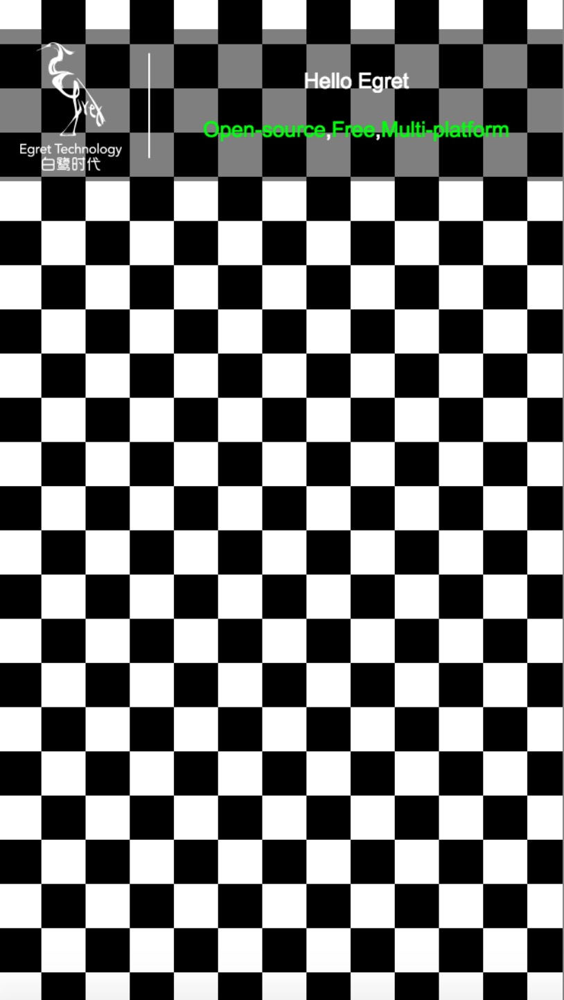

### 1.使用说明

egret 5.0.3 以上版本中提供了 `egret.CustomFilter` ，供开发者自由扩展滤镜，实现各种定制化效果。
> 该功能仅在web和微端环境下支持


`CustomFilter` 构造函数中需要传入顶点着色器和片段着色器程序的字符串，以及 `uniforms` 对象

* 开发者可以根据项目需求自行编写顶点着色器和片段着色器程序

* 顶点着色器中`aVertexPosition`，`aTextureCoord`，`aColor`，`projectionVector`属性由引擎传入

* 引擎渲染之前会将 `uniforms` 对象的属性上传到着色器中，开发者可以每帧改变 `uniforms` 对象的属性达到实现不同效果的需求。该属性目前只支持数字和数组

* `egret.CustomFilter` 同时提供了 `padding` 属性，该属性为滤镜的内边距，如果自定义滤镜所需区域比原区域大（如引擎提供的描边滤镜），需要手动设置该属性。该属性以像素为单位

更详细的使用方法请参考[API文档](http://developer.egret.com/cn/apidoc/index/name/egret.CustomFilter#methodSummary)。

### 2.实战教程

下面示例实现一个黑白方块背景的效果，首先创建一个game项目，之后在Main.ts中createGameScene函数最后插入顶点着色器代码：

```javascript
let vertexSrc =
	"attribute vec2 aVertexPosition;\n" +
	"attribute vec2 aTextureCoord;\n" +
	"attribute vec2 aColor;\n" +
	
	"uniform vec2 projectionVector;\n" +
	
	"varying vec2 vTextureCoord;\n" +
	
	"const vec2 center = vec2(-1.0, 1.0);\n" +
	
	"void main(void) {\n" +
	"   gl_Position = vec4( (aVertexPosition / projectionVector) + center , 0.0, 1.0);\n" +
	"   vTextureCoord = aTextureCoord;\n" +
	"}";
```

在之后插入片段着色器代码：

```javascript
let fragmentSrc =
    "precision lowp float;\n" +

    "varying vec2 vTextureCoord;\n" +

    "uniform float width;\n" +
    "uniform float height;\n" +

    "void main(void) {\n" +
    "vec4 fg;\n" +
    "if(mod(floor(vTextureCoord.x / width) + floor(vTextureCoord.y / height), 2.0) == 0.0) {" +
    "fg = vec4(1,1,1,1);" +
    "}" +
    "else {" +
    "fg = vec4(0,0,0,1);" +
    "}" +
    "gl_FragColor = fg;\n" +
    "}";
```
在代码中定义了每个方格的宽高，这两个值由`uniforms`属性传入。之后根据uv信息以及传入的宽高，利用取余函数算出奇偶数，通过奇偶决定方格是黑色还是白色。

对背景图使用自定义滤镜，设定每个方格大小为50像素：

```javascript
let size = 50;
let filter = new egret.CustomFilter(vertexSrc, fragmentSrc, { width: size / stageW, height: size / stageH });
sky.filters = [filter];
```

运行效果如下图，发现背景图变成了黑白交替的方格，每个方格大小为50像素。



之后再通过帧函数改变方格大小(uniforms属性)：

```javascript
let inc = 1;
this.stage.addEventListener(egret.Event.ENTER_FRAME, function () {
    size += inc;
    if (size >= 80) {
        inc = -1;
    }
    if (size <= 50) {
        inc = 1;
    }
    filter.uniforms.width = size / stageW;
    filter.uniforms.height = size / stageH;
}, this);
```

再次运行游戏，会发现每帧方格的大小都会相应变化
