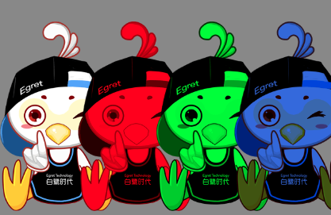

从 Egret 5.2.24 版本开始，`DisplayObject` 中新增加了一个 `tint` 属性，可以给当前对象设置填充色.

**注意：该功能还处于测试阶段，可以用于游戏调试，正式版本请谨慎使用。**

下面是一个示例，给图片加上不同的填充色。

```
let texture: egret.Texture = RES.getRes('bird_png');

let b1 = new egret.Bitmap();
b1.texture = texture;
this.addChild(b1)

let b2 = new egret.Bitmap();
b2.texture = texture;
b2.tint = 0xff0000
b2.x = 150;
this.addChild(b2)

let b3 = new egret.Bitmap();
b3.texture = texture;
b3.tint = 0x00ff00
b3.x = 300;
this.addChild(b3)

let b4 = new egret.Bitmap();
b4.texture = texture;
b4.tint = 0x4169E1
b4.x = 450;
this.addChild(b4)
```

