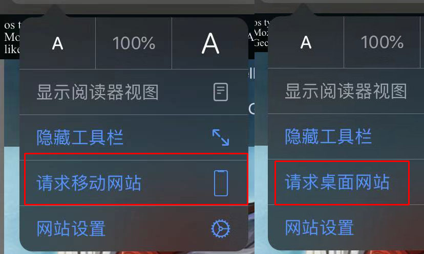

## 兼容性问题

#### ios 13 系统类型的判断问题

在引擎中使用 `egret.Capabilities.os` 方法，可以根据浏览器的 **navigator.userAgent** 来获取平台的操作系统，其中涉及到苹果系统的有2个：

* 苹果手机操作系统 **iOS**
* 苹果桌面操作系统 **Mac OS**

但是苹果手机或 ipad 升级到 ios 13 系统后，在内置的 Safari 浏览器中，用户可以手动设置浏览器的类型。

当设置为 **请求移动网站** 时，userAgent 和以前一样，没有变化。但是当设置为 **请求桌面网站** 时，userAgent 就变的和 mac 台式机**一摸一样**，此时我们无法区分是 ios 还是 mac os。尤其是 ipad，浏览器默认为  **请求桌面网站** 。

我们暂时还没有方法处理该问题，如果开发者有好的办法，可以在论坛反馈给我们。