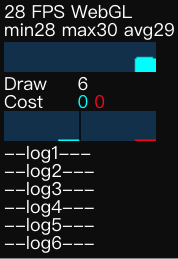

## 1.使用 DEBUG 编译参数
开发者经常写一些希望仅在开发阶段使用的代码，来进行数据校验、输出日志等。

Egret 提供了 `DEBUG` 这一全局变量来实现这样的功能。

下面的代码校验 `value` 是不是由4个数字组成，如果不是，输出指定的错误信息。

```
	if (DEBUG) {
	    var rect = value.split(",");
	    if (rect.length != 4 || isNaN(parseInt(rect[0])) || isNaN(parseInt(rect[1])) ||
	        isNaN(parseInt(rect[2])) || isNaN(parseInt(rect[3]))) {
	        egret.$error(2016, this.currentClassName, toXMLString(node));
	    }
	}
```

在发行版生成过程中，Egret 命令行会移除 `if(DEBUG){ ... }` 这一整个代码块，保持发行版包体的精简。

Egret 还提供了另外一个与 `DEBUG` 对应的编译参数 `RELEASE`，用来编写只在发行版中运行的代码。


## 2.使用内置日志输出面板

在PC端可使用 `console` 提供的诸多方法输出日志，然后使用浏览器提供的开发者工具查看。

但是在移动端这个方式受到了限制，大多数移动端浏览器没有查看日志的方法。
因此 Egret 集成了向屏幕输出日志的功能，以方便移动设备调试。



在 index.html 文件中有如下代码块：

```
    <div style="margin: auto;width: 100%;height: 100%;" class="egret-player"
         data-entry-class="Main"
         data-orientation="auto"
         data-scale-mode="showAll"
         data-frame-rate="30"
         data-content-width="640"
         data-content-height="1136"
         data-multi-fingered="2"
         data-show-fps="true" data-show-log="false"
         data-show-fps-style="x:0,y:0,size:12,textColor:0xffffff,bgAlpha:0.9"> 
     </div>
```

通过 data-show-log： 设置是否在屏幕中显示日志。 true 显示，false 不显示。

在代码中可以直接调用 `egret.log(message?:any, ...optionalParams:any[])` 来输出日志。

data-show-fps-style 可以设置日志的位置，文字大小和背景颜色

## 3.显示帧频信息

`data-show-fps="true/false"` 设置是否显示帧频信息，当这个值为 `true` 时 Egret 会在舞台的左上角显示 FPS 和 其他性能指标
		
* FPS:  60		- 帧频

* Draw: 13		- 每帧 draw 方法调用的平均次数
 
* Cost: 0,0		- 1)Ticker 和 EnterFrame 阶段显示的耗时; 2)绘制显示对象耗时（单位是ms） 

**注：** 5.2 之前的版本 Cost 有3个值，分别为：1）Ticker 和 EnterFrame 阶段显示的耗时; 2）每帧舞台所有事件处理和矩阵运算耗时; 3）绘制显示对象耗时（单位是ms） 

## 4.动态隐藏和显示信息面板
在游戏页面，FPS 面板和调试信息面板是在同一个 `div` 标签里。在引擎 `5.2.23` 版本之后，该 `div` 标签增加了`id`值 `egret-fps-panel`，
当您在 `index.html` 里开启信息面板后，
`data-show-fps="true" data-show-log="true"`。可以通过代码动态隐藏和显示这个面板。**注意** 该功能只有在 pc 的浏览器中才有效。

```
//隐藏面板
document.getElementById('egret-fps-panel').style.visibility ="hidden";
//显示面板
document.getElementById('egret-fps-panel').style.visibility ="visible";
```

	