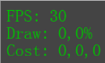
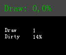
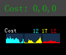
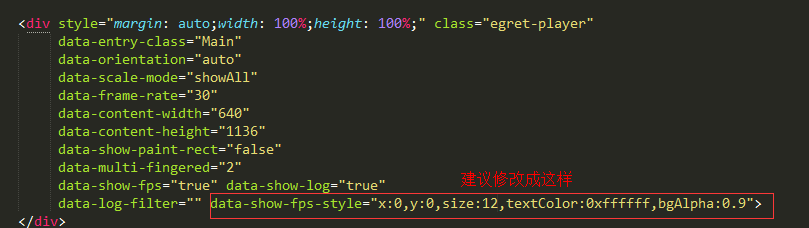

上面这个 FPS 性能监控面板，对于做 Egret 游戏的小伙伴们来说一定非常熟悉了。它陪伴我们从引擎的 beta 版一直走到现在。

我们一直在考虑如何改善和优化这个面板，让它能显示更多有用的信息，更好的帮助开发者观察游戏运行状况、排查问题，提高工作效率。

伴随着本次Egret 3.1.2版本的发布，FPS 性能监控面板也完成了迭代更新，正式面世啦！！小伙伴们可以愉快的使用啦！！

上面就是最新的 FPS 性能监控面板，是不是瞬间感觉高大上许多，专业许多。在小小个一个区域内，我们把开发时需要的数据尽可能的都展示出来，通过图形化的绘制，可以一目了然的看到各种数据的变化状况。另外新的面板是绘制在一个单独的 div 标签内，不再随引擎的缩放模式而改变大小，这样就可以保证文字的清晰度始终是一致的。

下面我们就把新、老监控面板对比讲解一下。

**FPS区域**

FPS 显示区域是变化最大的一个部分。以前只显示一个当前的 FPS 帧频。新版的增加了当前的显示模式状态， WebGL 还是 Canvas。100秒内的最大帧频，最小帧频和平均帧频。另外还用动态的柱状图的方式绘制了100秒的帧频数据，再也不用像以前一样死盯着帧频数字怕漏看掉了。

**Draw Dirty区域**

Draw: 每帧 draw 方法调用的平均次数
Dirty: 脏区域占舞台的百分比
老版本的 Draw 和 Dirty 显示在一行。新版的分为两行显示，这样可以更关注某一个数字，不会被其他数字的变化干扰。

**Cost区域**

Cost 三个参数的意义:
1-蓝色：表示 Ticker 和 EnterFrame 阶段消耗的时间
2-黄色：表示事件处理和矩阵运算阶段消耗的时间
3-红色：表示绘制显示对象阶段消耗的时间
新版面板把不同的参数用不同的颜色来区分，更容易识别。在数字下方，和 FPS 区域一样，同样用图形绘制了33秒内的数据变化情况，方便开发者调试。

ps：在老项目中使用性能监控面板，建议您在 index.html 中修改一下文字大小和配色方案，老版本的配色方案有点丑...

ps2：在 IE11 以下的浏览器中，FPS 面板会遮挡舞台，触摸事件无法穿透，建议您调试的时候使用 Chrome 浏览器。

