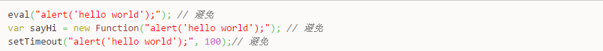
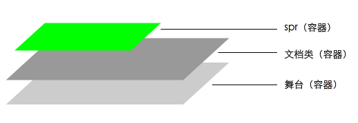
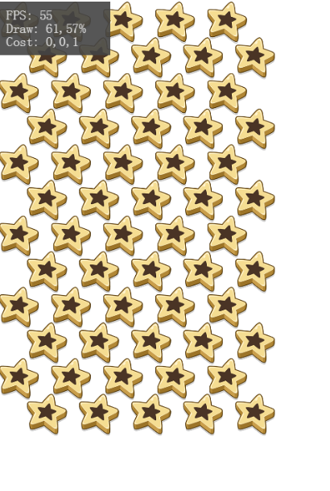
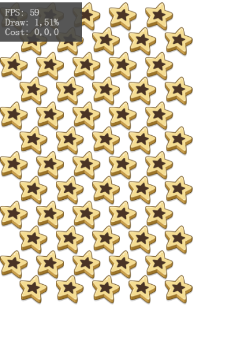
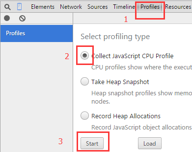

## 第一章：简介
本文档通过开发中所遇到的问题，为部署与优化程序的开发人员介绍最佳实践。

优化游戏性能以便获得最佳体验是非常重要的，针对移动设备尤其重要。通过下面几个技巧使你开发的移动游戏更好的运行在移动设备：

* 少使用Alpha混合。
* 显式停止计时器，让它们准备好进行垃圾回收。
* 使用事件侦听器并在不需要时删除这些侦听器。
* 在不需要触摸交互性时显式禁用触摸交互性。
* 合理使用dispatchEvents 函数。
* 尽可能重用对象，建立对象池，而不创建对象并对其执行垃圾回收。
* 多次调用类属性时，避免直接使用this.att，建立局部变量赋值。
* Event.ENTER_FRAME数量控制。
* 减少不必要的引用。
* 减少显示对象的旋转缩放。
* 使用SpriteSheet合并的图片尺寸要优于单张图片的总尺寸，尤其是带透明通道的。
* 在Http请求中，加载单个文件速度要优于加载多个文件。

根据游戏进程，合理使用处理器是性能优化的关键，很多设定不被推荐的原因是处理器很忙。改进性能有一些常规的方法，降低内存的使用量，降CPU的使用量,是否可以调用GPU等等，始终牢记预期与用户的体验是优化的关键。

在程序开发中，常见的一个建议是”避免过早优化”,也许某些性能优化需要难以理解或读懂的代码去实现，此类代码优化后难以维护。

Egret为开源免费引擎，为更好的发展，请给我们GitHub一颗小星星： https://github.com/egret-labs/egret-core

### 运行时代码执行基本原理
优化的关键在于了解运行的原理，在引擎的设计中，Egret底层使用了”弹性跑道模型”即各种操作都是针对每”帧”发生的。

例如：我们指定帧速率为30帧/秒,则运行时会尝试使每个帧的执行时间为三十分之一秒。

每个帧循环包括两个阶段，三部分：enterFrame 事件、事件和呈现。

第一阶段包括两部分（enterFrame 事件和事件），第一部分是派发一次enterFrame事件，第二部分是调度运行时的事件。 第二阶段是第一阶段所有事件调度后会执行clear后，帧循环的呈现阶段开始。此时，运行时将计算屏幕上所有可见元素的状态并将其绘制到屏幕上。然后，此进程重复，就像赛跑者围绕跑道奔跑。

最简单的方法是假设帧循环中的两个阶段需要相同的时间。在这种情况下，一半的时间运行帧循环事件处理函数和应用程序代码，另一半的时间发生呈现。但是，事实通常是不同的。有时，应用程序代码会通过增加运行时间并减少用于呈现的时间来占用帧中多一半的可用时间。在其他情况下，特别是对于混合模式等复杂的可见内容，呈现需要一半以上的帧时间。由于各阶段需要的实际时间是灵活的，所以帧循环常称为“弹性跑道”。

如果帧循环的组合操作（代码执行和呈现）所需时间太长，运行时将无法保持帧速率。帧会进行扩展，所需时间超过其分配的时间，因此在触发下个帧之前会出现延迟。例如，如果一个帧循环需要的时间超过三十分之一秒，则运行时不能以每秒三十帧的速度更新屏幕。如果帧速率减慢，将影响体验效果。最乐观的情况是动画断断续续。如果情况更糟糕，可能画面停止，或程序崩溃。

### 体验反馈与实际性能
根据操作的运行时与创建对象实例数来度量游戏性能：

* 动画是流畅还是断断续续？
* 音频是连续播放还是暂停再恢复播放？
* 键入时，文本输入保持同步还是有些延迟？
* 如果单击，会立即发生某些情况还是存在延迟？
* PC应用程序运行时，CPU 风扇声音是否会变大？
* 在便携式计算机或移动设备上运行应用程序时，电池是否会很快耗尽？
* 开启性能调试面板

> 在 Egret 2.5 版以上的引擎中可以在 index.html 内`data-show-fps`字段设置显示调试面板。之前的版本使用`egret.Profiler.getInstance().run();`。

通过上述度量，了解程序代码的执行性能方法，这里只是部分，如果有更好的，欢迎评论。

## 第二章：内存优化

### 显示对象

Egret包含多种显示对象，要限制内存使用量，需选择合适的显示对象。

* 对于非交互的简单形状，使用Shape。
* 对于没有重绘需求有子节点，使用DisplayObjectContainer 。
* 对于有重绘需求有子节点，使用Sprite。

### 重用对象

重用对性能与内存非常重要。

创建对象时，将对象创建在循环外部并在循环内反复重用它。并非所有对象总是能够这么做，但在许多情形下此技术很有帮助。

需要密集的创建对象，要引入对象池，例如：做一款打飞机类型游戏，进入战斗前，飞机，怪物，掉血特效等对象提前初始化，在过程中实时提取，而不是实时创建。

尽管使用对象池具有性能优势，但它的主要好处是让内存管理工作更容易。 如果内存利用率无限制地增长，对象池可预防该问题。 此技术通常可提高性能和减少内存的使用。

对象池参考： [对象池](https://github.com/egret-labs/egret-game-library/blob/master/src/game/ObjectPool.ts)

### 释放内存

JavaScript中，GC在回收内存时，首先判断该对象是否被其他对象引用。在确定没有其他引用，GC在特定条件下进行回收。

* 删除对象的所有引用确保被垃圾回收器回收。
* 删除资源RES.destroyRes("")。
* 暂停清除计时器clearInterval()、clearTimeout()、Timer.stop()。

### 使用位图

位图的创建过程中，需要考虑时机，创建是一个消耗内存与CPU的过程。大量的位图创建会使你内存占用快速增长，导致性能下降，可以使用对象池优化创建销毁。

针对分辨率制作相关素材要比适配最大分辨率节省内存，并且减少由程序自适应带来性能下降。

宽高<=1024*1024，这不是针对内存占用，但是它会影响兼容性。

### 文本

TextField减少对于描边的使用（stroke）。

TextField中使用cacheAsBitmap，可以减少重绘次数。

固定文字段落应当使用位图避免文字重绘产生开销。

### 事件模型与回调

Egret是基于事件模型的。这里主要指出事件模型值得注意的事项。

dispatchEvent()方法循环访问注册列表，并对各个注册的对象调用事件处理函数方法。以下代码说明过程：

```
 //触发
 this.dispatchEvent(new egret.Event(egret.Event.ADDED_TO_STAGE));
 //监听
 this.addEventListener(egret.Event.ADDED_TO_STAGE, this.test, this)
 ```
 
在每次触发时，会实例化Event对象，这样会占用更多内存，当侦听 Event.ENTER_FRAME 事件时，将在各个帧上为事件处理函数创建一个Event对象。在捕获和冒泡阶段（如果显示列表很复杂，此成本会很高），显示对象的性能可能会特别低。

## 第三章：CPU优化

### 触控交互

禁用不必要显示对象的触摸交互。

使用交互对象（例如MovieClip或Sprite对象）时，尤其是屏幕上显示许多交互对象，当他们重叠时，检测触摸交互可能会占用大量的CPU资源。避免这种情况的一种简便方法是对不需要任何交互的对象禁用交互行为。以下代码说明禁用触摸交互：

```
var sp: egret.Sprite = new egret.Sprite();
this.addChild(sp);
sp.touchChildren = false; //确定子孙是否接受触摸事件，默认true
sp.touchEnabled = false; //此对象是否接受触摸事件，默认true
```

还有一种方式禁用对象的touchEnabled，父容器创建如遮罩容器并侦听点击事件，寻找对象坐标标点


例如：上图需要判断点击哪个滑块的需求，实现方式是在滑块上创建Bitmap阻止点击事件深入冒泡，再通过Bitmap上的点击坐标来计算出具体点击的哪个方块。

### TypeScript

由于TypeScript最终会被编译为JavaScript，而JavaScript是一种解释型语言，执行速度要比编译型语言慢得多，随着作用域中的作用域数量的增加，访问当前作用域以外的变量的时间也在增加。所以，访问全局变量总是比访问局部变量要慢，因为需要遍历作用域链。只要能减少花费在作用域链上的时间，就能增加脚本的整体性能，对于写法的技巧非常重要，下面是一些简单常用技巧。

对于V8虚拟机的优化方法是，避免动态添加属性与修改变量类型，好处是减少创建新类的开销，V8中当试图修改动态变量或属性时，虚拟机会把function类缓存为一个固定的C++类并触发虚拟机的重新编译。当你使用TypeScript显而易见的好处是类型的声明以及语法规范会使你避免这种情况发生。

* 类方法中，将 this 赋值给另外一个临时变量，使用方法详见测试用例。

  测试：[this测试](https://github.com/xinfangke/egretDocsTest/blob/master/test3.ts)
  
* 在循环中，尝试改进写法,减少读取次数：for(var i = 0, length = array.length; i < length; ++i)。

  测试：[循环测试](https://github.com/xinfangke/egretDocsTest/blob/master/test4.ts)

* 避免双重解释，如eval函数，会使JavaScript创建解析器，产生额外的性能消耗。
 
  
 
* 推荐使用正则表达式处理字符串遍历。
* 避免使用[“property”]访问对象属性，改为Object.property。
* 创建对象var obj:object={“key”:”value”} > var obj:Object={} > new Object()。
* 字符串类型转换("" +) > String() > .toString() > new String()。
* 类声明属性不宜过多(<64)，少继承，多引用。

  测试（V8）：[V8 测试](https://github.com/xinfangke/egretDocsTest/blob/master/test6.ts)
  
* 代码中Getter ，Setter ，Try-catch会使性能下降。
* 请保持数组中类型的一致，数组中第一个对象类型是确定的会提供性能。

### 计时器与enterFrame事件

显示停止定时器，移除enterFrame侦听。

将程序中Timer对象与 enterFrame注册数量降至最少，事件中尽量减少对显示对象外观的更改。

每帧在运行时将为显示列表中的每个显示对象调度一次enterFrame事件。虽然你可以给很多显示对象在内部注册enterFrame事件，但这样做将使每帧执行更多代码，如果超出处理范围，程序会出现卡顿。 可以考虑使用一个集中的enterFrame处理函数，通过集中同类代码，更容易管理所有频繁运行的代码。

如果使用Timer对象，也将产生与多个Timer对象创建与调度事件相关的开销。减少或合理设置触发时间，对于性能提升很有帮助。停止未使用的Timer。

### 后台对象

移除显示列表中的对象，而不是visible=false, 对象仍在父级显示列表，某些功能依然在遍历这个列表。

避免一些后台对象参与逻辑，例如一些已经移出显示列的对象，是否需要碰撞检测，距离运算等。

适当延长检测时间，例如：碰撞间隔，非需要特别精确的时候使用简单的矩形碰撞。

### 动画

对于简单的动画，序列帧的性能更佳。

使用StalingSwf制作动画时，导出文件之前删除合并fla中多余帧，可以减少Json体积。

处理动画移动，使用帧时间差计算而不要使用帧率，不要相信帧率，它在各种环境中是不稳定的。

## 第四章：重绘优化

### 渲染对象



要改进渲染，务必考虑显示列表的嵌套。每个显示对象都是独立，当对象放入显示列表后参与整个渲染过程。

绘制过程：由内而外 spr-> 文档类 -> 舞台。

Egret版本大于2.5，引擎提供了自动的脏矩形，极大提高渲染能力，无需手动设置。

Egret版本小于2.5，可以通过制定重绘矩形范围，来优化程序。

例如,Egret版本小于2.5下可以使用下面代码添加一个在屏幕左上角200区域的脏矩形：

```
var area:egret.Rectangle = new egret.Rectangle(0, 0, 200, 200);
egret.RenderFilter.getInstance().addDrawArea(area);
```

### 显示优化

涉及频繁在Stage添加移除对象并且不关心ADDEDTOSTAGE与REMOVEDFROMSTAGE事件时，可以进行addChild和removeChild优化，减少逻辑判定。

示例：[显示优化测试](https://github.com/xinfangke/egretDocsTest/blob/master/test5.ts)

### Alpha混合

使用 alpha 属性时避免使用要求 alpha 混合的效果，例如淡化效果。当显示对象使用 alpha 值混合处理时，运行时必须将每个堆叠显示对象的颜色值与背景色混合起来，以确定最终颜色。因此，alpha 值混合处理可能比绘制不透明颜色占用更多的处理器资源。这种额外的计算可能影响慢速设备上的性能。尽可能避免使用 alpha 属性。

### 帧频速率

稳定的帧率是游戏性能最重要的表现，非动作游戏降低游戏帧率可以大幅提升性能。

```
this.stage.frameRate = 30;//能被60整除的数
```

使用egret.callLater，egret.setTimeout自定义分帧管理器等来实现功能的分帧、延时处理。

例如：切换界面时，界面显示与数据填充进行一个分帧或者延时处理来保证UI切换时的流畅度。 例如：当同一帧创建多个显示对象时，可进行分帧处理，保证帧率稳定。

侦听休眠与激活状态改变帧率与动画:

```
this.stage.addEventListener(egret.Event.ACTIVATE,this.onActive,this);
this.stage.addEventListener(egret.Event.DEACTIVATE,this.onDeactivate,this);
```

休眠中停止动画与呈现相关内容，在程序被激活时重新启动。

### 位图缓存

在适当的时候对多位图容器使用位图缓存功能。

选择cacheAsBitmap可实现良好的优化。此功能对渐变、多段落文字、多位图、9宫图等有显著提高呈现的性能，但是需要占用大量内存。

当显示对象内部是实时改变的，启动位图缓存你可能获得相反的效果。当每帧运行时必须更新缓存位图，然后屏幕重绘该位图，这一过程需要消耗许多CPU。仅当缓存的位图可以一次生成，且随后无需更新时，适合使用位图缓存功能。

对Sprite 显示对象开启位图缓存后，缩放、移动、修改x,y属性不会导致重新生成，但是修改Sprite内部子项将会导致重新生成缓存。

下例代码中创建了60个位图，并且有序的排列。将60个Bitmap放到一个Sprite中。运行后看到的效果如下：

```
private context:egret.Sprite = new egret.Sprite();
private createGameScene(): void
{
    for( var i:number=0; i<12;i++ )
    {
        for(var t:number=0;t<5;t++)
        {
            var bit:egret.Bitmap = new egret.Bitmap();
            bit.texture = RES.getRes("star");
            bit.x = 76*t+41*(i%2);
            bit.y = 52*i;
            bit.scaleX = 0.5;
            bit.scaleY = 0.5;
            this.context.addChild(bit);
        }
    }
    this.addChild(this.context);
    //使用 Tween 让容器动起来。
    egret.Tween.get(this.context,{"loop":"true"}).to({
			scaleX":0.8,"scaleY":0.8
		},2000).to({
					"scaleX":1,"scaleY":1
				},2000);

}
```


当前draw的数量为61，每帧执行61次draw操作。

将代码简单的修改一下：

```
private context:egret.Sprite = new egret.Sprite();
private createGameScene(): void
{
    for( var i:number=0; i<12;i++ )
    {
        for(var t:number=0;t<5;t++)
        {
            var bit:egret.Bitmap = new egret.Bitmap();
            bit.texture = RES.getRes("star");
            bit.x = 76*t+41*(i%2);
            bit.y = 52*i;
            bit.scaleX = 0.5;
            bit.scaleY = 0.5;
            this.context.addChild(bit);
        }
    }
    this.addChild(this.context);
	 //使用 Tween 让容器动起来。
    egret.Tween.get(this.context,{"loop":"true"}).to({
			"scaleX":0.8,"scaleY":0.8
		},2000).to({
					"scaleX":1,"scaleY":1
				},2000);

    this.context.cacheAsBitmap = true;
}
```

运行效果：



此时，我们的draw重绘为1，合理的使用位图缓存，可以极大程度提高渲染性能。

## 第五章：网络优化

### 资源划分

减少界面层次，多层组合为独立位图是目前高性能的方法。界面有时会分为单色背景，纹理，边框，子项边框等这种设定对于网络与程序性能没有提高，合并以上图层会对你应用带来质的飞跃。


合理的根据游戏进程去加载所需资源，常见的方法有每次场景变换加载所需资源，每次点击界面入口按钮加载界面资源并缓存，初始化应用只加载可能全局使用与当前可能需要的。分块分组（group）资源加载。

### 加载通信

当每次发起的HTTP请求会有协议头，确认过程，返回数据，优化合并文件减少请求数可以显著提高网络性能。


资源服务器开启GZIP压缩，提高载入速率。


对于一些有透明通道的png图片格式，可以使用压缩软件进行一定比例压缩，会有非常大的提升空间。对于没有透明通道的推荐使用jpg已达到提升网络加载。


对于MP3，尽可能的减少其采样率与码率。


使用egret compress_json 命令压缩Json文件，使体积减小。


加载中的显示对象，给予显示对象预设位图，这也许并不能带来网络性能提升甚至下降，但是这样的修改对于用户体验是极佳的。

 加载完成后----------》  


如果不做预加载处理，用户并不了解屏幕中呈现的最终效果，也许认为游戏有问题，给予用户感知思考是非常友好的体验。

## 第六章：环境优化

### IOS

预加载资源非常多，会使整个游戏帧率降低，合理的将零散位图合并为独立纹理集，减少配置文件数目，不是必要的文件放入游戏后加载。

### QQ浏览器

推荐位图的宽高限定在1024*1024。

1G内存手机最多可以使用20个Canvas，而引擎中cacheAsBitmap 是基于创建Canvas实现的，这里有一个小技巧，cacheAsBitmap配合对象池使用。可参考一下示例：

[对象池测试1](https://github.com/xinfangke/egretDocsTest/blob/master/test1.ts)   

[对象池测试2](https://github.com/xinfangke/egretDocsTest/blob/master/test2.ts)

更多详情请查看QQ浏览器开发文档：http://x5.tencent.com/guide?id=2004

> 在 Egret 2.5 以上版本的引擎中会自动处理`cacheAsBitmap`所占用的 Canvas 数量。

### 利用Chrome 调优
Chrome的profiles可以帮助我们确定代码执行效率，从而确定性能原因。

 

 


其他参考：

关于profiles使用：[Chrome Developer Tools之内存分析](http://blog.csdn.net/jiadustudent/article/details/41312891)

写出性能最优的代码(1) ：http://bbs.egret.com/thread-6198-1-1.html

写出性能最优的代码(2) ： http://bbs.egret.com/thread-6197-1-2.html