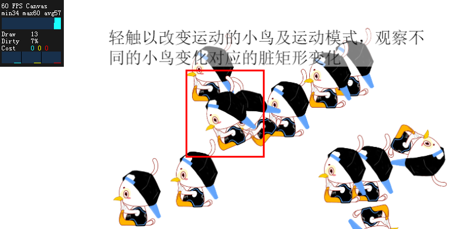

在 Egret 2.5 以上的版本中，可以在根目录下的 index.html 中能够很方便的控制脏矩形和帧频信息的显示状态。

```html
    <div style="margin: auto;width: 100%;height: 100%;" class="egret-player"
         data-entry-class="Main"
         data-orientation="auto"
         data-scale-mode="noScale"
         data-frame-rate="30"
         data-content-width="480"
         data-content-height="800"
         data-show-paint-rect="false"
         data-multi-fingered="2"
         data-show-fps="false" data-show-log="false"
         data-log-color="#b0b0b0"> </div>```

### `data-show-paint-rect="true/false"`

设置是否显示重绘区域，当这个值为 `true` 时 egret 会将舞台中的重绘区域用红框表示出来。



>上图适用于 Egret 3.1.2 以上版本
		
### `data-show-fps="true/false"`
	
设置是否显示帧频信息，当这个值为 `true` 时 Egret 会在舞台的左上角显示 FPS 和 其他性能指标
		
```
FPS:  29           - 帧频
Draw: 7,6%         - 每帧 draw 方法调用的平均次数，脏区域占舞台的百分比
Cost: 0,0,1        - Ticker和EnterFrame阶段显示的耗时,每帧舞台所有事件处理和矩阵运算耗时，绘制显示对象耗时（单位是ms） 
```
		

>在 Egret 2.5.0 到 Egret 2.5.4的版本中 Cost 没有第一个参数：Ticker和EnterFrame阶段显示的耗时。只有后两个参数:每帧舞台所有事件处理和矩阵运算耗时，绘制显示对象耗时（单位是ms）。