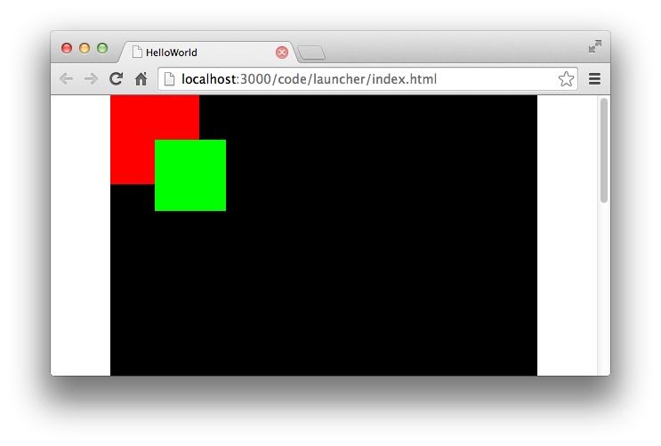
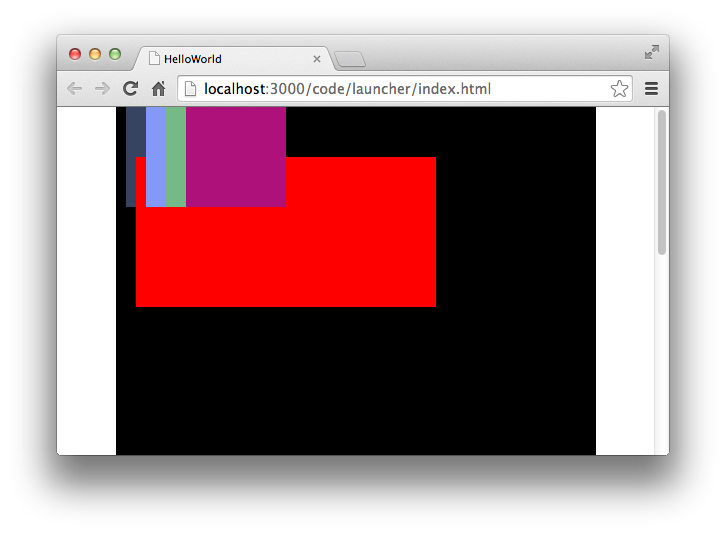
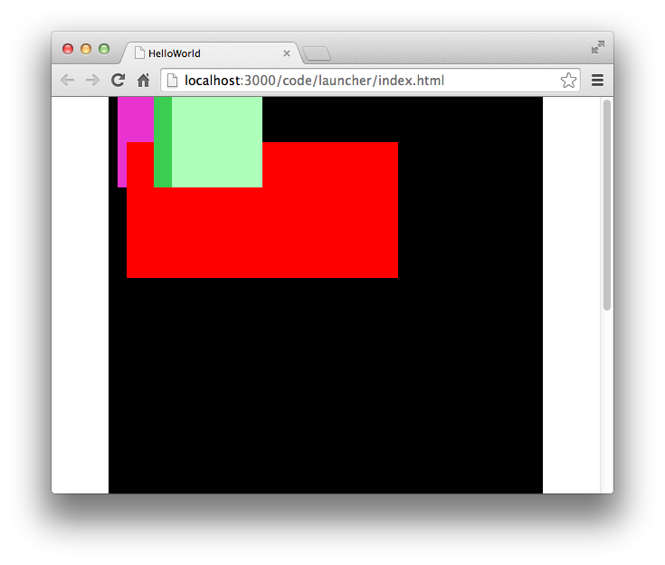
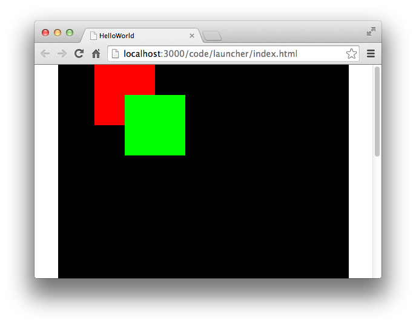

每一个容器都会有一个自己的深度管理功能，这个深度管理就好像我们排队一样。


每一个显示对象在其父级的容器中都应该拥有一个属于自己的深度值，而且这个值相对于同级显示对象应该是唯一的。这个深度值实际上就是一个显示对象的叠放次序。我们也称之为 *“z-次序”*。

深度是由每个容器的子对象列表所管理。每个容器都清楚自己拥有多少个子对象。我们可以通过容器的 `numChildren` 属性来获取当前容器的子对象数量。

`容器.numChildren`

在对深度的控制管理中，Egret提供了一些方便有效的深度管理API。下面我们就对深度管理功能做一些介绍。

## 深度顺序

Egret中容器的深度都是从0开始的，当一个显示对象第一个被添加到容器中时，它的深度值为0。这个显示对象也处于容器的最底层。当我们添加第二个显示对象的时候，他的深度值为1，并且在第一个显示对象上方。如果两个显示对象发生了相交，那么我们可以从视觉上看到，第二个显示对象遮挡住第一个显示对象。

下面的示例中，我们创建了两个显示对象，并且让他们发生遮挡，一次来查看显示对象的深度值关系。

```
var spr1:egret.Sprite = new egret.Sprite();
spr1.graphics.beginFill( 0xff0000 );
spr1.graphics.drawRect( 0, 0, 100, 100);
spr1.graphics.endFill();
this.addChild( spr1 );

var spr2:egret.Sprite = new egret.Sprite();
spr2.graphics.beginFill( 0x00ff00 );
spr2.graphics.drawRect( 0, 0, 80, 80);
spr2.graphics.endFill();
spr2.x  = 50;
spr2.y = 50;
this.addChild( spr2 );
```

运行效果如下：



## 添加/删除指定深度的对象

我们默认使用的 `addChild` 方法会默认按照当前子对象深度进行排序，从0开始，每次深度加1，以此类推。

当我们想讲某一个显示对象添加到一个指定深度的时候，我们需要使用 `addChildAt` 方法。这个操作很像排队时插队的想象。


使用 `addChildAt` 方法也非常的容易，具体使用方法如下：

`容器.addChildAt( 显示对象, 深度值 )`

我们来看一个具体的演示代码，我们随机绘制四个颜色不同的正方形，将它们依次叠加排列，然后新建一个显示对象，并且放到深度为1的位置。

```
var sprcon:egret.Sprite = new egret.Sprite();
this.addChild( sprcon );
sprcon.x = 10;

for(var i:number = 0; i<4; i++)
{
    var spr:egret.Sprite = new egret.Sprite();
    spr.graphics.beginFill( 0xffffff * Math.random() );
    spr.graphics.drawRect( 0, 0, 100, 100);
    spr.graphics.endFill();
    spr.x = i*20;
    sprcon.addChild( spr );
}

var sprNew:egret.Sprite = new egret.Sprite();
sprNew.graphics.beginFill( 0xff0000 );
sprNew.graphics.drawRect( 0, 0, 300, 150 );
sprNew.graphics.endFill();
sprNew.x = 10;
sprNew.y = 50;
sprcon.addChildAt( sprNew, 1 );
```

运行效果如图：



我们不仅仅可以再添加显示对象时指定显示对象的深度，在删除显示对象时依然可以通过深度来进行控制。

我们可以使用 容器.removeChild( 显示对象 ) 将一个显示对象移除显示列表，同样，还可以使用

容器.removeChildAt( 深度值 ) 来删除一个指定深度的显示对象。

我们通过上上面示例代码的修改，将深度值为2的显示对象移除显示列表。

```
var sprcon:egret.Sprite = new egret.Sprite();
this.addChild( sprcon );
sprcon.x = 10;

for(var i:number = 0; i<4; i++)
{
    var spr:egret.Sprite = new egret.Sprite();
    spr.graphics.beginFill( 0xffffff * Math.random() );
    spr.graphics.drawRect( 0, 0, 100, 100);
    spr.graphics.endFill();
    spr.x = i*20;
    sprcon.addChild( spr );
}

var sprNew:egret.Sprite = new egret.Sprite();
sprNew.graphics.beginFill( 0xff0000 );
sprNew.graphics.drawRect( 0, 0, 300, 150 );
sprNew.graphics.endFill();
sprNew.x = 10;
sprNew.y = 50;
sprcon.addChildAt( sprNew, 1 );

sprcon.removeChildAt( 2 );
```

运行效果如下：



有时候我们想一次性将一个容器内的所有子对象全部删除，那么我们不需要使用复杂的遍历操作来想子对象一一删除，例如：

```
var numChild:number = sprcon.numChildren;
for(var t:number = 0; t<numChild; t++)
{
    sprcon.removeChildAt( 0 );
}
```

这样的方式显然非常的繁琐，我们提供了一个更加方便快捷的方法，使用 `removeChildren` 可以将当前容器内的所有子对象全部移除显示列表。

使用方法如下：

`容器.removeChildren();`

我们依然使用上面的示例，继续在后面编写代码：

`sprcon.removeChildren();`

编译并运行，你会看到舞台sprcon内没有任何显示对象显示。

## 交换不同深度对象

交换不同对象深度的功能Egret为开发者提供了两个方法。一个是 `swapChildren` 方法，另外一个是 `swapChildrenAt` 方法。

两个方法使用方式少有不同，但效果相同，具体使用方法如下：

`容器.swapChildren( 显示对象, 显示对象 )`

`容器.swapChildrenAt( 深度值, 深度值 )`

我们来看一个具体的例子，这个示例中，我们创建一个sprcon容器，并向其中纺织两个颜色不同的方块。然后我们分别使用上面两个方法互换两个方块的深度值。

```
var sprcon:egret.Sprite = new egret.Sprite();
this.addChild( sprcon );
sprcon.x = 10;

var spr1:egret.Sprite = new egret.Sprite();
spr1.graphics.beginFill( 0xff0000 );
spr1.graphics.drawRect( 0, 0, 100, 100 );
spr1.graphics.endFill();
spr1.x = 50;
sprcon.addChild( spr1 );

var spr2:egret.Sprite = new egret.Sprite();
spr2.graphics.beginFill( 0x00ff00 );
spr2.graphics.drawRect( 0, 0, 100, 100 );
spr2.graphics.endFill();
spr2.x = 100;
spr2.y = 50;
sprcon.addChild( spr2 );
```

运行效果如图：



下面我们使用第一种方法进行两个方块的深度互换。

sprcon.swapChildren( spr1, spr2 );
第二种方法进行两个方块深度互换。

sprcon.swapChildrenAt( 0, 1 );


## 重设子对象深度

当我们将一个显示对象添加到显示列表中后，我们还可以手动重设这个显示对象的深度。

实现显示对象深度重置的方法是 `setChildIndex` ，使用方法如下：

`容器.setChildIndex( 显示对象, 新的深度值 );`

示例代码如下：

```
var sprcon:egret.Sprite = new egret.Sprite();
this.addChild( sprcon );
sprcon.x = 10;

var spr1:egret.Sprite = new egret.Sprite();
spr1.graphics.beginFill( 0xff0000 );
spr1.graphics.drawRect( 0, 0, 100, 100 );
spr1.graphics.endFill();
spr1.x = 50;
sprcon.addChild( spr1 );

var spr2:egret.Sprite = new egret.Sprite();
spr2.graphics.beginFill( 0x00ff00 );
spr2.graphics.drawRect( 0, 0, 100, 100 );
spr2.graphics.endFill();
spr2.x = 100;
spr2.y = 50;
sprcon.addChild( spr2 );

sprcon.setChildIndex( spr1, 1 );
```

上面这段代码中默认是绿色的方块遮盖在红色方块上方的，我们通过对spr1（红色方块）的深度重置（重置为1）将其放置于绿色方块上方。

运行效果如图：


