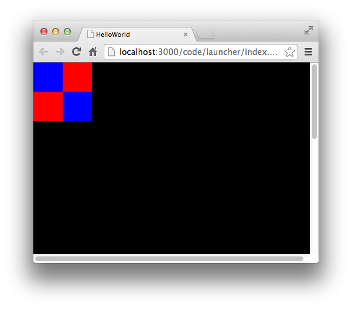
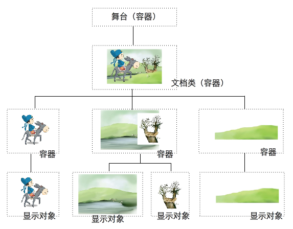

## 显示对象
### 1.基本概念
“显示对象”，是可以在舞台上显示的对象。可以显示的对象，既包括可以直接看见的图形、文字、视频、图片等，也包括不能看见但真实存在的显示对象容器。在Egret中，视觉图形都是由显示对象和显示对象容器组成的。

DisplayObject类是所有显示对象的父类，该类包含显示对象共有的属性与方法。

### 2.可视属性

可视属性用来定量描述显示对象在舞台中的显示状态，结合下图说明可视属性的含义。


如上图1所示，在Egret中定义舞台的坐标系

原点在屏幕左上角。

横轴使用X表示，向右为正。

纵轴使用Y表示，向下为正。

上图1中包含一个灰色的矩形，该矩形拥有一个“锚点”，Egret使用该点的坐标表示矩形的坐标。通过 x 和 y 属性访问修改显示对象的坐标位置。示例代码如下：

```javascript
var shape:egret.Shape = new egret.Shape();
shape.x = 100;
shape.y = 20;
```

图2中展示了显示对象的缩放功能。缩放是指将显示对象的宽或高进行比例缩放。缩放功能通过 scaleX 和 scaleY 属性来实现。图中，对灰色的矩形宽高进行0.5倍缩放。示例代码如下：

```javascript
var shape:egret.Shape = new egret.Shape();
shape.scaleX = 0.5; 
shape.scaleY = 0.5;
```

> 注意：如果对位图进行缩放或拉伸，图像会发生模糊。

图3中展示了关于透明度的操作。显示对象的默认透明度为"1"，表示完全不透明，通过 alpha 属性访问修改透明度。alpha取值范围为 0-1。示例代码如下：

```javascript
var shape:egret.Shape = new egret.Shape();
shape.alpha = 0.4;
```

图4中展示了显示对象的旋转操作，旋转角度可通过 rotation 属性访问修改。将图中的矩形旋转30°，示例代码如下：

```javascript
var shape:egret.Shape = new egret.Shape();
shape.rotation = 30;
```

上图展示了显示对象中常用的可视属性，下面列表是显示对象的全部可视属性。

* alpha：透明度
* width：宽度
* height：高度
* rotation：旋转角度
* scaleX：横向缩放
* scaleY：纵向缩放
* skewX：横向斜切
* skewY：纵向斜切
* visible：是否可见
* x：X轴坐标值
* y：Y轴坐标值
* anchorOffsetX：对象绝对锚点X
* anchorOffsetY：对象绝对锚点Y

### 3.核心显示类

不同的内容对应不同的显示对象，Egret 中一共封装了8个显示相关的核心类，如下表。

| 类 |  描述 |
|  --- |  --- |
|  DisplayObject | 显示对象基类，所有显示对象均继承自此类 |
|  Bitmap |  位图，用来显示图片 |
|  Shape | 用来显示矢量图，可以使用其中的方法绘制矢量图形 |
|  TextField |  文本类 |
|  BitmapText |  位图文本类 |
|  DisplayObjectContainer |  显示对象容器接口，所有显示对象容器均实现此接口 |
|  Sprite |  带有矢量绘制功能的显示容器 |
|  Stage |  舞台类 |

### 4.自定义显示对象类

自定义显示对象类需要继承自 `DisplayObject`的具体子类，例如`Shape`或者`TextField`。

示例代码如下：

* 创建
创建一个名称为 `MyGrid` 的类，并且继承自 `Shape` 。具体代码如下：

```javascript
class MyGrid extends egret.Shape{
    public constructor(){
        super();
        this.drawGrid();
    }

    private drawGrid(){
        this.graphics.beginFill( 0x0000ff );
        this.graphics.drawRect( 0, 0, 50,50 );
        this.graphics.endFill();

        this.graphics.beginFill( 0x0000ff );
        this.graphics.drawRect( 50, 50, 50, 50);
        this.graphics.endFill();

        this.graphics.beginFill( 0xff0000 );
        this.graphics.drawRect( 50, 0, 50,50 );
        this.graphics.endFill();

        this.graphics.beginFill( 0xff0000 );
        this.graphics.drawRect( 0, 50, 50,50 );
        this.graphics.endFill();               
    }
}
```

在 `MyGrid` 中绘制了一个红蓝相间的2*2格子，然后修改文档类`Main`，在文档类中创建并显示 `MyGrid`类的实例，具体代码如下：


```javascript
class Main extends egret.DisplayObjectContainer{
    public constructor(){
        super();
        this.addEventListener(egret.Event.ADDED_TO_STAGE,this.onAddToStage,this);
    }

    private onAddToStage(event:egret.Event){
        var _myGrid:MyGrid = new MyGrid();
        this.addChild( _myGrid );
    }
}
```

* 效果
编译并测试，在浏览器中看到如下图的效果。



## 显示容器
### 1.基本概念
所有的显示容器全部继承自 `DisplayObjectContainer` 类，该类继承自 `DisplayObject` 。也就是说，在Egret中，所有的容器都继承自 `DisplayObject`。

在Egret中,`DisplayObjectContainer` 封装了一些显示列表中常用的功能，将在后面文档中详细介绍。这些常用操作主要分为四类：

* 添加、删除子对象

* 访问子对象

* 检测子对象

* 设置叠放次序

>在Egret中，显示对象被分为两大类：一种是可以包括其他显示对象的显示对象容器，简称为“容器”。另外一种是单纯的显示对象，除自身以外不能包括其他显示对象，简称“非容器对象”。

### 2.Sprite

在Egret中，`Sprite`是一个常用的容器。

`Sprite`继承自 `DisplayObjectContainer`，同时添加了Graphics功能。

> 关于Graphics功能，会在矢量绘图部分进行详细讲解。

### 3.自定义容器

自定义容器，可编写一个类，继承 `DisplayObjectContainer` 。如果要同时实现Graphics绘图功能，可继承 `Sprite`。

下面是一个自定义容器类的示例，该示例定义了一个`GridSprite`类。这个类默认绘制一个红蓝相间的格子。

```javascript
class GridSprite extends egret.Sprite
{
    public constructor()
    {
        super();
        this.drawGrid();
    }

    private drawGrid()
    {
        this.graphics.beginFill( 0x0000ff );
        this.graphics.drawRect( 0, 0, 50,50 );
        this.graphics.endFill();
        
        this.graphics.beginFill( 0x0000ff );
        this.graphics.drawRect( 50, 50, 50, 50);
        this.graphics.endFill();
        
        this.graphics.beginFill( 0xff0000 );
        this.graphics.drawRect( 50, 0, 50,50 );
        this.graphics.endFill();
        
        this.graphics.beginFill( 0xff0000 );
        this.graphics.drawRect( 0, 50, 50,50 );
        this.graphics.endFill();
    }
}
```

在文档类中，实例化 `GridSprite` 即可。

```javascript
var _myGrid:GridSprite = new GridSprite();  
this.addChild( _myGrid );
```

编译运行效果如下：


## 显示列表
显示列表用来管理和组织容器和非容器对象，当某个显示对象处在显示列表中，就可以在画面中看到该对象。当显示对象从显示列表中移除后，该对象从画面中消失。

在Egret内部维护着一个显示列表，开发者无需关心该列表是如何运行，只需对自己的显示对象进行相应的操作。下面以一个例子说明显示列表的工作方式。

表达下图所示的场景


* 明确显示对象层级架构

在实际的操作中，可以把显示列表看成树状结构。

在这个树状结构中，处于最上层的是“舞台”。对应到程序中，是 `stage` 对象。舞台是Egret显示架构中最根本的显示容器。每个Egret应有且只有一个`stage`对象。舞台是这个显示树结构的根节点。

在舞台中，我们还拥有一个主容器。这个容器就是文档类所创建的容器。每一个Egret都会拥有一个文档类，这个文档类必须是一个显示对象容器。

在这个场景中，包含了一个场景背景，背景是由背景图和一颗大树组成的。另外两个元素分别是人物和草地。其树状结构如下图：



上面的树状结构图就是Egret的“显示列表”。
