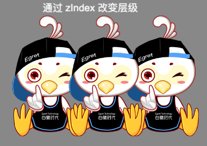

重设子对象深度有2种方法:[使用 setChildIndex ](http://developer.egret.com/cn/github/egret-docs/Engine2D/displayObject/depthManagement/index.html#4.重设子对象深度)和使用 zIndex.

从 Egret 5.2.24 版本开始，`DisplayObject` 中新增加了一个 `zIndex` 属性，可以设置对象的 Z 轴顺序。该值越大，越靠近顶部。

**注意，要给一个对象使用 zIndex，包含此显示对象的 DisplayObjectContainer 对象一定要设置 sortableChildren = true**

```
let container = new egret.Sprite();
container.sortableChildren = true;//注意，一定要设置为true
this.addChild(container);

let texture: egret.Texture = RES.getRes('bird_png');

let b1 = new egret.Bitmap();
b1.texture = texture;
b1.x = 100;
this.addChild(b1)

let b2 = new egret.Bitmap();
b2.texture = texture;
b2.x = 270;
this.addChild(b2)

let b3 = new egret.Bitmap();
b3.texture = texture;
b3.x = 440;
this.addChild(b3)


b2.zIndex = 3;//将第二个图片设置到顶部
```


