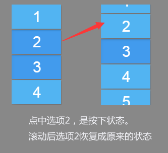

TouchEvent 是一个常用的功能，用于监听触摸事件的不同阶段。一个点击的流程一般会触发3个 touch 事件：TouchBegin 触摸开始，TouchEnd 触摸结束，TouchTap 点击。

在 Egret 版本 3.0.1 中，我们新增了一个 TouchCancel 事件，顾名思义就是取消触摸。这个功能目前主要用于 EUI 中，比如 Scroller 滚动列表，当你的手点中它后，首先抛出一个 TouchBegin，如果此时没有滚动，直接离开屏幕，那么还是原来标准的流程，抛出 TouchEnd 和 TouchTap。但是当你滚动它以后，则会抛出一个 TouchCancel 事件，而后续的 TouchEnd 和 TouchTap 事件就不会被触发了。

下面是一个示例代码，创建一个滚动列表并增加监听

~~~ Typescript
var scroller = new eui.Scroller();
var list = new eui.List();  
list.itemRendererSkinName = `
        <e:Skin states="up,down,disabled" minHeight="50" minWidth="100" xmlns:e="http://ns.egret.com/eui"> <e:Image width="100%" height="100%" scale9Grid="1,3,8,8" alpha.disabled="0.5"
                     source="resource/button_up.png"
                     source.down="resource/button_down.png"/> <e:Label text="{data}" top="8" bottom="8" left="8" right="8"
                     textColor="0xFFFFFF" verticalAlign="middle" textAlign="center"/> </e:Skin>`
var ac = new eui.ArrayCollection([1, 2, 3, 4, 5, 6, 7, 8, 9, 10, 11, 12, 13, 14, 15, 16]);
list.dataProvider = ac;
scroller.viewport = list;
scroller.height = 200;
this.addChild(scroller);

scroller.addEventListener(egret.TouchEvent.TOUCH_BEGIN,()=>{console.log("111 Scroller Begin")},this);
list.addEventListener(egret.TouchEvent.TOUCH_BEGIN,()=>{console.log("111 List Begin")},this);

scroller.addEventListener(egret.TouchEvent.TOUCH_END,()=>{console.log("222 Scroller END")},this);
list.addEventListener(egret.TouchEvent.TOUCH_END,()=>{console.log("222 List END")},this);

scroller.addEventListener(egret.TouchEvent.TOUCH_TAP,()=>{console.log("33 Scroller Tap")},this);
list.addEventListener(egret.TouchEvent.TOUCH_TAP,()=>{console.log("33 List Tap")},this);

scroller.addEventListener(egret.TouchEvent.TOUCH_CANCEL,()=>{console.log("44 Scroller cancel")},this);
list.addEventListener(egret.TouchEvent.TOUCH_CANCEL,()=>{console.log("44 List cancel")},this);
~~~

#### 没有滚动时

当没有滚动，点击列表后，会依次抛出以下事件。

~~~
111 List Begin
111 Scroller Begin
222 List END
222 Scroller END
33 List Tap
33 Scroller Tap
~~~

上图为点击后的样子

#### 滚动后

当你滚动 scroller 以后，会抛出 TouchCancel，后续的 touch 事件不会被触发。

~~~
111 List Begin
111 Scroller Begin
44 List cancel
44 Scroller cancel
~~~

另外 TouchCancel 触发以后，说明触摸被取消了，本次触摸被选中的选项条也会恢复成选中前的状态。