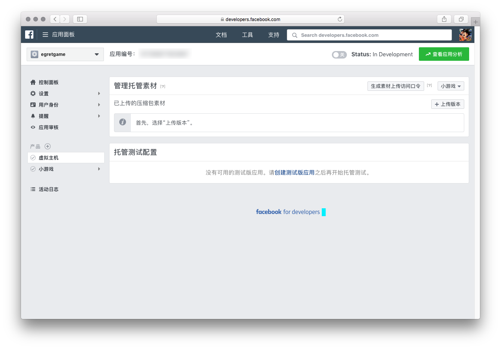
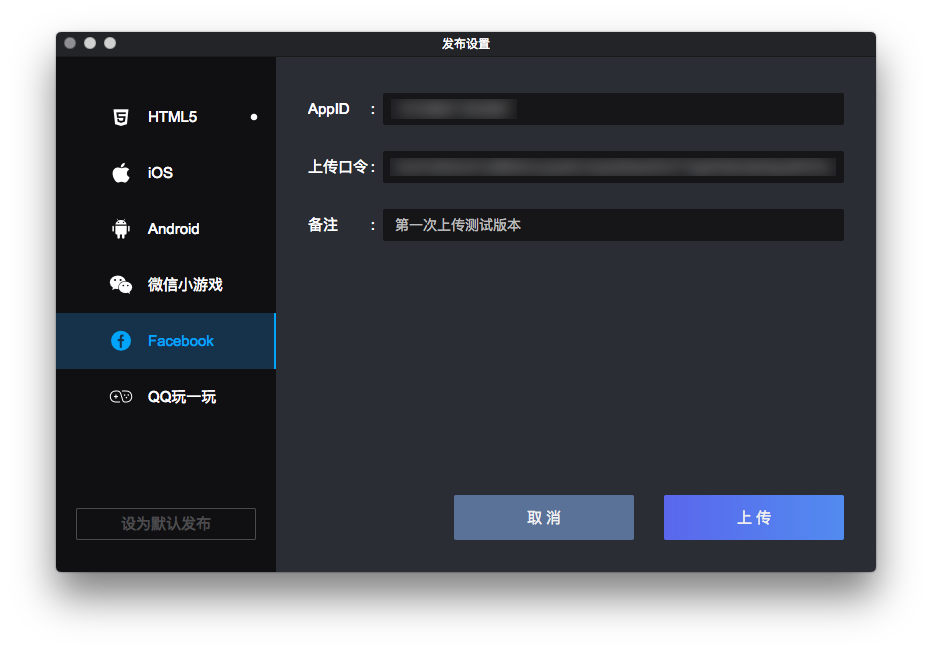
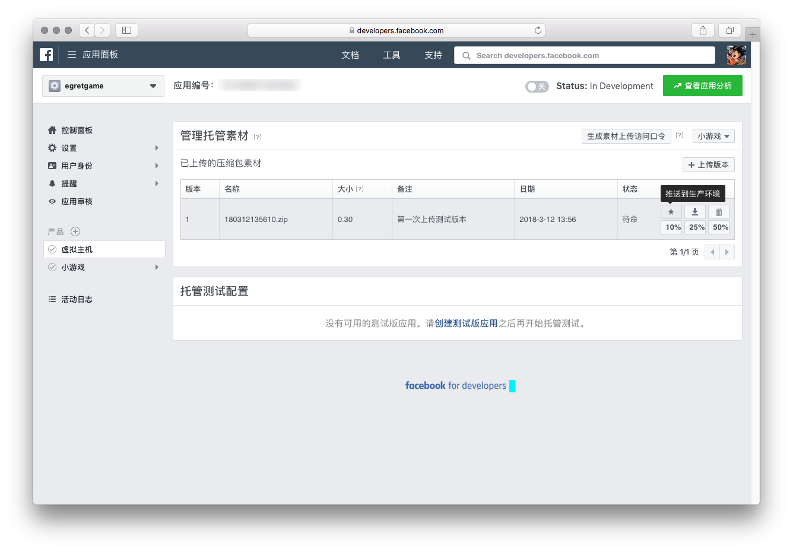
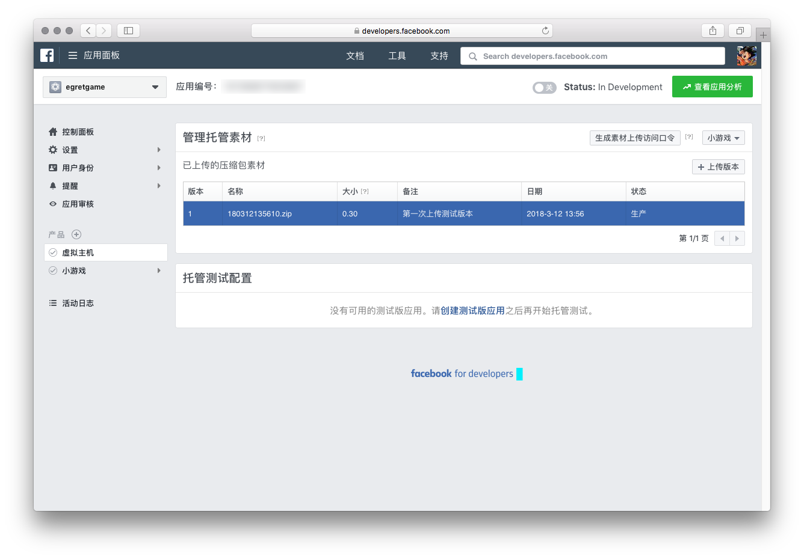
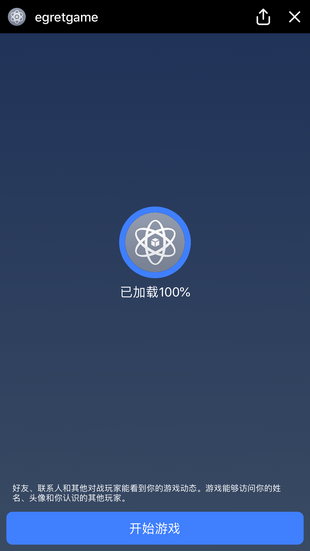

# Facebook Instant Games 开发快速指南

开发者可以基于现有的Egret HTML5游戏迁移到Facebook Instant Games平台，也可以开发全新针对于Facebook Instant Games平台的HTML5游戏。

本指南旨在带领开发者快速使用Egret工具提交并测试Facebook Instant Games平台游戏，其涉及平台功能与规则限制，请参考Facebook官方文档。

## 创建 Facebook Instant Games 应用

您需要在 [https://developers.facebook.com](https://developers.facebook.com) 登录您的Facebook账号


在我的应用中，点击**添加新应用**，填写应用相关信息，如下图：


进入到新创建的项目详情面板中，在添加商品中，选择**Facebook Instant Games**，如图：


在小游戏详情面板中，填写基本信息


进入到**虚拟主机**产品，点击**生成素材上传访问口令**按钮，将生成的口令保存，以备后用，如图：




## 创建 Egret 项目

创建Egret项目，扩展库中需要选择`Facebook Instant Games`


## 编写代码或迁移您的项目

关于API，您可查看 [Egret文档中心](http://developer.egret.com/cn/apidoc/) 以获取更详细的说明。

此处以一个示例项目为例，代码如下：

##### Button.ts

```
class Button extends egret.Sprite {

    public constructor(label: string) {
        super();
        this.drawText(label);
        this.addEventListener(egret.TouchEvent.TOUCH_BEGIN, this.touch_begin, this);
        this.addEventListener(egret.TouchEvent.TOUCH_END, this.touch_end, this);
        this.addEventListener(egret.TouchEvent.TOUCH_TAP, this.click, this);
        this.draw();
        this.touchEnabled = true;
    }

    private touch_begin(evt: egret.TouchEvent): void {
        this.isUp = false;
        this.draw();
    }
    private touch_end(evt: egret.TouchEvent): void {
        this.isUp = true;
        this.draw();
    }
    private click(evt: egret.TouchEvent): void {
        this.dispatchEvent(new egret.Event("CHAGE_STAGE"));
    }

    private isUp: boolean = true;
    private draw(): void {
        this.graphics.clear();
        this.removeChildren();
        if (this.isUp) {
            this.drawUp();
        } else {
            this.drawDown();
        }
        this.addChild(this.textF);
    }

    private textF: egret.TextField;
    private drawText(label: string): void {
        if (this.textF == null) {
            let text: egret.TextField = new egret.TextField();
            text.text = label;
            text.width = (Context.stageWidth - 30) / 2;
            text.height = 35;
            text.size = 22;
            text.verticalAlign = egret.VerticalAlign.MIDDLE;
            text.textAlign = egret.HorizontalAlign.CENTER;
            this.textF = text;
            this.textF.strokeColor = 0x292b2f;
        }
    }

    private drawUp(): void {
        this.graphics.beginFill(0x666666);
        this.graphics.lineStyle(2, 0x282828);
        this.graphics.drawRoundRect(0, 0, (Context.stageWidth - 30) / 2, 35, 15, 15);
        this.graphics.endFill();

        this.graphics.lineStyle(2, 0x909090, 0.5);
        this.graphics.moveTo(5, 2);
        this.graphics.lineTo((Context.stageWidth - 30) / 2 - 5, 2);
        this.graphics.endFill();

        this.graphics.lineStyle(2, 0x676767, 0.7);
        this.graphics.moveTo(5, 37);
        this.graphics.lineTo((Context.stageWidth - 30) / 2 - 5, 37);
        this.graphics.endFill();

        this.textF.stroke = 0;
    }
    private drawDown(): void {
        this.graphics.beginFill(0x3b3b3b);
        this.graphics.lineStyle(2, 0x282828);
        this.graphics.drawRoundRect(0, 0, (Context.stageWidth - 30) / 2, 35, 15, 15);
        this.graphics.endFill();

        this.graphics.lineStyle(2, 0x313131, 0.5);
        this.graphics.moveTo(5, 2);
        this.graphics.lineTo((Context.stageWidth - 30) / 2 - 5, 2);
        this.graphics.endFill();

        this.graphics.lineStyle(2, 0x676767, 0.7);
        this.graphics.moveTo(5, 37);
        this.graphics.lineTo((Context.stageWidth - 30) / 2 - 5, 37);
        this.graphics.endFill();

        this.textF.stroke = 1;
    }
}
```

##### Context.ts

```
class Context {
    static stageWidth: number = 0;
    static stageHeight: number = 0;

    public static init(_stage: egret.Stage): void {
        Context.stageWidth = _stage.stageWidth;
        Context.stageHeight = _stage.stageHeight;
    }
}
```

##### Menu.ts

```
class Menu extends egret.Sprite {

    public constructor(title: string) {
        super();

        this.graphics.lineStyle(2, 0x282828);
        this.graphics.moveTo(0, 35);
        this.graphics.lineTo(Context.stageWidth, 35);
        this.graphics.endFill();

        this.graphics.lineStyle(2, 0x6a6a6a);
        this.graphics.moveTo(0, 37);
        this.graphics.lineTo(Context.stageWidth, 37);
        this.graphics.endFill();

        this.drawText(title);
        this.addChild(this.textF);
    }

    private textF: egret.TextField;
    private drawText(label: string): void {
        if (this.textF == null) {
            let text: egret.TextField = new egret.TextField();
            text.text = label;
            text.width = Context.stageWidth
            text.height = 35;
            text.size = 22;
            text.verticalAlign = egret.VerticalAlign.MIDDLE;
            text.textAlign = egret.HorizontalAlign.CENTER;
            this.textF = text;
            this.textF.strokeColor = 0x292b2f;
        }
    }

    private viewNum: number = 0;

    public addTestFunc(label: string, callback: Function, target: Object): void {
        let btn: Button = new Button(label);
        
        btn.x = (Context.stageWidth - 30) / 2 + 20;
        btn.y = 48 + this.viewNum* 47;

        this.addChild(btn);
        btn.addEventListener("CHAGE_STAGE", callback, target);
        this.viewNum++;
    }
}
```

##### Main.ts

```
class Main extends egret.DisplayObjectContainer {

    public static menu: any;
    private static _that: egret.DisplayObjectContainer;
    public constructor() {
        super();
        this.once(egret.Event.ADDED_TO_STAGE, this.addStage, this);
    }

    private addStage(evt: egret.Event): void {
        this.initializeAsync();

        FBInstant.startGameAsync().then(() => {
            egret.log("start game");
            Main._that = this;
            Context.init(this.stage);
            Main.menu = new Menu("Egret Facebook SDK Demo")
            this.addChild(Main.menu);
            this.createMenu();
        });
    }

    public static backMenu(): void {
        Main._that.removeChildren();
        Main._that.addChild(Main.menu);
    }

    private createMenu(): void {
        Main.menu.addTestFunc("baseinfo", this.baseinfo, this);
        Main.menu.addTestFunc("quit", this.quit, this);
        Main.menu.addTestFunc("logEvent", this.logEvent, this);
        Main.menu.addTestFunc("shareAsync", this.shareAsync, this);
        Main.menu.addTestFunc("player", this.player, this);
        Main.menu.addTestFunc("getConnectedPlayersAsync", this.getEgretConnectedPlayersAsync, this);
        Main.menu.addTestFunc("contextinfo", this.contextinfo, this);
        Main.menu.addTestFunc("share", this.share, this);
    }

    private initializeAsync(): void {
        FBInstant.initializeAsync().then(function () {
            egret.log("getLocale:", FBInstant.getLocale());
            egret.log("getPlatform:", FBInstant.getPlatform());
            egret.log("getSDKVersion", FBInstant.getSDKVersion());
            egret.log("getSupportedAPIs", FBInstant.getSupportedAPIs());
            egret.log("getEntryPointData", FBInstant.getEntryPointData());
        })

        setTimeout(function () {
            FBInstant.setLoadingProgress(100);
        }, 1000);
    }

    private baseinfo() {
        egret.log("baseinfo");
        egret.log("getLocale:", FBInstant.getLocale());
        egret.log("getPlatform:", FBInstant.getPlatform());
        egret.log("getSDKVersion", FBInstant.getSDKVersion());
        egret.log("getSupportedAPIs", FBInstant.getSupportedAPIs());
        egret.log("getEntryPointData", FBInstant.getEntryPointData());
    }

    private quit(): void {
        egret.log("quit");
        FBInstant.quit();
    }

    private logEvent(): void {
        egret.log("logEvent");
        FBInstant.logEvent("test", 2, { "test": "ta" });
    }


    private shareAsync(): void {
        egret.log("shareAsync");
        let data: FBInstant.SharePayload = {
            intent: "",
            text: "",
            image: "",
        };
        FBInstant.shareAsync(data);
    }


    private player() {
        egret.log("player");
        egret.log("player.getID", FBInstant.player.getID());
        egret.log("player.getName", FBInstant.player.getName());
        egret.log("player.getPhoto", FBInstant.player.getPhoto());
    }

    private async getEgretConnectedPlayersAsync() {
        egret.log("frends info:::");
        let datas: FBInstant.ConnectedPlayer[] = await FBInstant.player.getConnectedPlayersAsync();
        egret.log(datas);
        datas.forEach(element => {
            egret.log("player.getID", element.getID());
            egret.log("player.getName", element.getName());
            egret.log("player.getPhoto", element.getPhoto());
        });
    }

    private contextinfo(): void {
        egret.log("Context.getID", FBInstant.context.getID());
        egret.log("Context.getType", FBInstant.context.getType());
    }

    private share(): void {
        egret.log("share");
        let data: FBInstant.SharePayload = {
            intent: "",
            text: "",
            image: "",
        };
        FBInstant.shareAsync(data);
    }
}
```

## 开发建议

我们建议您，在开发过程中为接入预留接口。本机测试过程中可忽略Facebook接口，当需要在Facebook中测试时，再开启相关API。

## 打包上传

在 index.html 里引入 sdk 的 js 文件。注意：该 js 文件必须像下面这样远程加载，不能放到本地，否则无法通过 Facebook 的审核。

```
<script src="https://www.facebook.com/assets.php/en_US/fbinstant.6.1.js"></script>；
```

如果您安装了最新版本的Egret Wing，可点击发布按钮打开上传面板。或者可通过Egret Launcher，项目中的发布设置按钮打开上传面板。

选择**Facebook**选项卡，填写您的APP ID和刚刚生成的上传口令，在备注中，填写此次上传版本的描述信息。



点击上传即可将当前项目打包并推送到Facebook服务器中。

## 测试

上传成功了，您可在应用管理后台看到刚刚上传的版本。



如要对此版本进行测试，则点击**推送到生产环境**



当对应版本从“待命”变为“生产”后，则可对此版本进行测试。

在Facebook Instant Games中，点击**详情**，最下方的**分享游戏**，将当前游戏分享至您的Facebook信息流中。


在手机Facebook APP中点击您刚刚分享的游戏，可打开游戏进行测试。

     