### 写在前面的话

你可能需要了解引擎的安装。

本章将开始指导大家来编写代码，并让自己的一些想法用Egret运行起来。

首先确保你对面向对象编程有基本的了解，如果熟悉一门基础的面向对象语言，比如AS3或Java，那就更好了。如不了解，请先阅读OOP入门的文章或书籍。

Egret 采用 TypeScript 进行编程，它是 JavaScript 的一个超集，而且本质上向这个语言添加了可选的静态类型和基于类的面向对象编程。TypeScript 扩展了 JavaScript 的语法，原生 JavaScript 的方法在 TypeScript 也是可以使用的。比如`Math`等。

更多TypeScript教程请访问：

* [TyptScript语言手册](http://bbs.egret.com/thread-1441-1-1.html)

* [TypeScript Handbook（中文版）](https://www.gitbook.com/book/zhongsp/typescript-handbook/details)

**注意** 虽然 Egret 开放了所有源代码，但是有些接口是不建议使用的，比如以 $ 开头的内部接口。当然您如果在源代码中看到的以`private`标注的接口在项目中是访问不到的，也不应该使用。

### 建立工作环境

工欲善其事，必先利其器。对于任何编程开发任务来说，部署一个强大易用的代码编辑器或IDE开发环境是首要的工作。 结合Egret本身的特点，我们推荐使用 Egret Wing 来开发 Egret 项目。Egret Wing 是一款针对 Egret 项目的集成开发环境，通过可视化的方式创建、编辑和管理项目中所有游戏用户界面，并可以同时进行 TypeScript 代码编写和断点调试。

在图形图像渲染中，Egret完全使用HTML5标准中的canvas技术,可以运行在支持 HTML5 的浏览器上。但是在我们调试项目的时候还是推荐使用 Chrome 浏览器，一个方面是对 HTML 5 支持的程度较高，二是可以方便的调试 JavaScript 和进行性能分析等。

当然还有诸如WebStorm,Sublime和Visual Studio等开发环境都可以用来开发Egret。请读者根据自己的爱好做出选择。

为了保持一致，我们的教程是以Egret Wing 2.0为IDE讲解的。如用其他开发工具，请在涉及Wing操作的步骤使用您所用工具对应的操作方法。

### 打开项目

[前一章](../../../Engine2D/getStarted/helloWorld/README.md)我们已经建立了一个HelloWorld项目，我们就以此为基础，用Wing来打开该项目。启动Wing程序，菜单选择导入项目：

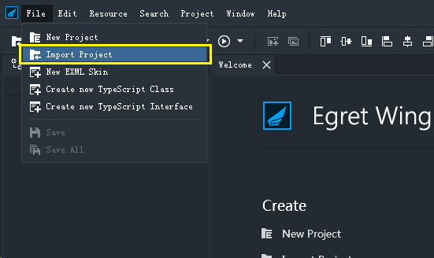

会弹出"Import Project"对话框。在"Project Path"框通过Browse选择我们之前创建的项目目录，即workspace下的HelloWorld，或在地址栏直接输入完整路径，均可： 

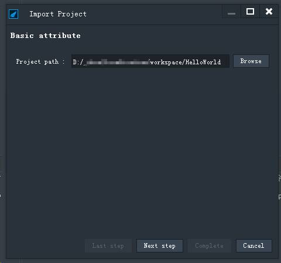

Next：

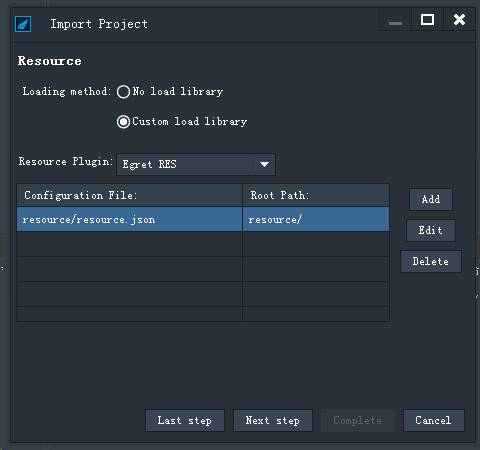

这一步用于选择RES管理方案，通常用默认的Egret RES即可，不用任何修改，Next：

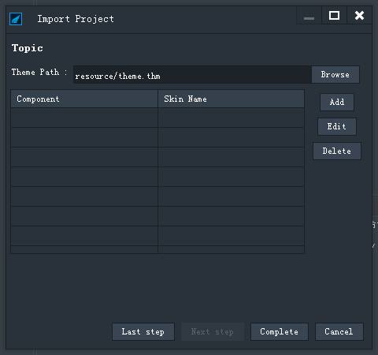

这一步用于为gui项目选择主题，直接忽略Complete即可。

确认选择正确后，点OK，即会在左侧的"Package Explorer"出现项目：

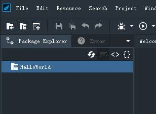

刚导入的项目图标是带锁的，双击即可开锁：

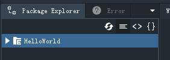

然后可以点开，看到项目的目录树结构：

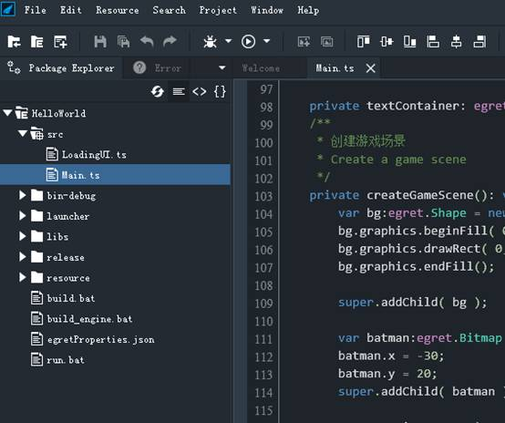

### 运行项目

在 Wing 中打开项目后，可以非常方便的从菜单编译运行：

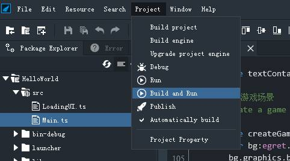

系统会自动打开浏览器窗口显示项目运行结果：

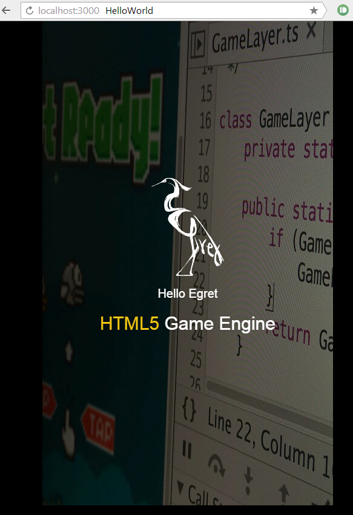

### 清理项目

到这里，工作环境建立起来了。接下来我们对项目进行不同的修改调整，并运行测试。来学习不同方面的Egret编程知识。

对新手来说，egret默认创建的项目显示了较为复杂的内容。为了不影响我们的学习过程，我们首先将这些显示内容清除掉。重新开始。

打开Main.ts文件，将createGameScene中的内容全部删除，并将createGameScene方法后边的所有方法删除。代码成为如图所示：

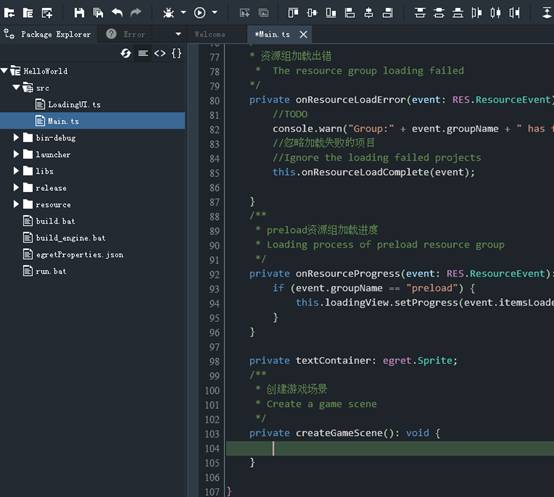

修改代码后重新build，以使我们对代码的改动生效：

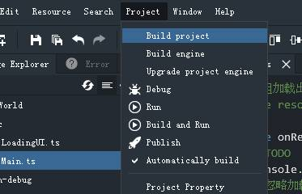

编译后，我们再打开刚才自动弹出的浏览器窗口，重新载入页面，会发现，刚才显示的内容已经消失，页面剩下漆黑一片：

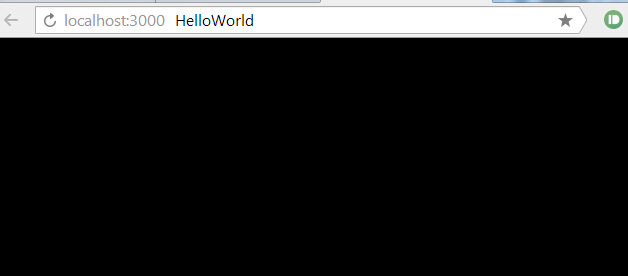

那么，我们将从这里真正开启我们的Egret学习旅程。

### Egret程序的入口

像所有的开发语言一样，总有一个入口，整个程序都从这里开始启动。熟悉类C系语言的开发者，如C++和Java都了解这些语言会从一个静态的main函数入口。

而Egret语言的入口类似于ActionScript，是从一个称之为文档类的类作为入口的。当然，具体点儿，就是以这个文档类的构造函数作为入口。

文档类是可以配置的，每个Egret项目都有一个index.html文件,可以在Egret项目的根目录找到这个文件，后边我们称之为index文件。

index.html可以打开直接编辑。打开该文件，找到div标签可以看到一些配置属性，其中的`data-entry-class`，其值默认为`Main`，就是指Main.ts中所定义的类Main。当然这只是个默认值，我们可以根据自己的喜好随意修改，只要确保项目设定文件中的index.html属性值所指定的类名在项目中有其类定义即可。

**注意** 在 Egret Engine 2.5 之前的版本中是如下配置的：
文档类是可以配置的，每个Egret项目都有一个配置文件egretProperties.json，可以在Egret项目的根目录找到这个文件，后边我们称之为项目设定文件。
项目设定文件是一个文本文件，可以打开直接编辑。打开该文件，会看到有一个document_class的属性，其值默认为"Main"，就是指Main.ts中所定义的类Main。当然这只是个默认值，我们可以根据自己的喜好随意修改，只要确保项目设定文件中的document_class属性值所指定的类名在项目中有其类定义即可。

### 入口函数

文档类的构造函数，即为Egret程序的入口函数，可以观察到入口函数内有一行代码

```
this.addEventListener(egret.Event.ADDED_TO_STAGE, this.onAddToStage, this);
```

现在，我们不需要具体分析这行代码，只需要知道，这行代码保证了onAddToStage方法执行时，文档类实例已经被添加到舞台中。并且在onAddToStage方法内，this.stage属性已经有效，其指向舞台对象。下一节我们将会用到。

### 绘制一个单色背景

通常游戏的画面都需要一个背景，让我们就从这最基本的显示开始着手！ 背景可以是一张图片，这需要将图片作为资源载入，后边我们会学习这种方式。

现在我们用最简单直接的方式，让Egret自己绘制一个单色的背景。先看看运行结果：

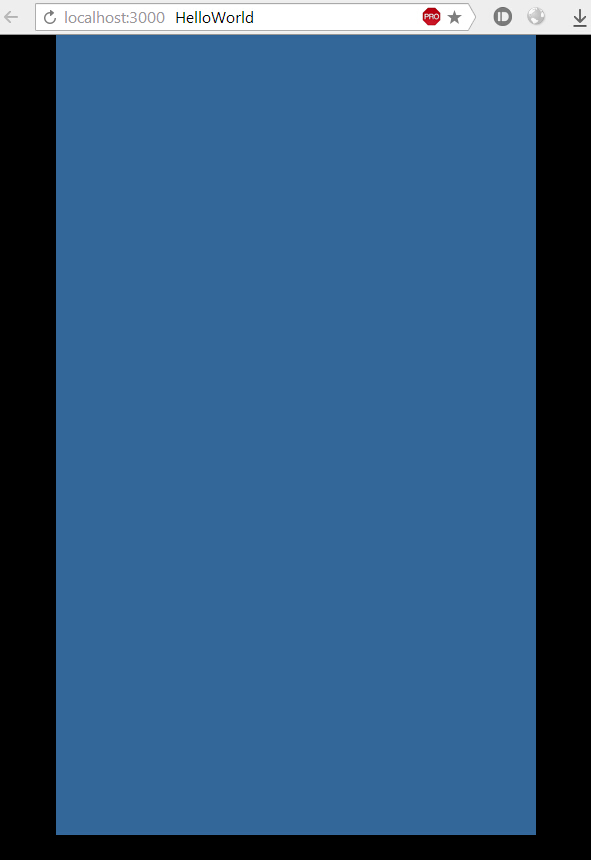

这个背景，实际上是绘制了一个给定填充颜色的矩形。打开`Main.ts`，在事先清空的`createGameScene`方法内加入如下代码： `var bg:egret.Shape = new egret.Shape();`这是我们第一次输入代码，因此有必要说明一下，Egret编写代码都使用TypeScript，如果对这门语言不是很了解，请先查阅相关资料。

这里，我们首先建立一个`egret.Shape`对象`bg`，这是由于`egret.Shape`对象有图形绘制功能。我们要绘制的背景的工作就用这个对象来完成。

Egret 官方提供的类都是在`egret`包内的，所以后边为方便表示，我们会省略到包名，直接用`Shape`来表示`egret.Shape`。其他类也一样。

创建好之后，开始绘制： 

``` 
bg.graphics.beginFill( 0x336699 );
bg.graphics.drawRect( 0, 0, this.stage.stageWidth, this.stage.stageHeight ); 
bg.graphics.endFill();
```

`Shape`对象中有`graphic`属性，用来专门负责图形绘制的工作。 第1行，在绘制前，需要定义图形的填充颜色，我们给出一个偏蓝的颜色。注意颜色值跟大部分其他OOP语言一样，是用十六进制的RGB颜色的组合来表示。用`beginFill`来设置填充颜色。 第2行绘制矩形。用`drawRect`来绘制矩形。参数部分，给出4个数字确定了一个矩形的区域，这4个参数分为两组，分别这顶区域的起点坐标和终点坐标。 注意这两组坐标，由于我们绘制的背景要刚好覆盖整个舞台区域，所以起点坐标为(0,0)，终点坐标为舞台的宽度和舞台的高度。这一对尺寸可以直接从前一节所讲到的`this.stage`中获得。 类似的绘制函数还有`drawCircle`等，可以绘制不同的简单形状。 第3行`endFill`用来结束绘制工作。

到这里，一张跟舞台同样大的浅蓝色矩形图形已经准备好。但，接下来我们还需要将其添加到显示结构中，才可以在运行时显示出来： `super.addChild( bg );` 这里，我们第一次使用`addChild`，这是Egret引擎操作显示列表的一个最常用的方法，就是将某个显示对象添加到某个显示容器上。 (注意，文档类实例添加到舞台是引擎默认完成的，不需要我们写代码完成该任务。) 另外，这里使用`super`是由于所调用的方法addChild是当前类的父类定义的。当然根据个人习惯，这里完全可以用`this.addChild`。参数直接传入`bg`。

运行项目，将会看到前面图中所示的效果，浏览器显示一个矩形背景！


### 调整屏幕适配模式

虽然显示出来了，但我们会发现一个现象，就是显示区域在浏览器中并没有占满。这是由于Egret项目建立后，默认的屏幕适配模式是不进行缩放的。

而Egret目前应用最广泛的是移动设备，通常需要的屏幕适配模式是整体显示。

Egret提供了几种常规的适配模式，刚才所说的不进行缩放是一种，在Egret中表示为`showAll`。占满屏幕是另一种，为`fixedWidth`。`fixedWidth`模式下会保持原始宽高比缩放内容，缩放后应用程序内容在水平和垂直方向都填满播放器窗口，但只保持应用程序内容的原始宽度不变，高度可能会改变。 我们可以在`index.html`中修改适配模式，打开项目根目录下的`index.html`文件，找到`data-scale-mode`开始的代码行，将等号右边的内容修改为`fixedWidth`刷新页面，会发现，蓝色背景已经占满浏览器屏幕：

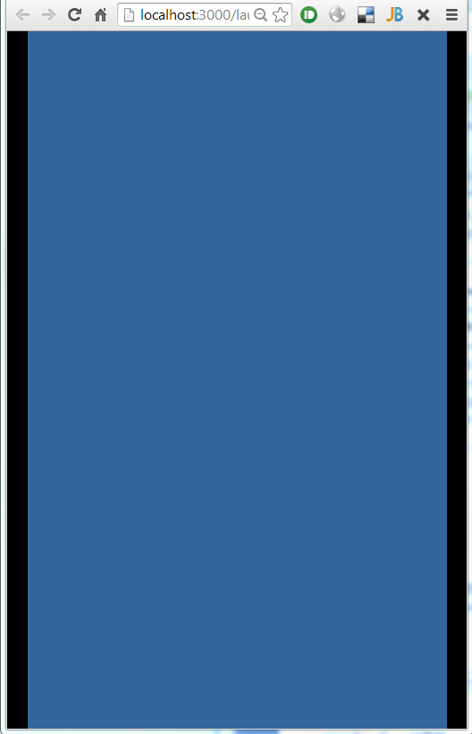

你还可以在项目代码里随时修改

```
this.stage.scaleMode = egret.StageScaleMode.FIXED_WIDTH;
```

**注意** 在Egret 2.5 （包括2.4.x）版之前的版本屏幕适配模式有所不同，Egret提供了几种常规的适配模式，刚才所说的不进行缩放是一种，在Egret中表示为`NO_SCALE`。占满屏幕是另一种，为`SHOW_ALL`。 我们可以在`egret_loader.js`中修改适配模式，打开项目`launcher`目录下的`egret_loader.js`文件，找到`var scaleMode`开始的代码行，将等号右边的内容修改为`SHOW_ALL： var scaleMode = egret.StageScaleMode.SHOW_ALL; `。

显示一些文字 显示文字是常用的功能，接下来，我们显示一段简单的文字。比如"I'm Jack, I will use Egret create a fantasy mobile game!"——当然，如果你不叫Jack，可以换成自己的名字。

```
var tx:egret.TextField = new egret.TextField();
tx.text = "I'm Jack, I will use Egret create a fantasy mobile game!"; 
tx.size = 32; 
this.addChild( tx );
```

跟绘制背景类似， 可以在[EDN之API](http://edn.egret.com/cn/index.php/apidoc/egret243/)参考查看API。

编译运行，结果如图：

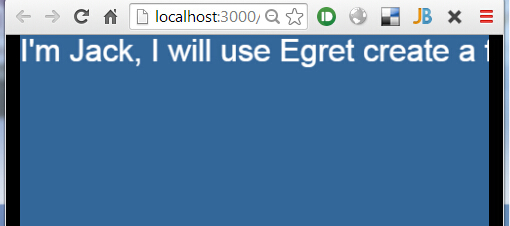

格式有些乱，我们稍微调整一下。紧接着加入如下代码： 

```
tx.x = 20; 
tx.y = 20; 
tx.width = this.stage.stageWidth - 40;
```

注意前两行，分别设置了文本对象的x和y坐标。在Egret中，设置坐标是以锚点为基准的，锚点默认位于显示对象的左上角。当然我们可以根据需要设置锚点的位置。

编译运行，结果如图：


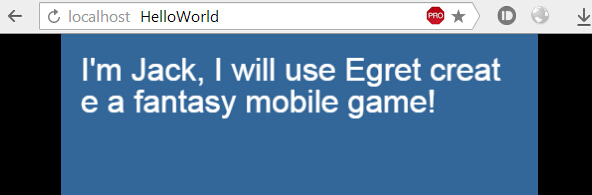

在Egret中，我们可以对文字进行更复杂的设置，比如设定颜色、加粗、斜体，甚至可以设置不同的文字应用不同的格式。具体用法会在专门的章节中介绍。

### 响应用户操作

不管我们制作游戏还是某种应用，用户的交互都是必备的。 在前一节的基础上，我们就对这段文字添加一些响应操作。比如，改变颜色： 

```
tx.touchEnabled = true; 
tx.addEventListener( egret.TouchEvent.TOUCH_TAP, this.touchHandler, this );
```

注意，第一行设置touchEnabled为true，意即允许该显示对象响应Touch事件，这是Egret中特别需要注意的问题。因为所有的显示对象，默认都是不响应Touch事件的，这是基于性能考虑，因为打开对这种事件的响应，是对性能有不可忽略的影响的。 其中第二行代码新增一个方法的引用，这就是事件处理函数，我们需要事件处理函数中对用户操作做出对应的反应。 在Main类中，加入如下代码： 

```
private touchHandler( evt:egret.TouchEvent ):void{
    var tx:egret.TextField = evt.currentTarget;
    tx.textColor = 0x00ff00; 
}
```

编译运行，然后点击这段文字，会如下图改变颜色：


这里的事件处理函数是用一个类方法来实现，还有一种简写的方法，直接作为匿名函数传入： 

```
tx.addEventListener( egret.TouchEvent.TOUCH_TAP
    , function( evt:egret.TouchEvent ):void{    
        tx.textColor = 0x00ff00; 
    }, this );
```

本例主要是使用用户轻触事件。在Egret中，还有各种其他方面的事件，比如网络通信相关的事件、计时器相关事件等等。在需要这种事件的地方，我们......再进一步讲解。

### 资源加载

到目前为止，我们所写的代码，都不需要加载任何外部资源，或者其他形式的网络通讯。 不可否认的是，创建内容生动的游戏，总是需要有足够的图片来表现内容。

Egret中所有的资源都是动态加载的。

#### 资源加载清单

Egret的资源加载方式，是以一个资源加载清单为基础的。 如果资源是我们要购买的若干物品，资源加载配置就好比是购物清单。我们首先把需要购买的物品条理清晰地列在清单上，就可以按步骤有条不紊的去购买其上所列出的物品。

在Egret中，我们使用json格式作为RES资源加载配置文件的格式。这种格式使用方便，你甚至可以用记事本来编写它。同时，json格式也是模式JavaScript支持的一种解析格式。我们可以得到最快的解析处理。

通常Egret中的资源加载配置文件位于项目目录的`resource`文件夹内，取名`default.res.json`。Egret项目在创建时已经包含该文件。

**注意** 在 Egret 2.5 版本之前的版本该文件名称为`resource.json`;

默认的`default.res.json`已经包含若干资源的配置：
```
{
	"resources": [
		{
			"name": "bgImage",
			"type": "image",
			"url": "assets/bg.jpg"
		},
		{
			"name": "egretIcon",
			"type": "image",
			"url": "assets/egret_icon.png"
		},
		{
			"name": "description",
			"type": "json",
			"url": "config/description.json"
		}
	],
	"groups": [
		{
			"name": "preload",
			"keys": "bgImage,egretIcon"
		}
	]
}
```

接下来，我们就从默认的配置来了解资源配置的规则。

配置文件中的"resource"我们可以视为资源库，当前游戏使用到的资源都可以放到这里。其中以资源为单位分别列出。每一项资源单位都包含三个属性：

* name：表示这个资源的唯一标识符。注意资源比较多的项目应确定一套命名规则，避免不同资源命名之间重复或太接近而易混淆。

* type：表示资源类型。紧跟着会进一步讲解其含义及取值规则。

* url：表示当前资源文件的路径。通常我们约定配置类型的资源置于config子目录下；其他类型置于assets子目录下。

* 每个"resource"单位中的type，是Egret约定好的若干类型，最常用的有以下类型：

* image：表示各种常见的图片类型，包括PNG和JPG格式，载入后将解析为egret.Texture对象；

* text：表示文本类型，即文本文件，载入后将解析为string对象；

* json：也是一种文本类型，不过内容是json格式的，载入后将直接解析为json对象；

很多情况下，我们在某种游戏场合，需要同时加载若干资源，用以准备后续的游戏流程显示。Egret已经考虑到这种情况，使得我们可以将若干项资源定义为一个资源组。需要时，只需加载这个资源组即可。 "groups"是预加载资源组的配置，每项是一个资源组。 每一个资源组须包含两个属性：

* name：表示资源组的组名

* keys：表示这个资源组包含哪些资源，里面的逗号分隔的每一个字符串，都与"resource"下的资源name对应。

至此，resource目录中的结构及资源配置文件内容如图所示：

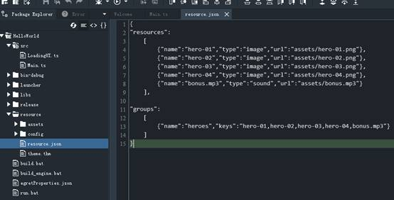

### 在程序中加载资源

在`Main.ts`中的开头部分，我们会发现大量使用RES开头的代码，RES就是专门用来加载资源的类，这些代码我们稍后再分析，首先我们完成把这些图片载入所需的步骤。

注意，在`onConfigComplete`的最后，有一行加载资源组的代码： `RES.loadGroup("preload");`

很显然，`loadGroup`就是用来加载资源组的。由于我们将资源组命名为`heroes`，因此这里代码中的`preload`需要改成`heroes`。 资源加载结束后，我们需要判断所加载的资源是哪个资源组的，所以`onResourceLoadComplete`中的`preload`也需要改成`heroes`。

完成这些改动后，Egret将会加载`heroes`资源组，并且程序执行到`createGameScene`时，资源组已经加载完成。

在`createGameScene`最后添加如下代码： `console.log( "createGameScene", RES.getRes("hero-01") );`

编译，运行，打开浏览器的开发者工具，在`Console`栏会看到改行代码产生的输出：

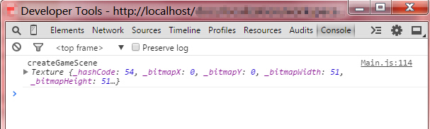

如图，在createGameScene后面紧跟着一个Texture对象，说明载入图片是成功的！

### 加载资源的代码分析

在进一步显示图片前，我们了解一下资源加载的代码。 再回过头看看加载资源的代码。加载资源的过程整体分为两部分，第一步首先加载资源配置清单，第二步就是加载资源。

在onAddToStage方法中，有代码：

```
RES.addEventListener(RES.ResourceEvent.CONFIG_COMPLETE, this.onConfigComplete, this);
RES.loadConfig("resource/default.res.json", "resource/");
```

这是专门用来加载资源配置的代码。 首先添加一个针对`CONFIG_COMPLETE`事件的侦听，然后执行加载。 配置加载完成时，即会执行`onConfigComplete`方法。

在`onConfigComplete`方法中，有如下 ：

```
RES.removeEventListener(RES.ResourceEvent.CONFIG_COMPLETE, this.onConfigComplete, this);
RES.addEventListener(RES.ResourceEvent.GROUP_COMPLETE, this.onResourceLoadComplete, this);
RES.addEventListener(RES.ResourceEvent.GROUP_LOAD_ERROR, this.onResourceLoadError, this);
RES.addEventListener(RES.ResourceEvent.GROUP_PROGRESS, this.onResourceProgress, this);
RES.loadGroup("heroes");
```

第一行移除了对`CONFIG_COMPLETE`事件的侦听，这是一个推荐做法，因为我们不再需要加载配置文件，该侦听也就没有作用了。及时移除事件侦听可以删除不必要的引用，使得不再需要使用的对象能被垃圾回收及时清理，避免内存泄露。

接着，加入了对资源组事件的侦听。

首先是对资源组加载完成的侦听，这是必须的，因为程序的流程需要从这里进行，即程序需要在某种资源加载完成后进行预期的后续流程。 另外，任何加载都需要稳定的网络，而网络出现各种中断是很常见的情况，所以需要添加对加载错误事件的侦听，以在这种情况作出相应的处理，通常是重新加载或者是提示用户检查网络。 可选的，可以加入对加载进度的侦听，通常是通过某种样式的进度条显示给用户当前进度，这在所加载的内容需要耗时较长时对于用户体验非常重要。

对于加载错误和进度的侦听处理，我们这里不做过多说明。

在加载完成的处理，即`onResourceLoadComplete`中，通过检查当前加载完成的资源组名称，来做对应的处理。确认当前加载的资源组是`heroes`后，便进入程序的正式流程`createGameScene`中。

### 显示图片

事实上，对于显示图片来说，相应资源加载完成，已经完成了95%的工作。接下来就是水到渠成了。

删掉文字部分的代码，即所有tx变量相关的代码。只留下绘制背景的代码。

#### 显示第一个超级英雄

然后加入如下代码，来显示我们所载入的图片资源：

```
var batman:egret.Bitmap = new egret.Bitmap( RES.getRes("hero-01") );
batman.x = -30;
batman.y = 20;
this.addChild( batman );
```

显示所需的图片，在Egret对应的类就是`Bitmap`。 使用`Bitmap`创建一个图片时，在其构造函数中传入RES载入的资源，这里取得的是一个图片的资源，图片资源通过getRes获得的将是一个`Texture`对象。 这段代码用01号英雄图片资源创建了一个位图(Bitmap)显示对象，然后设定其坐标。最后添加到显示列表中。

编译运行，看看效果：


蝙蝠侠！看起来相当酷！

#### 查阅API参考

在添加更多超级英雄前，我们先搞明白一个通用的问题。那就是，Bitmap构造函数的参数应该有几个，分别是什么类型，是否可选。 其实，之前我们绘制背景也用了几个方法，但是都直接给出代码。 如果自己写程序，应该给出怎样的参数，这些都是我们使用每一个API首先需要了解的。这里就说明一下如何来查阅API参考。

首先，我们官方提供了所有可用的类及其API参考网站：[API](http://edn.egret.com/cn/index.php/apidoc/egret243/)。

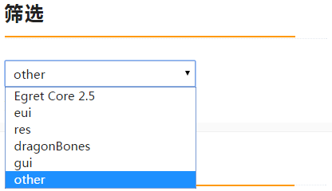

导航栏最上面是模块划分，Egret即表示核心的egret模块，GUI表示gui模块，RES表示RES模块,DB表示dragonBones模块，eui表示eui模块，other包括常用的全局函数Math和typescript中的数据类型。 首先选定所需模块，然后在导航栏会显示该模块所有可用的类，是按字母排序的。 可用滚动定位，也可以在搜索栏输入目标类的名称来快速定位。 选定后，会出现该类详细的API参考。

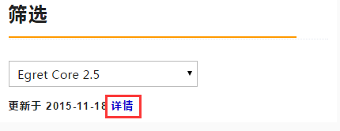

点击详情按钮可以查看 API 具体的更新情况。

**注意：** Egret 2.5 之前版本的 API，请使用 [Egret 2.0 API ](http://edn.egret.com/cn20/index.php/apidoc/egret/),其中不包含 eui。

另外，在Wing中，也提供了快速查阅用法的功能。譬如，我们可能不了解Bitmap构造函数的具体用法，当我们输入括号时，即会自动弹出函数及参数用法提示信息：

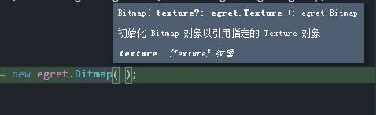

### 显示更多超级英雄

回到上面的代码中，接着我们再来几个超级英雄，为了让他们并列显示，我们给他们设置相同的Y坐标，并且设置X坐标比上一个增加100。紧接着上面的代码，添加另外三个英雄：

```
var captain:egret.Bitmap = new egret.Bitmap( RES.getRes("hero-02") );
captain.x = 70;
captain.y = 20;
this.addChild( captain );
var superman:egret.Bitmap = new egret.Bitmap( RES.getRes("hero-03") );
superman.x = 170;
superman.y = 20;
this.addChild( superman );
var hulk:egret.Bitmap = new egret.Bitmap( RES.getRes("hero-04") );
hulk.x = 270;
hulk.y = 20;
this.addChild( hulk );
```

编译运行，看看排在一起的超级英雄：

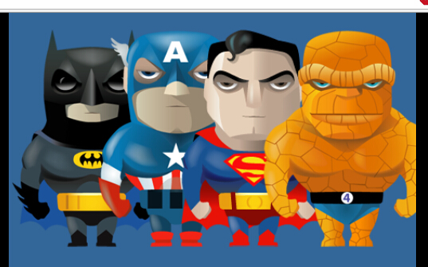

美国大兵、超人，还有石头人！这个队形，酷毙了有木有！

### 显示深度控制

#### 显示深度

然后，看他们站队的先后顺序，看起来蝙蝠侠个子比美国大兵低一点，也许让蝙蝠侠排在前边看起来更协调一些。 之前我们了解过Egret的显示结构设计，这是整体的不同级别之间来说的。 那么这里，我们进一步了解在某一个显示容器内的显示对象结构，可以称之为显示列表。这是由于处于同一显示容器的显示对象，是以类似列表的方式来管理的，每一个显示对象都有其索引，并且索引是从0开始的整数。显示列表索引通常称为显示深度。 我们的眼睛对着屏幕，显示列表中显示对象的索引顺序在从屏幕到眼睛方向就是从0开始，依次递增的。

首先我们验证一下当前的显示深度，在createGameScene底部加入代码：

```
console.log( "display indexes:", this.getChildIndex( bg ), this.getChildIndex( batman ),  this.getChildIndex( captain ), this.getChildIndex( superman ), this.getChildIndex( hulk ) );
```

我们称这段代码为索引log代码，后边还会用到。

则会输出：

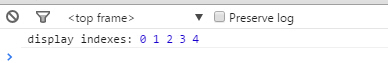

正是按照我们`addChild`的顺序依次递增的

### 修改显示深度

我们确认一下，现在蝙蝠侠的深度是1，队长的深度是2。 接下来，完成我们刚才计划的调换，我们获取蝙蝠侠的深度，并直接设置蝙蝠侠的深度为这个值：

this.setChildIndex( batman, this.getChildIndex( captain ) );

然后再复制一份深度log代码在这行后边。

编译运行，看看发生了什么：

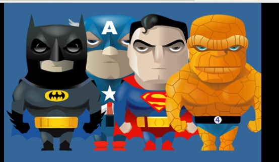

Cool!蝙蝠侠已经站到前边了。现在，再检查一下这两位超级英雄的深度如何变化：

display indexes: 0 2 1 3 4

蝙蝠侠的深度为之前队长的深度2，这点毋庸置疑。队长的深度由之前的2变为1，这里需要说明一下关于显示深度的规则：

A. 某一个显示深度只能对应一个显示对象，一个显示对象也只能有一个显示深度。

B. 显示深度总是从零开始连续的，当某个深度位置的显示对象被设置为其他深度时，原来的深度会自动被紧邻的比其深度值大1位置的显示对象占据，后续深度位置的显示对象会依次往前排。

C. 某一容器内的显示列表的深度最大值是显示列表长度-1。

可以理解每个深度位置是一个房间，这些房间从0开始依次编号。每个显示对象是一个人，显示列表维护总要确保每个人在一个自己的房间，并且这些房间之间没有空的，除非这些人都从0开始排满了前面的房间。

#### 交换显示深度

接下来，我们尝试让绿巨人也站到超人后边，就会形成前后两排的格局，这样也许会显得更整齐。

除了像上边的代码直接占据现有已被显示对象占据的深度，我们还可以直接交换两个显示对象的深度。 在createGameScene底部继续加入代码：

```
this.swapChildren( superman, hulk );
```

同样再复制一份深度log代码在这行后边。

编译运行，看看结果： 

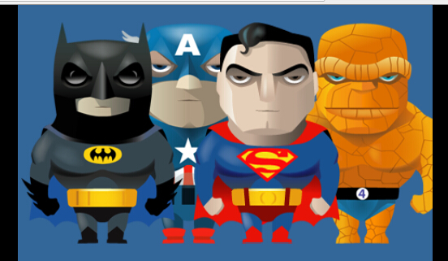

如愿以偿，队形很整齐哦！

可以看到两位英雄深度已经完成互换：

```
display indexes: 0 2 1 4 3
```

#### 不可逾越的显示深度最大值

之前我们说明了显示深度规则，其中C说明了最大值。为了更深一步理解，我们可以给一个较大的深度值来验证一下。 队长的个头高，或许我们让队长排最前边会更显威风。我们给一个远超过最大值(5-1=4)的深度值20：
```
this.setChildIndex( captain, 20 );
```
同样再复制一份深度log代码在这行后边。

编译运行，看看结果：


这是个看起来更有战斗力的队形！

会发现队长的深度并没有变成20，而是自动取允许的最大值4：

```
display indexes: 0 1 4 3 2
```

这是引擎自动处理的，也算是一种容错功能吧。

深度控制是显示编程的一个重要概念，如果没有完全理解，请自己反复使用本节所使用的深度控制API来测试验证。

### Tween动画效果

到目前为止，我们显示的内容都是静止的，是时候让我们来领略Egret强大的Tween动画控制功能了。所谓Tween动画，就是设计某种属性（比如位置、透明度和缩放）的两个不同状态，然后在给定的时间内从一个状态平滑过渡到另外一个状态。

我们制造几个简单的位移和透明度动画来初步体验。

#### 认识锚点

在继续动画之前，我们首先要清楚一个关于坐标定位的重要概念：锚点。 锚点用另一个易于理解的词来说，就是定位点。因此锚点是只存在于显示对象的概念。并且锚点是对显示对象自身设置的。

由于是用于坐标定位，锚点自然地包含了两个部分：X方向锚点和Y方向锚点。 锚点的设置是通过给出一个相对于显示对象本身的坐标值来实现的。具体来说就是以显示对象本身的左上角作为原点的，取值就是具体的像素值。 使用显示对象属性`anchorOffsetX`和`anchorOffsetY`来设置坐标值锚点。

比如我们设置一个显示对象的锚点坐标为：X方向30像素，Y方向40像素，那么如图所示，锚点就在两个方向箭头所指的黑色圆点位置：

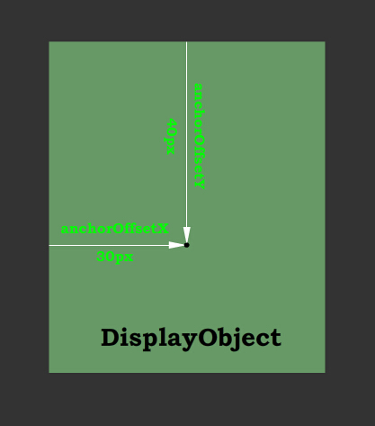

代码：
```
hulk.anchorOffsetX = 30;

hulk.anchorOffsetY = 40;

hulk.x += 30;

hulk.y += 40;
```

设置锚点后，我们还需要根据锚点的偏移修改坐标值，以使绿巨人还保持原先的显示位置： 

确保以上四行代码已经置于`createGameScene`最后。

#### 设计并实现一组Tween动画

接下来，我们继续用这些超级英雄来展示强大的`Tween`功能。我们从不同的方面设计三个`Tween`动画： 第一步，让蝙蝠侠和超人互换位置； 第二步，让队长进行透明度变化，变透明然后再恢复； 第三步，让绿巨人缩小再放大（目前已经够大，所以不能再大了）；

操作方面为了便捷，我们设计为点击舞台，每次点击播放不同的动画。由于要分次显示不同的动画，我们用一个成员变量times来记录次数，在类内部建立该成员变量：
```
private times:number;
```
并设计为在每次点击时增加1，并取余3，使得我们在点击一轮三次动画后，后续的点击还可以从头再运行。

这样关于点击次数控制的代码结构：
```
this.times = -1;
var self = this;
this.stage.addEventListener( egret.TouchEvent.TOUCH_TAP, function(){ 
	switch ( ++ self.times % 3 ) { 
		case 0: break; 
		case 1: break; 
		case 2: break; 
	} 
}, this );
```
接下，我们在switch-case的3种case中，分别完成三个Tween动画控制代码。 第一步，让两个超级英雄互换，直接设置目标X坐标为对方的当前X坐标即可：
```
egret.Tween.get( batman ).to( { x:superman.x }, 300, egret.Ease.circIn );
egret.Tween.get( superman ).to( { x:batman.x }, 300, egret.Ease.circIn );
```
由于这两个动画设计为同时进行，我们分别设置其Tween即可。

这里先熟悉一下`Tween`的基本用法。 `Tween.get`内传入需要对其进行动画控制的对象，并返回一个`Tween`对象。然后可以设置`Tween`对象的动画，即调用`to`方法。 `to`方法包含三个参数。 首先是动画目标属性组，这个参数可以对目标对象本身的各项属性进行设定，就是动画结束时的状态，可以设定一个或多个属性。 第二个参数是动画时间，以毫秒计。 第三个参数是补间方程，即对动画区间内每个时间点的属性值设定分布。在`egret.Ease`已经提供了丰富的补间方程，可以根据自己的喜好选择。

第二步，队长的透明度分为两个阶段，使用e`gret.Tween`来实现这两个阶段时，直接在同一个语句中，用连续写法即可：

```
egret.Tween.get( captain ).to( { alpha:.3 }, 300, egret.Ease.circIn ).to( { alpha:1 }, 300, egret.Ease.circIn );
```
之所以可以这样用，是由于`Tween`提供的方法均会返回`Tween`对象。 另外，这种连续写法将这些动画过程按照先后关系形成一个队列。运行过程中，前面的动画执行完毕后，依次立即执行后续的动画。直到队列执行完毕。 上面的代码将实现队长的透明度变为0.3，之后再恢复为1。

第三步，该步动画同样分两个阶段，因此与第二步有些类似，用连续写法，依次写出：
```
egret.Tween.get( hulk ).to( { scaleX:.4, scaleY:.4 }, 500, egret.Ease.circIn ).to( { scaleX:1, scaleY:1 }, 500, egret.Ease.circIn );
```
如代码所示，对尺寸放大缩小最便捷的方法就是设置X和Y方向的缩放因数。

注意，以上三个步骤的代码分别写在之前`switch-case`的三个`case`中。

**注意** 在 Egret 2.5 之前的版本中，Tween包含在 egret 核心中。在 Egret 2.5 中，tween成为一个单独的模块。对于不需要此功能的项目可以去掉该模块。项目模块化配置可以参考：[项目配置文件说明](../../../Engine2D/projectConfig/configFile/README.md) 。

### 加入声音

为了让我们能快速直观地学习Egret的用法，我们在前面的步骤都学习显示方面的内容。然而在游戏开发中，各种声音效果的配合也是非常重要的。

声音资源配置
跟图片一样，声音也必须作为资源加载才可以播放。 首先我们要先将准备好的声音文件放入到assets文件夹。这里准备的文件为`bonus.mp3`。 在`default.res.json`中加入声音的配置，为简明我们没有新创建组，直接添加到原来的组成为：
```
 { "resources": [ 
	{ "name":"hero-01","type":"image","url":"assets/hero-01.png" }, 
	{ "name":"hero-02","type":"image","url":"assets/hero-02.png" }, 
	{ "name":"hero-03","type":"image","url":"assets/hero-03.png" }, 
	{ "name":"hero-04","type":"image","url":"assets/hero-04.png" },  
	{ "name":"bonus.mp3","type":"sound","url":"assets/bonus.mp3" } 
	],
"groups": [ 
	{"name":"heroes","keys":"hero-01,hero-02,hero-03,hero-04,bonus.mp3"} 
 ] 
}
```
播放声音

在程序中，就不需要做额外的处理，加入如下代码即可：

```
var sound:egret.Sound = RES.getRes( "bonus.mp3" ); 

var channel:egret.SoundChannel = sound.play(0,1);
```

上面的代码生成了一个 sound 对象并调用 sound 的 play 方法，其中的第一个参数 0 表示播放的开始时间，第二个参数表示播放次数，这里我们只播放一次，如果将第二个参数设置为负数将循环播放。该方法返回了一个 SoundChannel 对象。通过操作 channnel 对象可以控制声音的音量大小停止播放等。

为了方便测试，我们不直接播放。而是将这段代码加到队长渐变的部分,即case 1代码段中。 编译运行，将会在每次队长渐隐渐显动画播放时听到所加声音播放。

**注意** 在 Egret 2.5 （包括 Egret 2.4） 之前的版本中不通过 SoundChannel 来控制声音。SoundChannel 为新增的API。 

### 常规网络通讯

**注意** 在 Egret 2.5 中，这部分内容包括在`game`兼容扩展库中，若要使用该部分内容，请确保项目中包括了`game`扩展库。项目模块化配置可以参考：[项目配置文件说明](../../../Engine2D/projectConfig/configFile/README.md)。

在游戏开发项目中，数据的通讯无疑是不可或缺的因素。

本节，我们就来通过一个简单的实例来学习网络通讯的基本用法。

#### URLRequest

`URLRequest` 类封装了进行HTTP请求所需要的所有信息。 常用的HTTP请求有GET/POST两种类型。当进行HTTP请求时，可以直接在URLRequest实例上设置请求类型和实际数据。

HTTP请求首先需要URL，我们准备了一个专用于测试的URL，其返回当前浏览器的代理信息： `http://httpbin.org/user-agent`

使用URLRequest类，就要创建其实例，通常在构造函数中传入URL即可：
```
var urlreq:egret.URLRequest = new egret.URLRequest( "http://httpbin.org/user-agent" );
```

#### URLLoader

URLRequest只是一个信息集合，实际通讯需要使用`URLLoader`。 `URLLoader`必须使用一个URLRequest实例来发挥作用，并且为了得到返回结果，需要加一个事件监听，代码如下：

```
var urlloader:egret.URLLoader = new egret.URLLoader(); 
urlloader.addEventListener( egret.Event.COMPLETE, function( evt:egret.Event ):void{
    console.log(evt.target.data);
}, this );
urlloader.load( urlreq );
```

编译运行，没有错误的话，控制台将会输出类似的代理信息log：

```
 {  "user-agent": "Mozilla/5.0 (Windows NT 6.1; WOW64) AppleWebKit/537.36 (KHTML, like Gecko) Chrome/39.0.2171.95 Safari/537.36" }
```

### 使用WebSocket通讯

众所周知，WebSocket为Web应用提供了更高效的通讯方式。 本节介绍WebSocket的基本用法。

确保项目支持WebSocket
从Egret1.5.0开始，以官方扩展模块的形式支持WebSocket。在现有的Egret项目中，修改egretProperties.json中的"modules"，添加"socket"模块：

```
{
	"name": "socket"
}
```

**注意** 添加模块的时候要注意保证 json 的语法正确。

在项目所在目录内执行一次引擎编译：

`egret build -e`

本步骤已经完成，现在项目中既可以使用WebSocket相关的API了。

WebSocket客户端用法
我们通过一个最简单的示例来学习。

所有的通讯都是基于一个WebSocket实例，首先创建WebSocket对象。
首先看基本代码。
```
private webSocket:egret.WebSocket;
private createGameScene():void { 
	this.webSocket = new egret.WebSocket();
    this.webSocket.addEventListener(egret.ProgressEvent.SOCKET_DATA, this.onReceiveMessage, this);
    this.webSocket.addEventListener(egret.Event.CONNECT, this.onSocketOpen, this);
    this.webSocket.connect("echo.websocket.org", 80);

}
```

WebSocket对象主要有两个事件，一个是连接服务器成功，另一个是收到服务器数据。在正常的网络交互中，这两个事件都是要必须侦听的。
加入侦听事件后，即可连接服务器。注意像所有的通讯协议一样，服务器需要支持WebSocket协议，为便于测试，WebSocket官方提供了一个专用于测试的服务器echo.websocket.org，连接其80端口即可测试。

在连接成功后，即可发送消息，消息的具体格式都是根据情况自己定义的，通常是json格式，便于解析。当然可以自定义其他的字符串格式：
```
private onSocketOpen():void {    
    var cmd = "Hello Egret WebSocket";    
    console.log("The connection is successful, send data: " + cmd);    
    this.webSocket.writeUTF(cmd); 
}
```

服务器根据约定的格式个客户端发送消息，则会触发SOCKET_DATA事件，在其事件处理函数onReceiveMessage中即可读取消息，读取到字符串后，即可根据约定的格式解析：

```
private onReceiveMessage(e:egret.Event):void {    
    var msg = this.webSocket.readUTF();    
    console.log("Receive data:" + msg); 
}
```
编译运行，没有错误的话，控制台将会输出如下log信息：
```
The connection is successful, send data: Hello Egret WebSocket Receive data: Hello Egret WebSocket
```
**到此Egret小白教程结束**
