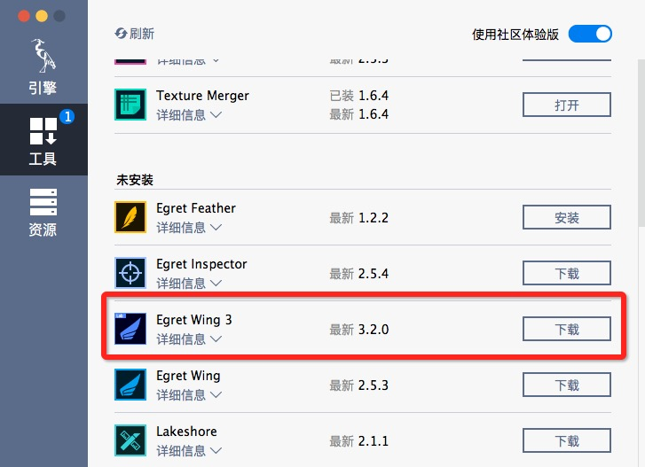
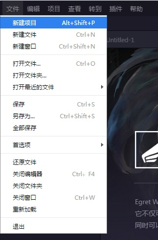
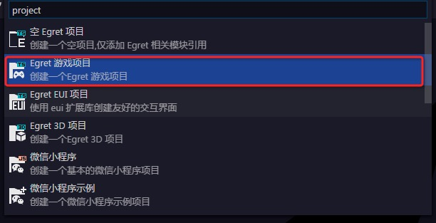
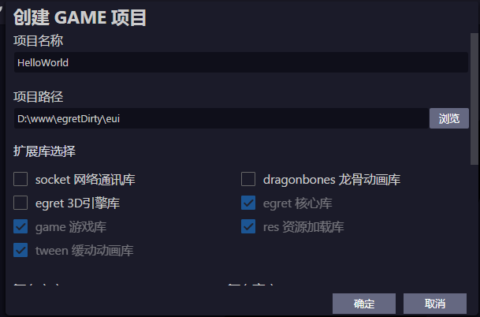
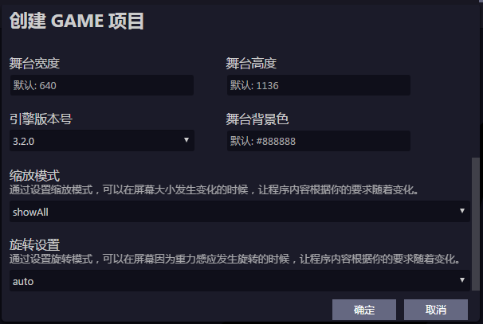
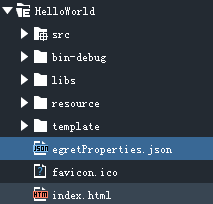
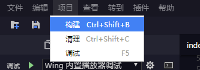
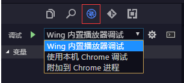

任何编程语言和框架的教程都是从打印 HelloWorld 开始的，白鹭引擎也不例外，首先请从创建一个的 HelloWorld 项目开始。

## 准备工作

### 引擎与工具

开发者首先需要在白鹭引擎的官网白鹭引擎的[库管理器](http://www.egret.com/products/engine.html)。安装过程很简单。如果需要的话可以参考：[安装与部署](../../../Engine2D/projectConfig/installation/README.md)和[引擎和工具的管理](../../../Engine2D/projectConfig/launcherManager/README.md)。安装好后以后我们可以方便的管理白鹭引擎和工具了。

打开引擎管理工具，可以看到有工具选项卡，可以在这里找到 Egret Wing。Egret Wing 是针对 Egret 项目的 IDE。下面的教程都以 Egret Wing 来做演示。



新用户可能还没有安装 Egret Wing,上图打开部分显示为安装，点击即可。

这里需要注意的是我们安装的是最新版的 Egret Wing，需要打开右上角的社区体验版按钮。

Egret 也支持在命令行完成编译，运行，发布等操作。在下面的教程中会穿插对应操作的命令行代码。

### TypeScript

Egret 项目使用 TypeScirpt 语言来开发。TypeScript 是 JavaScript 的超集，具体内容可以参考[TyptScript语言手册](http://bbs.egret.com/thread-1441-1-1.html)。接下来的教程包含 TypeScript 具体的语法与 API。如果开发者对 Flash 有所了解的话，会发现白鹭引擎的语法和 API 与 Flash 及 ActionScript 3.0 很类似。 

## 创建新项目

当大家熟悉 Egret 开发之后可以直接创建Egret游戏项目或者Egret EUI 项目等，里面包含了很多默认的配置。这里以新建游戏项目为例。

### 使用 Egret Wing 创建项目

1、安装好Egret Wing 之后，点击菜单“文件”-》“新建项目”来快速创建项目。



2、选择“Egret 游戏项目”来创建拥有游戏模板的项目。同样“Egret EUI 项目”将会包含EUI项目模板


> 如果想使用 EUI 库，请使用创建 EUI 项目来创建而不是通过创建游戏项目再加入 EUI 库来实现。

3、选择建新项目之后会弹出新建项目的面板，在这里需要选择项目的基本配置。



* 项目名称 
这里填上项目名称，比如 `HelloWorld`。

* 项目路径
目录选择自己的工作目录。

* 扩展库选择
这里包含默认的几个库，`egret`，`game`,`tween`,`res`。如果需要其他的库也可以自行勾上。




* 舞台宽度、高度
  游戏呈现的分辨率。和机器本身的分辨率不同，这个是会根据“缩放模式”、“旋转设置”将游戏呈现的区分按照这个比例来分成若干等分，而不是简单的等同于机器的分辨率。最终的游戏的分辨率可能和设计的不太一样，可以通过(stage.stageWidth,stage.stageHeight)来获取最终分辨率。

* 引擎版本号
  
  创建的项目使用的 Egret 的版本。
  
* 舞台背景色
	
	根据项目的具体需要设定。如果舞台是空的情况下就会只显示该颜色。

* 缩放模式
  游戏的适配方式。更多关于缩放模式的介绍可以参考：[缩放模式和旋转模式说明](../../../Engine2D/screenAdaptation/explanation/README.md)
	
* 旋转设置
	
	当游戏运行在移动端的时候，会面临屏幕旋转的问题。这里旋转`AUTO`选项，舞台将随设备旋转而旋转。更多关于旋转设置的介绍可以参考：[缩放模式和旋转模式说明](../../../Engine2D/screenAdaptation/explanation/README.md)


### 使用命令行创建项目

可以使用

```
egret create HelloWorld
```

来创建我们上面的是默认的游戏项目，如果有特殊需要可以加入参数`--type empty|game|gui|eui`来指定不同的项目。

如果需要设置项目的旋转和缩放模式，需要在项目内来修改，在下面会介绍。


## 项目结构

选择好舞台的设置之后点击下一步，我们的项目就创建好了。在 Wing 的左上角可以看到有我们项目的目录结构：



* Fighter 我们的项目名称
	* src 目录，存放我们的代码。我们编写的代码都放在src目录下面。
	* bin-debug 目录，项目编译和运行的debug目录，一般我们不要修改该目录下的内容。
	* libs 目录，这里面存放我们的库文件，包括 Egret 核心库和其他扩展库。当然以后添加了第三方库的话也会放在这里。
	* resource 目录，这里放置我们的资源文件，这里面有一个`default.res.json` 配置文件，用来配置资源。
	* template 目录，这里是项目调试过程中所需的目录，一般我们不需要修改该目录下的内容。
	* egretProperties.json 项目的配置文件，一般我们会用到里面的`modules` 字段来配置项目的模块。具体的配置说明可以参考：[EgretProperties说明](../../../Engine2D/projectConfig/configFile/README.md)

	* index.html 项目访问的入口文件，我们可以在这里面配置项目的旋转缩放模式背景颜色等。具体的配置说明可以参考：[入口文件说明](../../../Engine2D/projectConfig/indexFile/README.md)
	* favicon.ico 一个ico。

## 调试项目

### 编写第一行代码

项目的入口类默认在`src/Main.ts`里面，在上面创建的项目里面默认包含下面代码：

```
class Main extends egret.DisplayObjectContainer 
```

第一行我们看到 `class` 关键字，表示类。如果熟悉面向对象编程的开发者肯定熟悉。表示我们声明一个类，而类名就是 `Main`,我们的入口类。这个是我们可以自己定义的。如果修改之后需要在上面的 `index.html` 里面修改。下一个关键字 `extends` 表示该类继承自什么地方。Egret Engine 规定入口的文档类必须继承自显示容器`DisplayObjectContainer`或其子类。关于显示对象的具体知识下面会讲到。

下面编写我们的项目的第一行代码,在默认的代码中找到第 119 行，`createGameScene()`函数里面下面一行添加`console.log("Hello World");`。变成了下面的样子：

```
private createGameScene():void {
        //插入 log
        console.log("Hello World");
        
        var sky:egret.Bitmap = this.createBitmapByName("bgImage");
        this.addChild(sky);
        var stageW:number = this.stage.stageWidth;
        var stageH:number = this.stage.stageHeight;
        sky.width = stageW;
        sky.height = stageH;
		//以下省略
    }
```
这里我们调用了一条常用的调试命令，`console.log("需要显示的log内容")`将在浏览器的开发者工具下显示出来我们的log。我们推荐使用 Chrome 来调试 Egret 项目。

### 调试项目

编写好代码后需要构建项目才会生效，把`TypeScript`代码编译成`JavaScript`代码，这样是使用`TypeScipt`的一大特性。Wing 菜单“项目”-》“构建”可进行一次项目的编译。



用命令行的情况下，使用下面代码同样可以构建项目：
```
egret build
```
构建完成之后点击调试按钮，可打开调试模式，这里选择 Wing 内置播放器模式。

点击，即可运行起来。


打开菜单“EgretWing”->“切换开发者工具”即可看到输出的log。




同样也可以使用命令行来运行项目：

```
egret startserver
```
