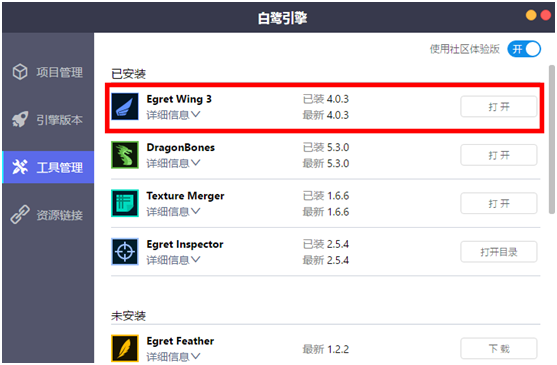
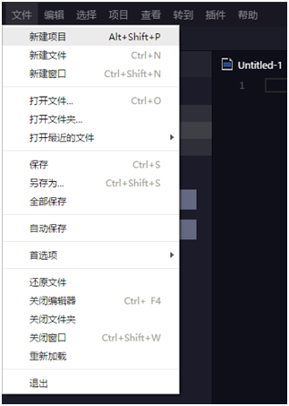
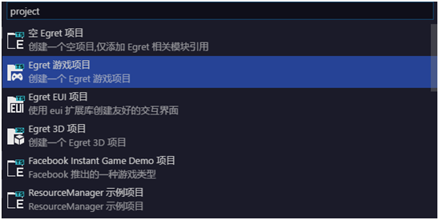
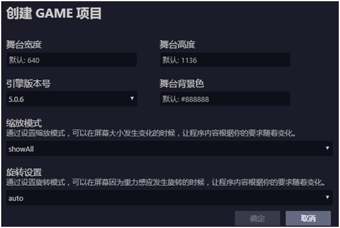
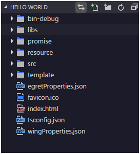

### 安装引擎

下载[Egret Engine](http://www.egret.com/products/engine.html),（可参考：[安装与部署](../../../Engine2D/projectConfig/modelconfig/README.md)）。

### 安装开发工具

打开Egret Launcher，切换到工具管理选项卡，点击安装 Egret Wing，如下图。

### 创建项目

1、打开Egret Wing 后，点击菜单“文件”->“新建项目”来创建项目，如下图。

2、选择“Egret 游戏项目”来创建拥有游戏模板的项目，如下图。

3、在弹出的新建项目面板中，设置项目的基本配置，如下图。

* 项目名称 
当前项目的名称，如 HelloWorld。

* 项目路径
该项目所存放的文件路径。

* 扩展库选择
项目中需要使用的系统库。

* 舞台宽度与高度
 默认游戏舞台的高度与宽度，以像素为单位.

* 引擎版本号
  
  当前项目所使用的 Egret 的版本。
  
* 舞台背景色
	
	默认舞台显示的背景颜色。

* 缩放模式
  屏幕的适配方式，这里选择showALL模式。更多关于缩放模式的介绍可以参考：[缩放模式和旋转模式说明](../../../Engine2D/screenAdaptation/explanation/README.md)
	
* 旋转设置
	
	屏幕的旋转模式，这里选择auto模式。更多关于旋转设置的介绍可以参考：[缩放模式和旋转模式说明](../../../Engine2D/screenAdaptation/explanation/README.md)

点击确定，创建Hello World项目。

### 项目结构

在Egret Wing左侧，可看到当前项目的目录结构：

各文件夹功能说明
* bin-debug：项目调试时，所产生的文件存放于此目录。
* libs：库文件，包括 Egret 核心库和其他扩展库存放于此目录。
* promise：promise支持库文件存放于此目录。
* resource：项目资源文件存放于此目录。
* src：项目代码文件存放于此目录。
* template：项目模板文件存放于此目录。

* egretProperties.json：项目的配置文件。具体的配置说明可以参考：[EgretProperties说明](../../../Engine2D/projectConfig/configFile/README.md)
* tsconfig.json：typescript 编译配置文件。
* wingProperties.json：Egret Wing 项目配置文件。
* index.html：入口文件。具体的配置说明可以参考：[入口文件说明](../../../Engine2D/projectConfig/indexFile/README.md)

### 运行项目

点击菜单“项目”->“构建”，编译项目，如下图。

构建完成之后点击菜单“项目”->“调试”，运行项目，如下图。

