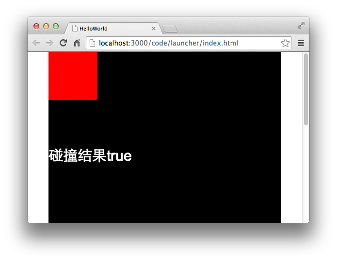
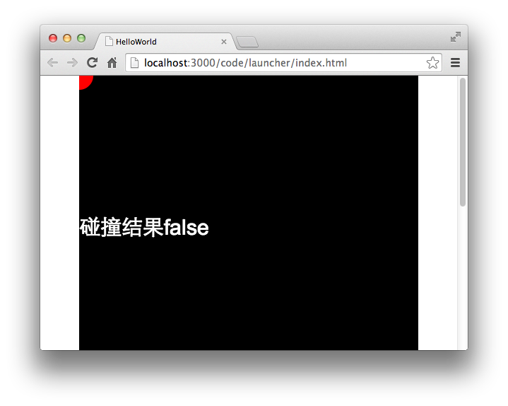

Egret Engine 2.5.6 中开始支持精确碰撞检测。

使用`hitTestPoint`方法的第三个参数。

`shp.hitTestPoint( 10, 10，ture);`

## 示例

### 方形
我们来看一下具体代码：

```
var shp:egret.Shape = new egret.Shape();
shp.graphics.beginFill( 0xff0000 );
shp.graphics.drawRect( 0,0,100,100);
shp.graphics.endFill();
shp.width = 100;
shp.height = 100;
this.addChild( shp );

var isHit:boolean = shp.hitTestPoint( 10, 10, true );
this.infoText.text = "碰撞结果" + isHit;
```

这段代码运行后效果与上面的效果相同，如图：



### 圆形

我们稍微修改一下代码，将原来宽高为100的正方形修改为一个半径为20的圆形。代码如下：

```
var shp:egret.Shape = new egret.Shape();
shp.graphics.beginFill( 0xff0000 );
shp.graphics.drawCircle( 0, 0, 20);
shp.graphics.endFill();
shp.width = 100;
shp.height = 100;
this.addChild( shp );

var isHit:boolean = shp.hitTestPoint( 25, 25, true );
this.infoText.text = "碰撞结果" + isHit;
```

编译运行后我们可以看到效果如下：

  

这样修改后，Egret则执行精确碰撞检测，精确的碰撞检测并非测量DisplayObject包围盒是否和某一点相交，而是测量DisplayObject中的图案是否和指定的点相交。

>大量使用精确碰撞检测，会消耗更多的性能